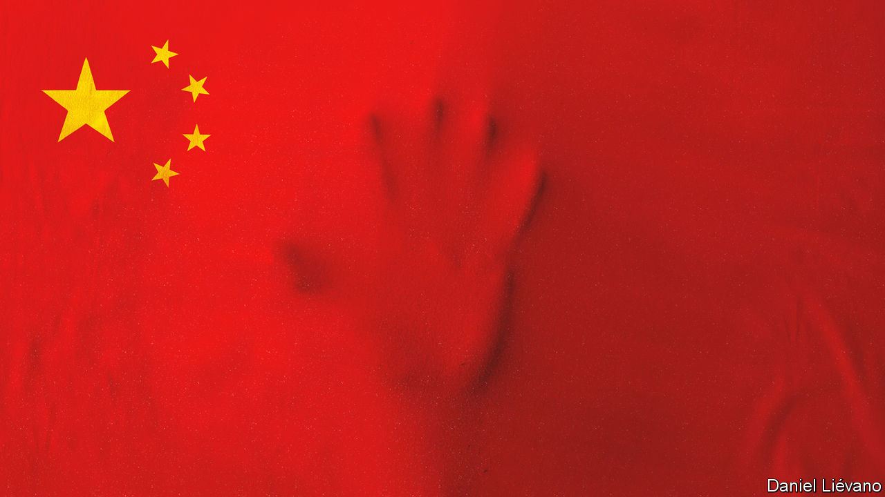

###### The thought police

# China’s mental-health crisis is getting worse 

##### Covid lockdowns and constant surveillance probably do not help 

 

> Jun 22nd 2022 

It is no surprise that demand for psychotherapy is increasing in China. Take the residents of Shanghai, who recently suffered through . Now they are free to move about, but still constantly tested for covid-19, with a positive result landing them in an isolation centre. If the virus is not causing enough anguish, there is also the . China’s youth-unemployment rate has shot up to 18.4%. Don’t complain too much, though, lest the state take notice. Censorship, surveillance and , on the rise ahead of a Communist Party congress later this year, add to the anxiety.

China’s collective mental health seemed to be declining even before the pandemic. In Shanghai the suicide rate has been rising since 2009. Covid has not helped. Suicides in Wuhan, the city where the virus was first identified, were 79% higher in the first quarter of 2020 (when it was under lockdown) than in the same period a year earlier. When Shanghai entered lockdown in April, a survey of residents found that more than 40% were at risk of depression. Searches in Shanghai for “psychological counselling” on Baidu, a search engine, rose by 253% that month.

China has come a long way since the Mao era, when psychology was outlawed and sufferers of mental illness were accused of lacking revolutionary zeal. In recent years the government has passed laws promoting mental health and set itself related goals, such as treating more people who are depressed. But the government itself is a big part of the problem. It is not just that lockdowns and oppression lead to anxiety and depression. The party is also trying to use psychotherapy to mould compliant, socially conservative citizens.

In some cases there are echoes of the past. Dissidents, for example, have been committed to psychiatric hospitals against their will. In 2018 Dong Yaoqiong streamed video of herself splashing ink on a poster of President Xi Jinping while accusing the party of “thought control”. Uniformed men then took her away and (with no hint of irony) stuck her in a psychiatric clinic. Last year Li Tiantian voiced support online for a teacher in Shanghai who had been dismissed. The police reportedly forced their way into Ms Li’s home and took her to a psychiatric hospital, too (the state said her committal was voluntary).

Often the state’s tactics are more subtle. After an earthquake in Sichuan province in 2008, therapists were ordered to guide parents away from complaining about the poorly constructed schools that had collapsed on their children. In an effort to promote social stability, therapists are employed by courts to convince people seeking divorce to stay married. Guidance counsellors in schools have received awards for steering adolescent boys away from homosexuality, which is out of step with the party’s conservative values. 

“If I am not careful, I can easily become their instrument of control,” a therapist for the police told Li Zhang, who has written a book about the politics of psychotherapy called “Anxious China”. The therapist said she worried about having to file reports to senior police officers about her conversations with patients.

Legitimate therapists are in a tough spot. Until 2017 the requirements for certification as a psychological counsellor were minimal. Quacks, profiteers and those with little experience benefited. China has since scrapped that system, but not replaced it with a new certification process. “No wonder a lot of ordinary people don’t trust therapists,” says Ms Zhang.

Even therapists who work outside government settings feel pressure to promote “positive energy”, one of Mr Xi’s favourite terms. Before the pandemic he ordered the media to push inspirational stories. That effort has gone into overdrive since covid arrived. During the lockdown in Wuhan, officials suggested that residents be taught to give thanks to Mr Xi and the party for their management of the virus. During the lockdown in Shanghai, videos of children thanking health workers in song went viral. Meanwhile, online complaints about health workers breaking into people’s homes and killing pets were censored.

Therapists describe this as a kind of gaslighting, in which the state tries to make suffering citizens doubt their own feelings. An extreme case came in May, when a journalist for , a state-run newspaper, died. She had written stories praising the fight against covid in Shanghai right up until her death, which was reported as a heart attack. Some close to her think it was suicide. It is not uncommon for people’s anger at irrational government policies to turn to helplessness, say therapists. “What can you do? You’re angry and it’s useless,” says one in Shanghai. “So you drop that and go to the next stage, which is sorrow.” Chinese activists have long had a term for this:  (political depression). Now ordinary people are experiencing it, too. ■

