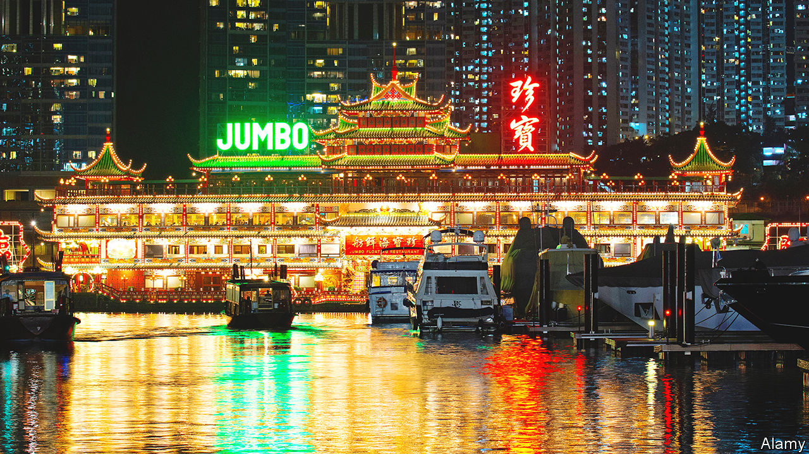

###### The metaphor still holds water

# Hong Kong’s most famous floating restaurant sinks 

##### Some say the city is also going down 

 

> Jun 23rd 2022 

The iconic Jumbo Floating Restaurant had sat in Hong Kong’s Aberdeen harbour for 46 years. Built in the style of an imperial palace, it attracted locals, tourists and celebrities. But it was losing money when it closed in 2020. On June 14th it was towed away. Wherever it was heading, it never made it: the vessel sank on June 18th. Some saw a metaphor in its demise. China’s Communist Party has undermined Hong Kong’s democratic institutions in recent years. Jumbo represented a more hopeful era, now gone.

