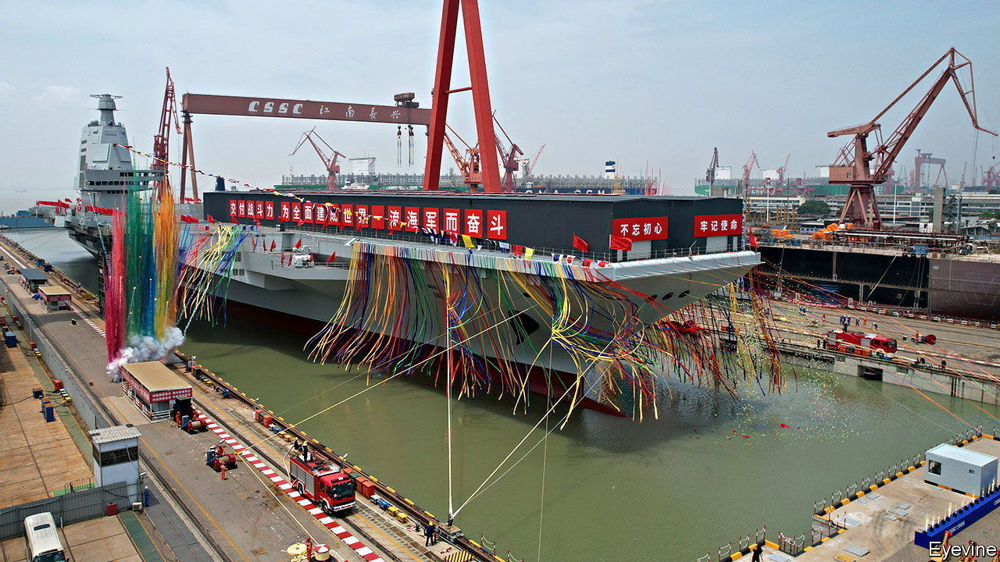
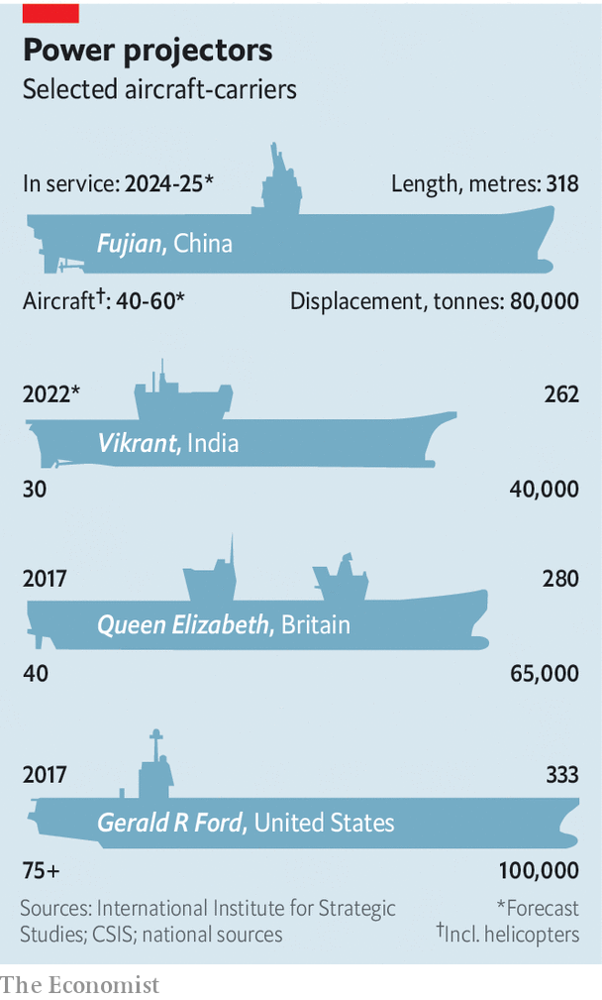

###### Catapulting forward

# What to make of China’s new aircraft-carrier 

##### A big and expensive demonstration of its ambitions 

 

> Jun 23rd 2022 

The aircraft-carrier has long been a symbol of military might. Admiral William Halsey, who commanded an early American one and led Allied forces in the South Pacific during the second world war, described it in 1942 as the best way to “get to the other fellow with everything you have, as fast as you can, and to dump it on him.” That has held true for most of the eight decades since, during which carriers played a key role in conflicts from Korea to Libya. They remain critical to ensuring American military dominance in Asia as friction with China intensifies, especially over .

 


So the launch on June 17th of the , China’s third carrier and its second homemade one, was an unambiguous public demonstration of its ambitions to project power, as America does, far from its shores. At roughly 318 metres long and 80,000 tonnes, the  outstrips Britain’s new carrier, , and is surpassed only by America’s supercarriers (see chart). It also puts China’s carrier fleet ahead of Britain’s as the second biggest after America’s, which boasts 11.

Yet the ’s most significant feature was hidden from view on its launch from Shanghai’s Jiangnan shipyard. Hoardings concealed the parts of its deck that will house an electromagnetic catapult for launching aircraft. That will allow heavier fighter jets (carrying more fuel and weapons), as well as surveillance planes and smaller drones, to fly from the . It can thus undertake more ambitious missions than China’s other two carriers, which entered service in 2012 and 2019, but have so far exercised only in Asian waters.

The ’s catapult represents a technological leap—and a gamble. The only operational carrier with an electromagnetic version is America’s newest one, the , which has yet to be deployed, partly due to problems with the catapult. America’s other carriers use steam-powered catapults, which are reliable but also bulkier, less powerful and hard to calibrate for different planes. China’s two operational carriers, meanwhile, use an upward-curved ramp, or “ski jump”, which works only for fighter jets with a high thrust-to-weight ratio, impeding the use of heavier weapons, like bombs. Both ships carry the j-15 fighter, an unlicensed copy of Russia’s Su-33. They also carry helicopters to monitor their surroundings as longer-range fixed-wing aircraft cannot use the ski jump. That limits their ability to provide air cover for a larger naval task-force. “Without catapult-capable carriers, China’s ambition to operate task groups globally is a risky undertaking, especially in times of conflict,” says Ridzwan Rahmat of Janes, a defence-intelligence firm. 

The  is designed to change that. Once sea trials are complete, it will probably start operating with upgraded j-15 models that include nose gear designed for the catapult, better radar and heavier weapons, including bombs and guided missiles. Later they will probably be joined by a new stealth fighter, the j-35. That plane could be ready for use in the latter half of the decade, says Henry Boyd of the International Institute for Strategic Studies, a think-tank in London. He projects a similar time frame for the kj-600, a new fixed-wing “early warning and control” aircraft to co-ordinate fighter operations and detect incoming threats. Andreas Rupprecht, an author of books on Chinese military aviation, describes that as “the force multiplier” allowing the ’s air wing to operate similarly to those on America’s carriers, which often involve a combination of f/a-18 fighters, stealthy f-35s and Hawkeye early-warning and control aircraft. 

Even then, China will be far from parity with America. The  is conventionally powered, whereas American carriers are nuclear-driven, giving them greater speed and endurance. Plus America has decades of experience operating carriers. It will take at least two years to complete the , and probably more to perfect using its catapult. Even if, as some suspect, China is already building a nuclear-powered carrier and plans to have four by 2035, that would still leave it lagging America. Yet such comparisons can mislead. China’s carriers are not designed for direct confrontation with America, naval experts say. In a war over Taiwan or in the seas around China (the likeliest conflicts involving China and America) ballistic and sea-skimming missiles would quickly destroy any big ships. 

China is more likely to use its carriers against less powerful countries—much as America has since the cold war. Think, perhaps, of a confrontation with Vietnam over disputed islands or an intervention in Africa to protect Chinese interests. In the missile era, it is unrealistic to imagine a clash like the battle of Midway in 1942, which involved three American carriers and four Japanese ones, says Sam Roggeveen of the Lowy Institute, a think-tank in Sydney. “I don’t read China’s carrier ambitions as being a direct challenge to American naval power,” he says. “I really view it as a gambit to build a navy that will be useful when the Americans are far less powerful and when China has more space to coerce and punish smaller countries.” ■

