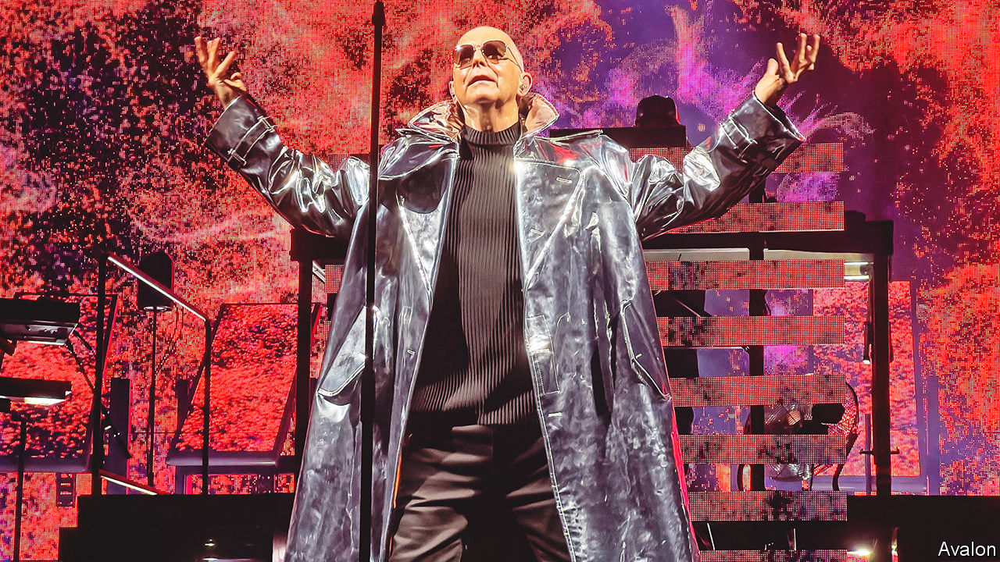

###### Back Story

# Pet Shop Boys achieved a kind of alchemy that only music can 

##### Their hits have endured because they transmute sadness into joy 

 

> Jun 23rd 2022 

When “it’s a sin” was released in 1987, gay marriage was barely a dream. Margaret Thatcher’s government would soon pass a law banning the “promotion of homosexuality” in classrooms. Neil Tennant, Pet Shop Boys’ singer and lyricist, drew on his spell at a Catholic school in Newcastle, characteristically using language at once limpid and flexible, so that the “sin” seems to cover all manner of impulses. In a video directed by Derek Jarman, Mr Tennant was tormented by inquisitors as he made his pulsating confession:

When I look back upon my life

It’s always with a sense of shame

I’ve always been the one to blame

Times have changed. Mr Tennant (pictured) came out in 1994; recently his song lent its title to a tv drama about the aids crisis of the 1980s. He and Chris Lowe, the keyboardist and other half of Pet Shop Boys, are in their 60s. Yet on June 26th they will headline the Glastonbury festival, midway into a greatest-hits tour bound from Europe to North America in the autumn. Their staying power is down to more than stamina or fans’ nostalgia: their best music still pulls off an emotional alchemy that few bands—and no other art form—can match.

The pair met in a synthesiser shop on the King’s Road in 1981, both northerners in London (Mr Lowe is from Blackpool) and keen on electronic music. Some of their songs are hymns to the city, its promise and loneliness, exhilaration and vertigo. From the noir opening—“Sometimes, you’re better off dead”—“West End Girls”, a transatlantic number one in 1986, mixes anomie with the frisson of cross-class desire, the glitz and grind of “a West End town in a dead-end world”.

That song was influenced by the chattering voices in “The Waste Land”. Russian history is a recurring motif in Mr Tennant’s lyrics; some are sly critiques of Thatcherism. Since their “imperial phase” in the late 1980s, the duo have confirmed their reputation for “intellectronica” with a pop oratorio about the gay codebreaker Alan Turing and a soundtrack for Sergei Eisenstein’s “Battleship Potemkin”. 

For all the bookishness, though, the band’s appeal lies partly in a kind of sublime simplicity: expressing sadness and longing in plain yet supple words that are poignant even when they also seem ironic. “What Have I Done to Deserve This” mourns a failed relationship, “Rent” the sense of being trapped in one (“Look at my hopes, look at my dreams…”). “Suburbia” laments the claustrophobia of the suburbs, “Being Boring” the way the lives of friends diverge, and some end prematurely: “All the people I was kissing/Some are here and some are missing.” That track commemorated a friend who died of aids; on the current tour Mr Tennant dedicates it to the victims of covid-19. 

The other part of Pet Shop Boys’ genius is to set these feelings of heartache to tunes that urge you to wave your arms, stamp your feet and chant the chorus. Their sound brought together the tempo of the “hi-nrg” dance music that had developed in America with influences from David Bowie and Kraftwerk to film scores and rap, combining them into a dramatic brand of electropop. It counterpoints the melancholy of the lyrics with infectious beats, arresting key changes, swooning refrains and operatic climaxes.

So when Mr Tennant sings about running with the dogs in suburbia, you want to run with them. In “Left to My Own Devices”, a rousing riff on isolation, you wouldn’t mind being in the head of the “lonely boy, no strength, no joy” who hears “Che Guevara and Debussy to a disco beat”.

In the new show, the act’s trademark lighting and effects illuminate an otherwise limited spectacle—Mr Lowe standing as impassively as ever at his keyboard as Mr Tennant potters about the stage. For “It’s a Sin”, flames and bursts of crimson swirl behind them. The throbbing chords and breathless crescendos turn shame into defiance, repression into joy. 

For everything I long to do

No matter when or where or who

Has one thing in common, too:

It’s a…It’s a…It’s a…It’s a sin.

Classic songs are a time machine. These hits teleport Pet Shop Boys’ older listeners to their youth, a thrill even if those years were hard. They capture the bygone mood of a gritty age. More than that, they let you smile at sorrow, at once echoing your woes and making you feel better. Doing either is an artistic achievement; doing both together is a feat that only words and music can perform, and only rarely. It will never get old.


