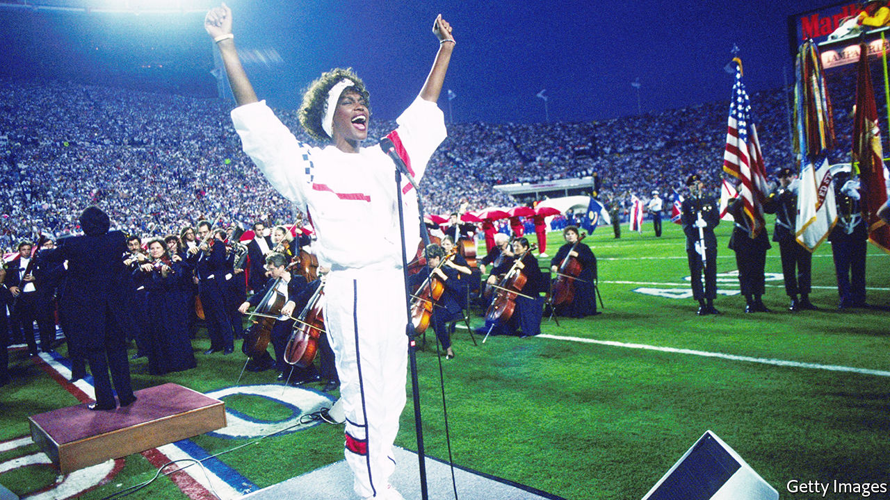

###### “The Star-Spangled Banner”

# The curious history of America’s national anthem 

##### Mark Clague explores its meaning and music in “O Say Can You Hear” 

 

> Jun 23rd 2022 

By Mark Clague. 

In july 1814 an unsigned magazine article bemoaned the state of patriotic music and poetry in America. “Our national songs are full of ridiculous exaggeration, and frothy rant, and commonplace bloated up into fustian,” complained the writer, thought to be Washington Irving. When would someone produce an anthem worthy of the new republic? 

Just two months later, as it turned out. Inspired by the Battle of Fort McHenry, a young lawyer named Francis Scott Key wrote the words for “The Star-Spangled Banner” and set them to a popular tune. Irving’s  published the lyrics, which caught on across the country. Key’s song served less to reflect than to encourage national unity. As Mark Clague says in “O Say Can You Hear”, Key had written “an implicit critique of anyone who sustained the nation’s partisan divide” during the War of 1812 with Britain.

Mr Clague, a music professor at the University of Michigan, has produced a thoughtful and elegant history of America’s national anthem. Unlike a flag, he writes, a song must be performed, so it is “not a static icon but a patriotic act”. Removing your hat for it signals respect. Kneeling or raising a fist, as African-American athletes have done to protest against racism, makes a political statement. Almost any deviation from custom can cause a stir. Translate the anthem into another language, sing it poorly or adapt it to a new musical tradition and someone will howl.

All the same, “The Star-Spangled Banner” has also been remarkably pliable. More than 30 other songs set to the same tune were written about the War of 1812 alone. During the civil war the Confederates twisted the lyrics: “O say does that Rag-Strangled Banner still wave/O’er the land of the thief and the home of the slave?” Later the proper version helped reconcile the foes. At the Court House in Appomattox, a quartet of Union soldiers serenaded former Confederate officers as the peace was signed. “Gentlemen,” said the rebels, “if we’d had your songs, we’d have licked you out of your boots!” 

Alongside the anthem’s historical significance, Mr Clague explores its musicology. It is famously hard to sing. Many a performer has fretted over the high note on the word “glare”, yet “to sound this note true and in tune is to signal the melody’s extraordinary ambition, not only to symbolise heroism but in a sense to be heroic.” The music itself was written in around 1778 by John Stafford Smith, an Englishman. Mr Clague reckons the greatest modern performance was by Whitney Houston at the Super Bowl in 1991 (pictured). His personal favourite—for musical ambition, political awareness and sheer audacity—is by Jimi Hendrix at Woodstock.

Key’s own biography muddies the story. In his day job, the amateur lyricist filed over 100 freedom petitions for enslaved African-Americans, more than any other lawyer in the District of Columbia. But he also represented slaveholders, owned slaves himself and despised abolitionism (the word “slave” appears ambiguously in his little-sung third verse). Rather than proposing to tear down monuments to Key—as happened in San Francisco in 2020—or find a new anthem, Mr Clague embraces the vexed historical record. Contradictory, beautiful and full of aspirations unfulfilled, “The Star-Spangled Banner” remains the perfect song for America. ■

