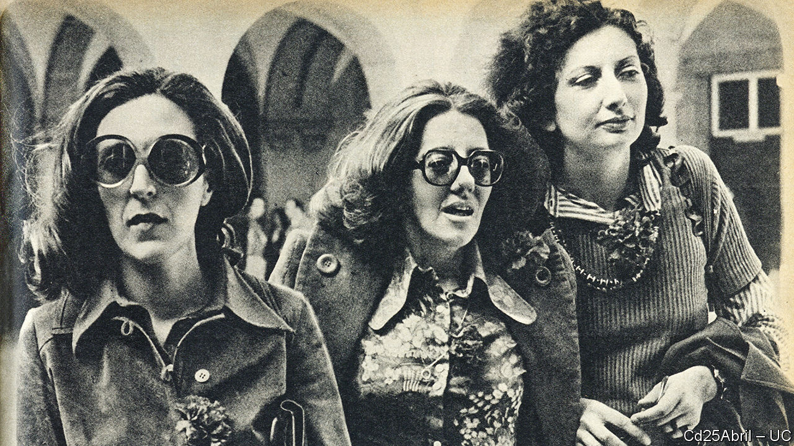

###### The case of the “Three Marias”

# The women who challenged Portugal’s dictatorship 

##### A book that caused a scandal 50 years ago remains powerfully relevant 

 

> Jun 23rd 2022 

Leaving home one summer’s evening in 1971, Maria Teresa Horta noticed a car was following her. She had recently published a volume of poetry, “Minha Senhora de Mim” (“My Lady of Myself”), which reflected on female sexual pleasure. Portugal’s dictatorial regime, led by Marcello Caetano, did not approve. The goons in the car confronted Ms Horta, warning her not to write such smut again. The beating they administered put her in hospital.

A few days later she turned up to lunch with two friends and fellow writers. They were appalled. “God, if a single woman has something like that happen to her because of a book of poetry,” Maria Velho da Costa said, “imagine if the three of us wrote a novel.” Ms Horta was enthusiastic about the idea; the third woman, Maria Isabel Barreno, was more cautious. Yet when they next met, Barreno had begun the book.

For nine months the three convened every week to exchange work. The result was more ambitious and strange than a novel: a mix of poems, letters and essays inspired by “Letters of a Portuguese Nun”, a 17th-century epistolary story in which a Franciscan nun addresses her French former lover and describes being held in a convent against her will. The authors felt this was an apt metaphor for women’s lives in modern Portugal. “What woman is not a nun, sacrificed, self-sacrificing, without a life of her own, sequestered from the world?” they wrote. “What change has there been in the life of women through the centuries?”

They called the book “New Portuguese Letters” and, seeing it as a joint endeavour, did not identify their contributions. Using a sometimes bewildering cast of characters, they comment on the subjugation of women in the home, misogynist laws, sexual and domestic violence, abortion, the Catholic church and the colonial wars Portugal was waging in Africa. They anticipated a backlash, but “the machismo of the Portuguese had to be made clear,” says Ms Horta, now 85. “It was a macho country that gagged women. It was a country that wanted us to obey the rules and customs that had been in place for decades.”

“New Portuguese Letters” was published 50 years ago, in 1972. Tipped off by the printers, the government acted swiftly. It banned the book, seizing copies on the grounds that the text was “irreparably pornographic and incompatible with public morality”. Copies already sold circulated on the black market. The women were questioned, charged with abusing the freedom of the press, then released on bail. A trial was set for 1973. The country’s media were not permitted to report on the case.

But word of the women’s persecution, and the stifling of free speech in Portugal, got out. A friend of Barreno smuggled copies of the book into France and sent them to feminist writers including Christiane Rochefort, who publicised the case. French newspapers published excerpts of the text, which was shared among women’s liberation groups. In Britain authors including Doris Lessing, Iris Murdoch and Jean Rhys wrote to the expressing their disgust with the trio’s treatment. At the International Feminist Planning Conference held in Massachusetts in June 1973, representatives of dozens of countries agreed to rally round the “Three Marias”.

The suppression of “New Portuguese Letters” became the first international feminist cause, known from Buenos Aires to Islamabad. Women round the world put pressure on Caetano’s government by signing petitions, writing letters to embassies and appealing to the un Human Rights Commission. In London and New York, theatres hosted readings from the book; women in Brussels and Paris marched in solidarity. In The Hague feminists climbed onto the roof of the Portuguese embassy and unfurled a banner.

The regime was “internationally discredited by the negative publicity of the Marias’ case”, says Hilary Owen of Oxford and Manchester universities. At home, the furore fed a dissenting mood. Already unpopular for its costly, grim wars in Angola, Guinea-Bissau and Mozambique, the dictatorship was overthrown in a military coup on April 25th 1974. 

The women were acquitted soon after the coup, known as the Carnation revolution, and interest in Barreno, da Costa (who died in 2016 and 2020 respectively) and Ms Horta waned. Other reforms took precedence over gender issues; for a time the book went out of print. Today many Portuguese have heard of it but not read it.

The letters and the law

Ana Luísa Amaral, a poet and academic, says that is changing. She has edited a volume on the international reception of “New Portuguese Letters” and published an annotated edition that made the writing more accessible. She says scholarly interest has risen, both because it is a “great book” and because its themes still resonate. A section on abortion, only liberalised in Portugal in 2007, might profitably be read by American judges; it describes the lengths to which women have gone to end a pregnancy, using anything “they had at hand that would penetrate and scrape”. A letter written in the voice of a Portuguese fighter, articulating his fear and despair, “could very well have been written by soldiers in Iraq”, Ms Amaral says.

The 50th anniversary may prompt more readers to seek out the book. An exhibition focused on the case is travelling across the country; Rita Rato and Joana Alves of the Aljube Museum in Lisbon say it was popular with school-age children there, attracting lots of atypical visitors. Already performed in Lisbon and Guimaraes, a play about the lawsuit will be staged in Almada and Funchal later this year. Ms Horta will appear in “Mulheres de Abril” (“Mothers of April”), a forthcoming documentary film and accompanying television series about Portuguese female activists.

Half a century on, Ms Horta says the book remains relevant as “equal opportunities are far from being achieved”. Ms Rato notes the glass ceiling that still limits women’s careers in Portugal and the soft sentences often given to perpetrators of violence against them. “My sisters”, asks a passage in “New Portuguese Letters”, “what can words do?” The book’s own history offers a kind of answer. ■

