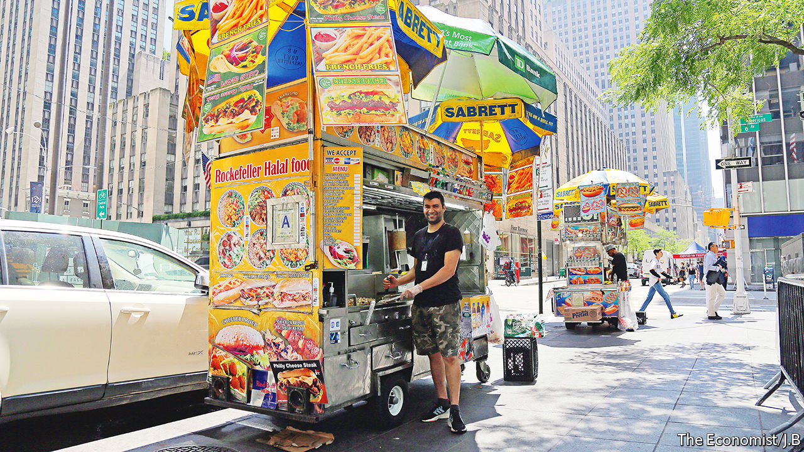

###### World in a dish

# What Manhattan’s street-food vendors reveal about their city 

##### The lessons of a day in Midtown with Sherif Baioumy and his halal cart 

 

> Jun 23rd 2022 

Sherif baioumy’s morning begins at around 7am in a garage in Queens, where he loads up his cart with the day’s food: marinated chicken, a ten-pound skewer of ground lamb, rice, vegetables, hot dogs, falafel, frozen chips, canned soft drinks and bottled water. A colleague hitches the cart to the back of a pickup truck, and by 9.30 they’ve rolled it into place on the south-west corner of 48th Street and 6th Avenue, in the heart of office-worker Midtown.

Soon the lamb is rotating on its skewer, chicken is sizzling on the grill and falafel burbling in the deep-fryer (the cart is a symphony of efficient design, without an inch of wasted space). Too many people consider food vendors a nuisance, or somehow déclassé. In fact they play a vital role—not just by feeding people, but as living records of their cities’ changing habits and demography.

The next eight hours are a steady stream of frying, wrapping and unceasing banter. Calling Mr Baioumy friendly is like calling water damp; he is ebullient and warm, whether fist-bumping with his regulars or enticing passers-by. In restaurants, where chefs are generally secreted in the kitchen, they can afford to be surly. Buying lunch from a vendor is a more intimate experience, and chatting to him as he cooks is part of the charm.

Mr Baioumy runs one of Manhattan’s “halal carts”, a term with a meaning specific to New York. Usually overseen by Afghans, Bangladeshis or Egyptians like him, they mainly serve halal chicken or lamb over rice or in a pita, garnished either with “white sauce” (a bafflingly popular spiced mayonnaise cut with vinegar) or hot sauce. Much like  stalls in Hanoi or taco trucks in Los Angeles, New York’s halal carts have similar menus, but each vendor has his own style. Mr Baioumy’s marinade has an almost Mediterranean flavour, with strong notes of lemon, garlic and rosemary.

These carts were unknown a couple of decades ago, when souvlaki was the street lunch of choice. But as immigration from Greece slowed and Greek vendors aged, newer arrivals took their place. That cycle recurs around the world. Grilled chicken, papaya salad and sticky rice came to the streets of Bangkok—home to perhaps the world’s most delicious and varied street food—with migrants from Isaan, the country’s impoverished north-east.

The work is gruelling, especially in the heat. Mr Baioumy reckons that on a good day he takes home $200 in profit, but every two years $20,000 of that goes to the Florida-based owner of his licence. Because New York issues a paltry number, the licences are valuable commodities, though that is set to change: the city will give out 4,450 more in the next decade, and will require the holders actually to run the carts.

In time, the chicken and lamb that Mr Baioumy sells may seem as unremarkably American as bagels or hot dogs, both of which were once the province of immigrant vendors. But as the food evolves, New York’s food carts serve the same function: offering a quick meal and friendly greeting to a city eternally in a hurry. ■

