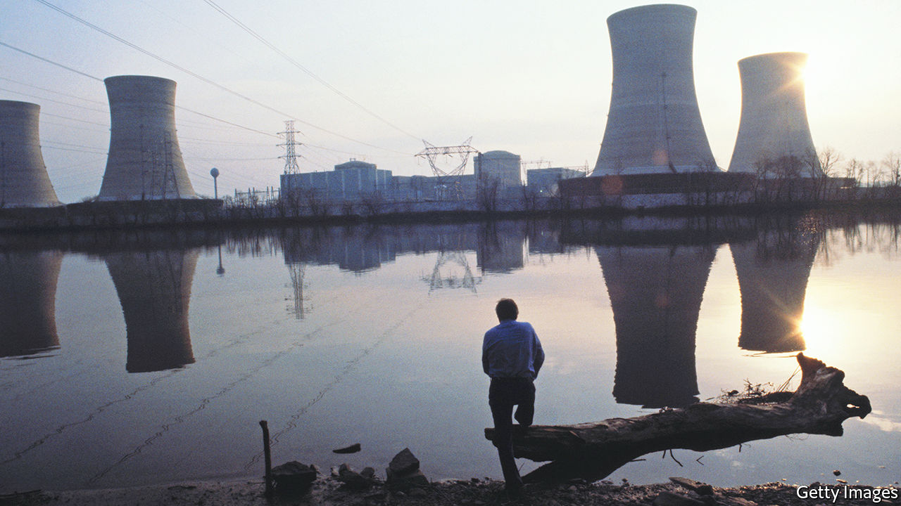

###### Ghosts in the machines

# “Atoms and Ashes” is a dramatic account of nuclear accidents 

##### But Serhii Plokhy’s scepticism of nuclear power goes too far 

 

> Jun 23rd 2022 

By Serhii Plokhy. 

Given that they are grounded in an aspect of nature unknown before the turn of the 20th century, it is not surprising that the immense, insensible powers of nuclear reactions have something of the supernatural about them. That sense of otherworldliness lends a ghost-story dread to the moments of nuclear malfunction when the reactions intrude into the world of the bodily and perceptible.

Serhii Plokhy’s accounts of the world’s six worst nuclear accidents to date capture those occasions with haunting drama. He evokes the moment in 1954 when—30km from the unexpectedly titanic Castle Bravo h-bomb test on Bikini Atoll—a shock wave transforms the toilet in the firing team’s bunker into a fetid fountain. He describes the terrible, scaled-up recapitulation of that eruption when, in 1957, 150 tonnes of concrete are blown 20 metres into the air from the top of a nuclear-waste storage tank at Chelyabinsk-40, releasing a plume of radioactive material that would contaminate 20,000 square kilometres of the eastern Urals.

In the same year, a technician at Windscale, in north-west England, peers through an access port and sees the reactor within on fire, its graphite face glowing red. Then in 1986 an operator at Chernobyl (the subject of a previous book by Mr Plokhy) hears a “roar” of a “completely unfamiliar kind, very low in tone, like the moan of a human being”, as the core of reactor 4 slipped for ever out of control. 

This is the stuff of good storytelling, and on that score “Atoms and Ashes” succeeds. All six accounts provide context and telling detail. Some feature bravery and some obtuseness. It is hard, with the benefit of hindsight, not to want to shout at the operators at Three Mile Island in Pennsylvania (pictured), who so consistently did the wrong thing before the partial meltdown of 1979. There are touches of humour, too. Arthur Wilson, the technician who looked into the burning heart of the reactor at Windscale, recalls thinking: “Oh dear, now we are in a pickle.”

Nevertheless, the book should not be treated as definitive. Microcuries and millicuries are confused, as are megawatt-days and kilowatt-days and plutonium and beryllium. In a couple of places the text suggests that nuclear reactors can be used to produce uranium-235, which is not the case. Besides these slips, “Atoms and Ashes” is less satisfying when it and the reader pull back from the individual dramas to consider the subject of nuclear technology as a whole.

Mr Plokhy, a Ukrainian historian at Harvard whose other books include a history of the Cuban missile crisis, holds that the inevitability of accidents is one of several reasons to encourage nuclear power to drift into disuse, rather than give it a new role in the fight against climate change. He argues that if the world pursues nuclear power on a grand scale to cut carbon emissions and one of the plants involved has its own accident, the nuclear strategy will stall and the possibility of using other technologies to the same end will have been forgone.

That is a well-observed worry. But looking at past accidents in context does not make them seem so necessarily damning. The three associated with nuclear weapons and their manufacture—those at Bikini, Windscale and Chelyabinsk—all happened in programmes being rushed forward at a tremendous pace. Chernobyl, too, was in part the result of a rush. The Soviet Union felt it had fallen behind in nuclear energy and decided to roll out rbmk reactors because they could be built quickly, ignoring the fact that, by using both cooling water and graphite moderators, they combined the risks of fire and explosion. The design was nightmarish in other ways, too, as was a culture that valued the personal authority of bosses over safety regulations, which were consciously ignored.

These accidents amount to a case against hasty programmes based on limited knowledge and carried out in cultures of secrecy, autocracy and fear. Three Mile Island showed the need for more considered operator training; the Fukushima disaster in Japan in 2011 demonstrated the danger of a nuclear regulatory body too entangled with the industry it regulated, and with a government from which it should have been independent.

As Mr Plokhy says, lessons have been learned from all the episodes in his book. It is fair to be concerned about how well those lessons have been assimilated, especially given that a lot of today’s reactors are being built in or by China and Russia, not countries in which authority tends to be questioned and the public informed, nor places much inclined to independent regulators. But it is a step too far to foresee a future in which nuclear power must be abandoned altogether. ■

