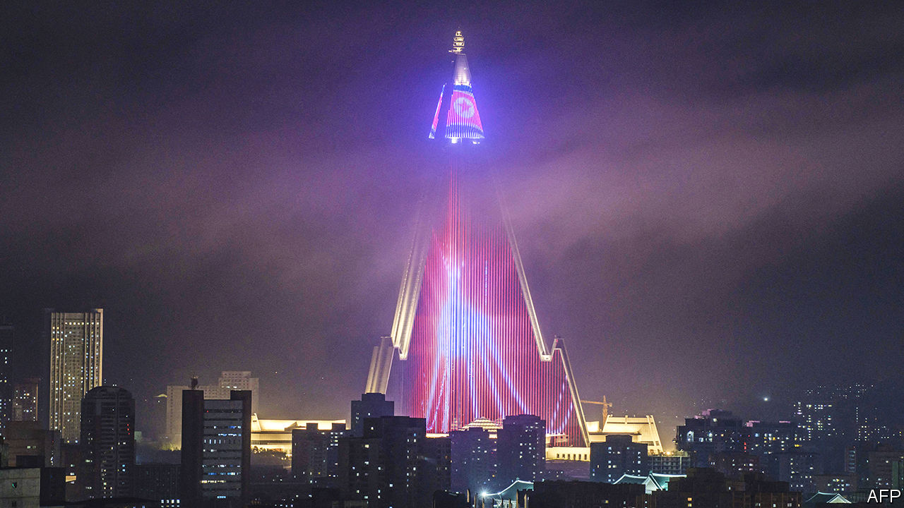

###### Pirates of Pyongyang

# “The Lazarus Heist” explains North Korea’s wild hacking spree 

##### The internet lets the hermit kingdom steal money from all over the world 

 

> Jun 23rd 2022 

By Geoff White. 

The “hermit kingdom” of North Korea is so technologically backward that it is visible—or rather invisible—from space. Photographs taken at night show a country covered in darkness, with only a few pinpricks of light around Pyongyang, the capital. China, Japan and South Korea, by contrast, glow with artificial illumination. 

But as Geoff White, a bbc journalist, explains in his rollicking new book, that backwardness has helped make a handful of North Koreans very technologically savvy indeed. He tells the story of the Lazarus Group, the name given by security analysts to a collection of North Korean state-sponsored hackers. In a country where access to the internet is a luxury afforded to only a tiny few, they have, over the past decade, become some of the world’s most prolific cybercriminals. 

The Lazarus Group is thought to have been responsible for a $100m raid on Bangladesh’s central bank in 2016; the WannaCry malware attack that in 2017 hit organisations around the world, from Maersk, a shipping giant, to Britain’s National Health Service; and a string of more recent hacks and cryptocurrency frauds. The group’s various schemes are thought to have netted billions of dollars of precious foreign currency for the North Korean regime.

“The Lazarus Heist”, which is based on a bbc podcast of the same name, provides both a pacey insight into the cutting edge of modern crime and an equally fascinating portrait of life inside North Korea (gleaned from a mix of official sources and interviews with defectors). In theory, the regime preaches , usually translated as “self-reliance”, deliberately isolating itself from the decadent capitalism that contaminates the rest of the world.

But self-imposed isolation has left North Korea impoverished and underdeveloped. Its pursuit of nuclear weapons has brought sanctions, compounding the problem. With the economy strangled and citizens poor and sometimes starving, Mr White describes a state trying its hand at a variety of criminal schemes, from counterfeiting to smuggling and cooking crystal meth, in an effort to earn foreign currency. Eventually it alighted on computer hacking—especially electronic bank raids—as the most lucrative. A un report of 2019 attributed 21 separate attacks to the Lazarus Group, most aimed at foreign banks.

Despite its technical topic, the book is breezily written. Well-observed pen portraits make the revolving cast of characters—Chinese underworld fixers, hapless bank employees, casino croupiers and hackers in rural England—easier to follow. Knotty details are skimmed over without sacrificing the crucial points, though at one stage Mr White guides the reader through a few lines of low-level computer code, perhaps to reassure the technically minded of his bona fides. 

And the tales themselves need no embellishment. A bank clerk frustrated by a misbehaving printer comes to realise it was one of the few outward signs of a huge scam taking place under his nose. Bangladesh’s losses are limited by a piece of blind luck: a destination bank for the stolen money is located on Jupiter Street in Manila, and “Jupiter” happens to be the name of a shipping firm involved with Iran, which trips anti-fraud systems. The stolen Bangladeshi loot is laundered through the vip baccarat tables of a Filipino casino; gangs of money mules pose as high-rollers yet seem oddly bored and listless while placing enormous bets. 

Conspicuously missing, despite the title, are the stories of the hackers themselves. Mr White describes how mathematically talented children from across North Korea can be funnelled into what has become a prestigious job, offering better housing, social status and even occasional trips to the outside world. He shows how the hackers’ sophistication has grown alongside their confidence. But North Korea’s isolation, and the fact that the culprits remain safely ensconced thousands of miles from the targets of their heists, mean only one of them is ever given a name—Park Jin Hyok, whose face adorns the fbi’s “Cyber Wanted List”. And even that may be a pseudonym. ■

