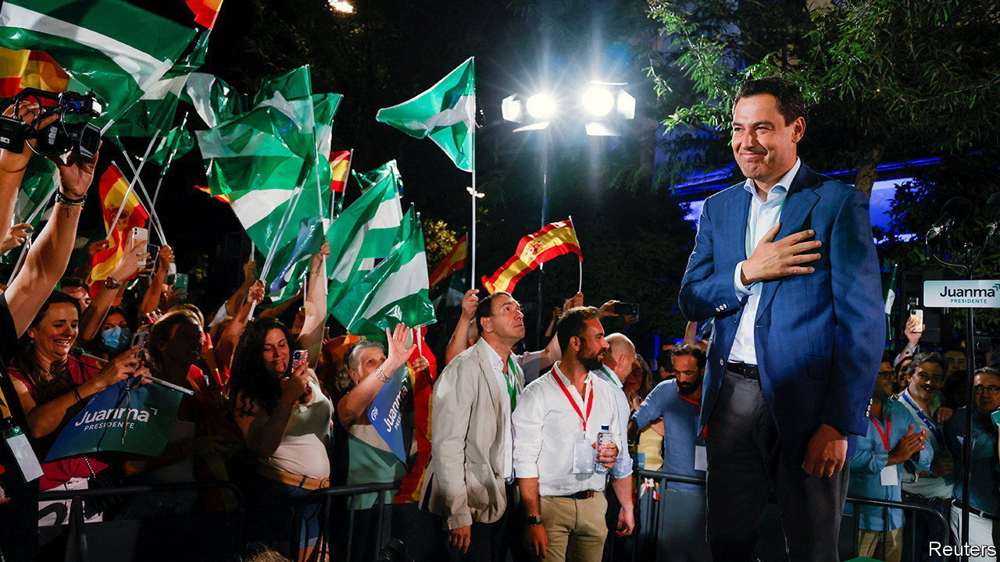
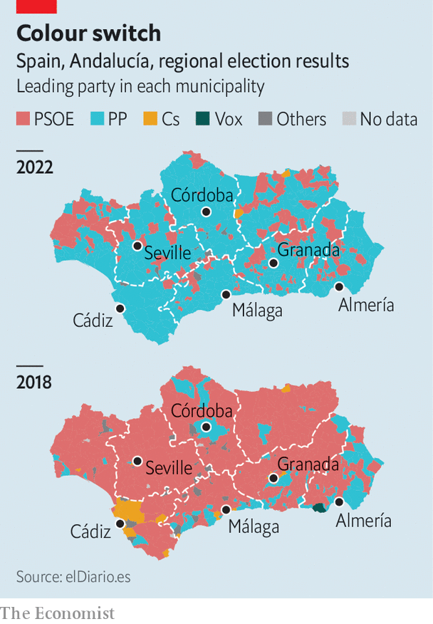

###### The great riposte of Córdoba

# A stunning victory for Spain’s conservative opposition in Andalucía 

##### The People’s Party hopes it augurs national success 

 

> Jun 23rd 2022 

“Congratulations, caliph.” Thus did Alberto Nuñez Feijóo salute his party-mate, Juanma Moreno, for a rampaging victory for the conservative People’s Party (pp) in regional elections in Andalucía on June 19th. Formerly the heart of an Islamic empire, Andalucía is Spain’s second-biggest and most populous region. It has long tended to the left. The Socialists ran it from the advent of Spanish democracy in 1978 until 2019.

But this time its voters gave the Socialist Party the biggest kicking it has ever had in the region, and handed the pp its first absolute majority in the regional assembly. The party triumphed in all eight of the region’s provinces. It won the city of Seville for the first time in any election of any sort, notes Elías Bendodo, the party’s number three. It pummelled Ciudadanos, a centre-right party that failed to win any seats at all.

 


The pp also halted the rise of Vox, a hard-right party whose first electoral breakthrough was in Andalucía four years ago. Vox sent one of its stars, Macarena Olona, to head its effort there. She ran an erratic campaign (at one debate she said that sex-education textbooks that discuss masturbation were the equivalent of perverts approaching children in parks). 

The Socialists won the most seats of any party in the election in 2018, but a coalition of the pp and Ciudadanos nonetheless managed to form a government on the right. Its leader, Mr Moreno, has been a genial and competent manager, and has brought down taxes. Nationally, the pp has moved to the centre. Since Mr Feijóo took over a few months ago, he has made a point of sounding civil and sensible. Mr Moreno took a similar tone in the campaign.

The Socialists, for their part, failed to inspire. Juan Espadas, their leader in the region, struggled to make a compelling case for replacing Mr Moreno, instead harking back limply to the economic growth the Socialists brought in the past. But voters also remember a legacy of corruption from the long Socialist hegemony, notes Andrés Santana of the Autonomous University of Madrid.

The pp is naturally keen to spin its regional triumph as a prelude to taking power nationally next year. But those elections are not due until November 2023, and the party’s recent national rebound has only managed to bring it level with the Socialists in the polls. In a year and a half, anything can happen. After all, the pp took Andalucía. 

