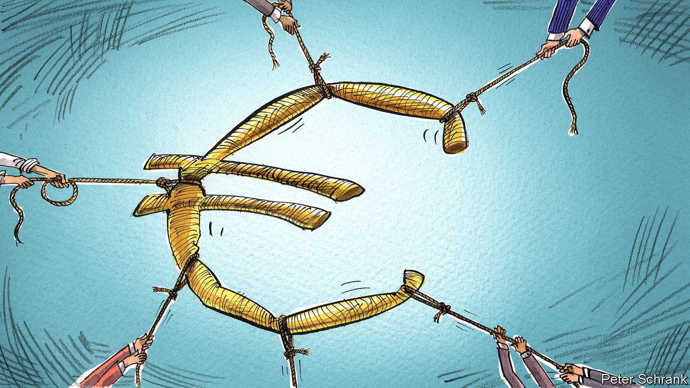

###### Charlemagne

# Briefly united by Ukraine, Europe faces divisions on the home front 

##### The eu agrees on war, but not bail-outs 

 

> Jun 23rd 2022 

Pandemics resulting in lots of deaths are a Bad Thing. Russia invading Ukraine: also Bad. What about finance ministers running large budget deficits in a downturn to keep the economy humming along? Well, that depends on whom you ask. Therein lies a brewing problem for Europe. Dealing with covid-19 then Ukraine has bound the continent together. The economic fallout from both will revive old debates that tend to tear it apart. 

Next month will mark a decade since Mario Draghi, then president of the European Central Bank (ecb), promised to do “whatever it takes” to save the euro. The effectiveness of the spell seems finally to be wearing off. The euro zone is not yet in crisis. But once again countries in the south—notably Italy, whose prime minister these days is one Mario Draghi—are having to offer jittery investors higher interest rates to fund their debts than Germany, the continent’s fiscal goody-two-shoes. Given that the emergence of “” in 2011 was a prelude to the carnage of the original euro crisis, its return is enough to set nerves jangling. Remember those all-night summits ten years ago, at which European leaders berated Greece and scrambled to save the single currency? Now imagine the same scenario with a diminished French president, surging inflation and war on the eu’s doorstep.

Optimists argue that a re-run of euro-zone fragmentation—wonk-talk for when Italy and Germany look as though they don’t belong in the same currency union—would be easier to handle this time. One reason is that measures were taken in the wake of the original crisis, such as making banks sounder. More important yet is the political situation. Europe has gone through a period of remarkable unity in the past two years or so. 

Start with the response to covid. The (patchy) joint procurement of vaccines by the bloc’s 27 countries got the most headlines. But even more notable was the setting up in July 2020 of a €750bn ($793bn) fund, known as Next Generation eu (ngeu), which resulted in large transfers of money from richer countries in the union to poorer ones. Forgotten, for a time, were the familiar squabbles pitting tight-fisted northern Europeans against supposedly spendthrift southerners. Instead, money raised by the eu (and in effect guaranteed by national governments) flowed to those who needed it most. Even if the scale was relatively puny, this was precisely the kind of redistributive federal budget whose absence many had blamed for the original euro miasma.

The case for unity over Ukraine is more contested. Hawkish leaders in eastern Europe think their counterparts farther west—Emmanuel Macron in France and Olaf Scholz in Germany most of all—are far too soft on Vladimir Putin, Russia’s despot. But beyond the odd verbal volley, the eu’s 27 member states have acted cohesively. They unanimously agreed on six packages of sanctions against Russia, and have sent lots of arms and cash to Kyiv. Bar a last-minute hitch, Ukraine was set to be recognised as a candidate to join the club at a summit of eu leaders on June 23rd, as  went to press, despite early reservations in many countries.

Could the goodwill that made such unity possible carry the eu through a revived euro crisis? Early signs have not been encouraging. A French proposal to help parts of the bloc affected by the war in Ukraine through an ngeu 2.0 were shot down early on. Northern Europeans, led by the Dutch, argue that the original Next Generation fund was a one-off: an exceptional financial measure devised for a no-less-exceptional pandemic. That Italy became an early hotspot of the disease in Europe could be construed as an act of God. In contrast, the giant net debt load which the country has taken on over the years—now equivalent to nearly 140% of gdp—is seen as the act of Italians. Northern skinflints think that bailing them out would encourage future profligacy. 

Against that, Italy has been an early victim of the ecb calling time on ultra-loose monetary policy. The expectation of a shift towards a more normal interest-rate regime, which the ecb announced on June 9th, prompted Italian borrowing costs to surge (until the bank promised to act to keep them under control). But the tightening of monetary policy is partly itself a product of the war in Ukraine, which sent energy prices—and so overall inflation—much higher, leaving the ecb with little choice but to act. Thus Italy can argue it is a victim of an act of Putin. Is that enough to prompt solidarity? Does Italy, once a steadfast friend of Russia, not bear some of the responsibility for its predicament?

And while the politics between countries may have become more harmonious, the opposite is true domestically. Central to any grand European bargain needed to stem a future currency crisis will be a confident Germany, willing to lead northern Europe into loosening the purse-strings. But Mr Scholz looks indecisive atop a three-way coalition, and is on the back foot in Europe given his party’s past ties to Russia. At least he can command a majority to pass legislation, unlike Mr Macron in France, who now has no clear route to get reforms through a parliament he no longer controls. Italy is well run under Mr Draghi, but he is facing domestic turmoil and will step down as prime minister no later than next year anyway. The two longest-serving eu leaders, meanwhile, are Viktor Orban of Hungary, who ritually vetoes stuff to extort goodies from Brussels, and Mark Rutte of the Netherlands, who does so out of penny-pinching conviction. 

Back in sight, back in mind

European harmony has been helped in recent years by governments not having to think too much about each other’s public spending. That was true even before covid caused eu rules limiting national debt and deficits to be suspended (the edicts will come back, but not before 2024). Now the once-familiar realities of markets fretting over which country owes how much have returned. And, with them, the distinct possibility of rifts that rarely show Europeans in their best light. ■


