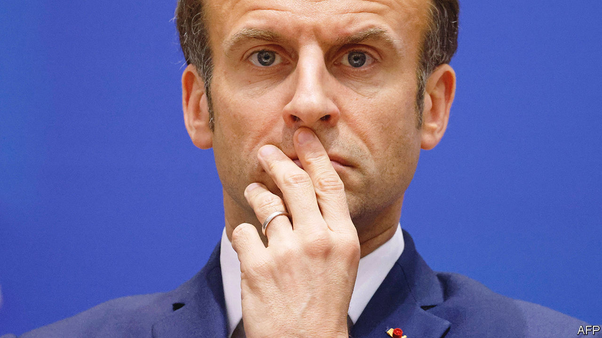
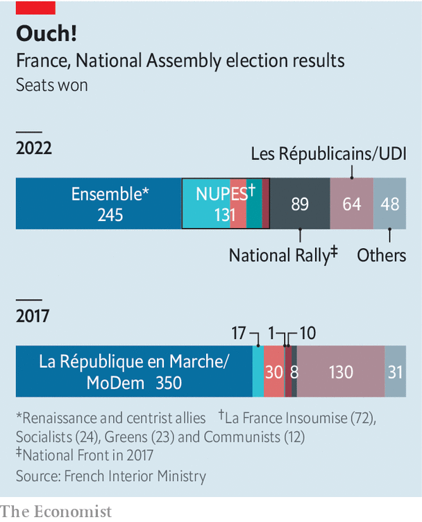

###### Jupiter in descent

# Emmanuel Macron loses his parliamentary majority 

##### France faces uncertainty and stagnation 

 

> Jun 19th 2022 

When charles de gaulle drafted the modern French constitution in 1958, he sought to end the parliamentary instability that had brought gridlock to the previous republic. By and large France has since turned into one of Europe’s most stable polities. Street theatrics are common. But general elections deliver clear results. Governments succeed each other promptly. Now, however, France looks to be heading for trouble after Emmanuel Macron’s centrist alliance, Ensemble, lost its . It was a disastrous election result for the president.

On June 19th, at the run-offs in the two-round general election, Ensemble won just 245 seats, 44 short of a majority and 105 fewer than Mr Macron and his allies had won in 2017. That leaves him weakened, and his top-down governing style impeded. Mr Macron now needs to work out how to lead in a country that has no experience of post-election coalition-building. France may learn to act more like consensus-minded Germany; but some worry it will end up more like bickering Belgium.

The result was worse than polls had predicted. Elisabeth Borne, the technocratic prime minister appointed in May, won a seat in Normandy. But some of Mr Macron’s closest allies lost theirs, including Richard Ferrand, the parliamentary speaker, and Christophe Castaner, leader of his parliamentary party. Three ministers were also spurned by voters, and resigned. “It’s a nightmare,” says one Ensemble deputy. 

 


Even in its shrunken state, Ensemble will remain the biggest party in parliament. But it now faces two big, feisty opposition blocks. On the left, , the New Popular Ecological and Social Union (nupes), secured a hefty 131 seats. The 70-year-old former Trotskyist stitched the grouping together for these elections, absorbing the Socialists, Communists and Greens. The result, he declared, was a “monumental slap in the face” for “”. 

This week a beaming Mr Mélenchon guided his new deputies through the National Assembly on his last day as a deputy, since he himself did not run for re-election. His group’s durability has yet to be tested. The parties disagree on much, from Europe and nato to nuclear energy. Already each constituent party has wriggled out of Mr Mélenchon’s grip to sit separately in parliament. But if they work together, they will have the clout to delay and in effect even block legislation.

On the populist-nationalist right, Marine Le Pen’s National Rally (rn) pulled off an even greater electoral coup. She secured her party’s best legislative result ever, winning 89 seats, a ten-fold increase on its tally in 2017. The rn won seats even in places where it has no base, such as rural constituencies in the Dordogne and Normandy. 

Ms Le Pen’s success marks the astonishing normalisation of her brand of politics. The old rule, by which voters of various stripes put aside their differences to back any candidate who could keep Ms Le Pen’s party out, is in shreds. Rather than take a stand against her, many voters stayed at home. Fully 24% of those who in the first round backed a nupes candidate who was then eliminated, voted for her party in the second. Mr Macron claimed that the election was about order (him) or chaos (the extremes). Voters ignored him. The rn won 53 of the 107 constituencies where it was in a run-off against Ensemble. rn now has a bigger parliamentary presence than the centre-right Republicans or any of the constituent parties that make up nupes. 

By denying Mr Macron a majority, voters sought to punish a president they re-elected but dislike, curbing his powers and forcing him to govern differently. His top-down presidency has helped to revive the economy, create jobs and protect firms and lives during the pandemic. Yet these policies did not win over enough voters. Many of them apparently resented the way Mr Macron’s muted campaign seemed to be taking victory for granted. His unilateral manner of governing also irks people. If Mr Macron cannot change, voters seemed to have been saying, they would simply have to force his hand. 

This week, after Mr Macron had consulted party leaders, he ruled out forming a government of national unity. But he has no simple alternatives. He could try to secure a pact, possibly with the Republicans, who won 61 seats. Some of the Republicans’ party members are in favour, but so far the leadership has refused. Or he may install a minority government, perhaps enlarged by new defections, and seek backing, bill by bill. This would be tough if he tries to raise the pension age, as he has promised, but easier if he wants to subsidise rising energy bills. France had a minority government in 1988-91, led by Michel Rocard. But its shortfall was only 14 seats. Even so, Rocard made use 28 times of a constitutional rule to bypass parliament, in effect; this procedure has since been curtailed.

For now, the president has refused to accept Ms Borne’s resignation. Yet the bruising times ahead argue for replacing her with a weightier figure. Bruno Le Maire, the finance minister and an ex-Republican, is one name circulating. Nobody, though, will find the new set-up easy. Mr Macron is pragmatic and a persuasive deal-maker, but not good at sharing power. Parliamentary culture is confrontational, theatrical and divisive. “We no longer have the political culture of compromise and consensus-building,” says Chloé Morin of the Fondation Jean-Jaurès. Clément Beaune, the Europe minister and a newly elected deputy, commented wryly that French voters have “handed us a flat pack, without an instruction manual”.

In the best-case scenario, the revival of parliamentarism could act as a healthy check on presidential fiat, and even a source of compromise. De Gaulle intended parliament to control the executive, not act as a rubber stamp. “The president needs to return to the role of arbiter, and not run everything himself,” says one of his deputies. This might even help to defuse the anger that spills on to the streets. “We are not necessarily heading for paralysis,” argues Roland Lescure, another Ensemble deputy; “But we will need to learn new habits.”

A more likely outcome is uncertainty and stagnation. Mr Macron’s government could face a vote of no-confidence as soon as July 5th. The constitution allows him to dissolve parliament and call new elections at any point. “It’s not in his nature to give up trying to do things,” says a close ally. The question is whether he can fight his instinct to do those things alone. ■

