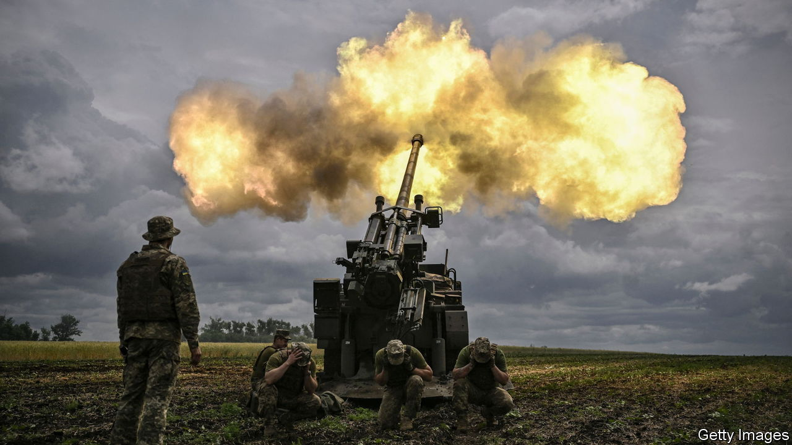
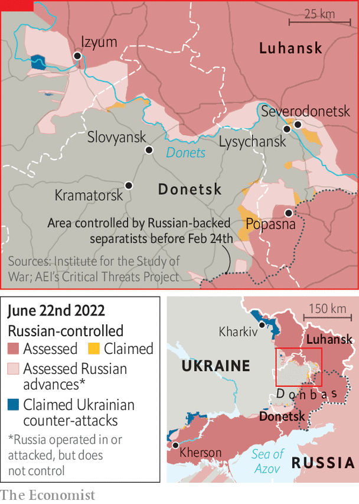
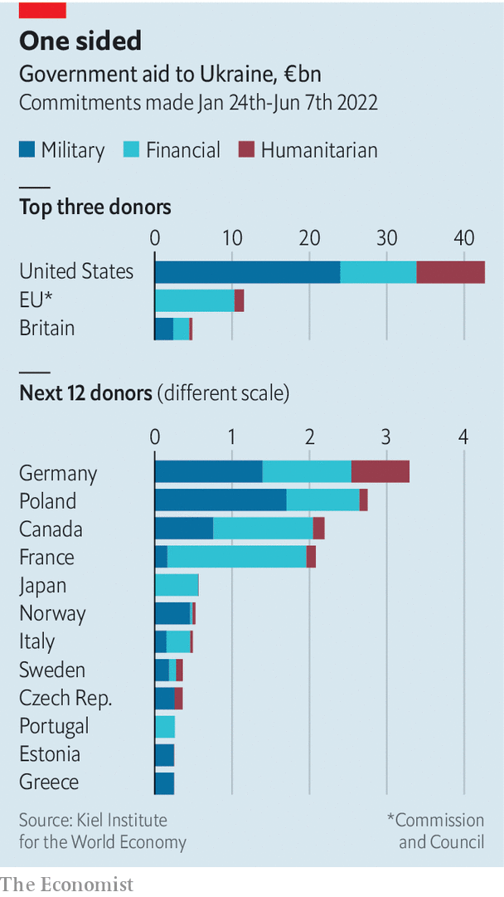

###### Running on empty

# Is the West supplying Ukraine with enough weapons? 

##### The answer depends, in part, on what the goal is 

 

> Jun 19th 2022 

When the leaders of France, Germany, Italy and Romania visited Kyiv on June 16th, they came bearing gifts. “We are doing everything so that Ukraine wins this war,” declared Emmanuel Macron, France’s president. He vowed to send six more  “in the coming weeks”, on top of the dozen delivered so far. Boris Johnson, Britain’s prime minister, popped up in Kyiv a day later and promised a big new military-training programme. And on June 21st a Ukrainian official said that the Panzerhaubitze 2000, a formidable German self-propelled howitzer, had arrived. 

Such help is desperately needed. In recent weeks Ukraine has made some gains in southern Kherson province, and on June 17th it sank a Russian vessel reinforcing Snake Island, a small Russian-occupied fortress in the Black Sea. But these are small consolations next to the steady gains that Russia’s army has made in the eastern Donbas region, where the fighting is concentrated. Russia now controls most of , a town that lies deep in a Ukrainian salient under attack from three sides, with resistance confined to an industrial zone in the west. The town can now be supplied only by river. Russian forces are also making gains west of Severodonetsk around Slovyansk, attacking the same salient from the north.

 


One reason for these setbacks is that Russia’s army is concentrating its forces and using them more methodically than it did in the first stage of the conflict—when it attacked along several different axes at the same time, dispensing with rudimentary principles of warfare. Russia also has a big advantage in raw firepower. On June 14th Anna Malyar, Ukraine’s deputy defence minister, said that Ukraine was firing 5,000-6,000 shells a day, one-tenth of Russia’s barrage. Mykhailo Podolyak, an adviser to Ukraine’s president, Volodymyr Zelensky, adds that in some places Ukraine’s artillery is outnumbered ten to one.

Russia is also using long-range rockets, which allow it to strike Ukrainian positions while remaining safe from retaliatory fire. Ukraine is largely out of ammunition for its own Soviet-era Smerch and Uragan rocket-launchers, which can fire much farther than conventional artillery. A recent video showed Ukrainian soldiers operating a diy rocket-launcher—an aircraft rocket pod strapped to a truck-towed trailer—revealing both ingenuity and scarcity.

 


Ukrainian casualties have reached . On June 9th Mr Podolyak said that 100-200 Ukrainian soldiers were dying a day, a figure that Mark Milley, America’s top general, described as “in the ballpark” of the Pentagon’s assessments. Ukraine’s call for more arms has thus reached a new intensity. “Today we have about 10% of what Ukraine has stated that we need,” complained Ms Malyar.

But more powerful weapons are in the pipeline. Around ten rocket-launchers—American himars and British mlrs—are due to arrive shortly, and the Biden administration is considering whether to send four more. These fire guided missiles with a range of up to 84km. Some Ukrainian crews have already been trained to use them in Germany, and more are being taught. General Milley said that the quality of these weapons would eventually show on the battlefield: “The Russians are just doing mass fires without necessarily achieving military effect…The Ukrainians, on the other hand, are using much better artillery techniques.” 

In public, at least, American and European leaders sound hawkish about sustaining this flow of arms. “We will stay focused on this for as long as it takes,” insisted Lloyd Austin, America’s defence secretary, in Brussels last week. “As long as necessary, until peace returns to a free and independent Ukraine, we will remain committed,” tweeted Mr Macron. In private, there are doubts. nato countries are clean out of the sort of ammunition needed by Ukraine’s Soviet-era weapons: “It’s gone already in three months,” says one European defence official. “It doesn’t exist any more.” The plan, to be formalised at a nato summit starting on June 28th, is to help Ukraine’s armed forces switch more fully to nato kit. That is a huge undertaking, and will take time.

Europe’s own stocks of munitions are low, and finding extra workers and components for complex weapons, like Javelin or Stinger anti-aircraft missiles, is hard. Moreover, as countries like Germany and Poland rearm at breakneck pace, demand will outstrip defence manufacturers’ capacity to produce. Shortly before his trip to Kyiv, Mr Macron warned that France had entered a “war economy in which I believe we will find ourselves for a long time”. The 18 caesars that France has sent or promised to Ukraine make up almost a quarter of the country’s entire stock.

America and its European allies have demonstrated extraordinary unity over nearly four months of war. Almost all want to see Ukraine emerge as a secure and sovereign state. But what that means in practice is not always clear, and seems to be shifting over time. In April Mr Austin said that America’s goal was to sap Russia’s strength: “We want to see Russia weakened to the degree that it can’t do the kinds of things that it has done in invading Ukraine.” At a gathering of defence ministers the next day he added, “Ukraine clearly believes that it can win, and so does everyone here.” Last week he was more circumspect, saying cryptically that America’s aim was a “democratic, independent, sovereign and prosperous Ukraine”. Twice America’s defence secretary was asked whether he still wanted Ukraine to win. Twice he ducked the question. ■


