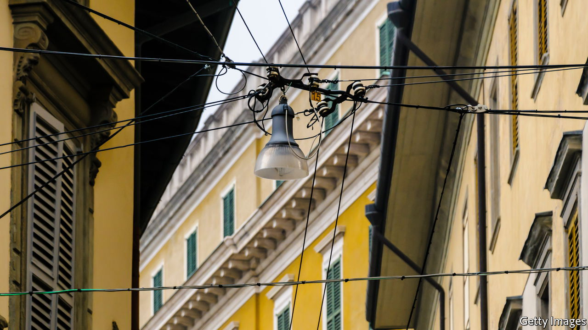

###### The Putin effect

# Italy is the latest victim of Ukraine-related divisions 

##### Public opinion does not support robust action 

 

> Jun 23rd 2022 

Among the least expected reactions to Russia’s invasion of Ukraine was Italy’s firm response. Under Mario Draghi, Italy has backed sanctions on Russia that are painful for its own economy and has supplied weapons to Ukraine—though exactly which, and how many, remains unclear.

That secrecy illustrates the political sensitivity of Mr Draghi’s resolve. The party in his broad coalition with the biggest parliamentary contingent is the anti-establishment Five Star Movement (m5s). It is splitting apart over Ukraine.

Averse to being dragged into a foreign conflict, the m5s contested earlier sanctions against Russia over its annexation of Crimea in 2014. Since March the Five Stars have been led by Giuseppe Conte. As the independent prime minister of a m5s coalition with the populist Northern League between 2018 and 2019, Mr Conte frequently cosied up to Vladimir Putin. And over recent weeks, he and most of his lawmakers have criticised arms shipments to Ukraine. A minority that notably includes the foreign minister, Luigi Di Maio, has continued to back the government’s line.

Matters came to a head this week as the parties in Mr Draghi’s broad coalition struggled to agree on a resolution to put to parliament ahead of the European summit on June 23rd and 24th. On June 19th the m5s’s executive publicly rebuked Mr Di Maio for his hawkish stance, and within two days the foreign minister’s supporters were preparing a breakaway parliamentary group. Their critics argue that Mr Di Maio’s real motivation is personal: remaining in the m5s would subject him and others to a rule that bars elected representatives from serving more than two terms.

One of Mr Di Maio’s followers said they were aiming to win over some 70 of the movement’s 227 lawmakers. Another said the name of the new group would be Together for the Future. The defections will have no immediate effect on the government’s stability. All the signs were that Mr Di Maio would stay in the cabinet and that his supporters would continue to back the government. But it remains to be seen whether Mr Conte will pull the rest of the Five Stars out of the governing majority in the months ahead.

Trailing in the polls, the m5s is a shadow of the party that took nearly a third of the vote at the election in 2018. But its division into mutually hostile camps would not necessarily be good news for the supporters of a firm line on Ukraine. Enrico Letta, the leader of the centre-left Democratic Party and a firm supporter of Mr Draghi, had been counting on a pact with the Five Stars to prevent Italy’s hard right from taking power at the next election. The rightist party with the most support, the Brothers of Italy, has a conventional pro-nato stance. But Matteo Salvini, the leader of the populist Northern League, has been altogether more ambiguous.

The election is due next year and, as it approaches, two linked factors will become increasingly significant. One is public opinion. A poll for the European Council on Foreign Relations found support for Ukraine weakest in Italy of all the ten countries surveyed: 27% of Italians blame America, the eu or Ukraine itself for the war. The second factor is the threat of gas shortages next winter. No sooner had Mr Draghi arrived in Kyiv with his French and German counterparts on June 16th than Italian energy firms began reporting a drop in supplies from Russia.

In 2020 Russia accounted for 43% of Italy’s gas imports. Germany buys even more of its gas from Russia (66%). But Italy relies on gas for a much higher proportion of its energy: 43% in 2020 compared with 27% in Germany. Mr Draghi and his ministers have scurried to Algeria, Angola, Congo-Brazzaville, Mozambique and most recently Israel to find replacement supplies. But only Algeria is linked by pipeline to Italy.

As the minister for ecological transition, Roberto Cingolani, told parliament on May 3rd, the government’s strategy depends on two things. It needs two floating regasification facilities to be brought into service by the start of 2023, and for Russia not to turn off the tap before the end of 2022. Neither is a given. ■

