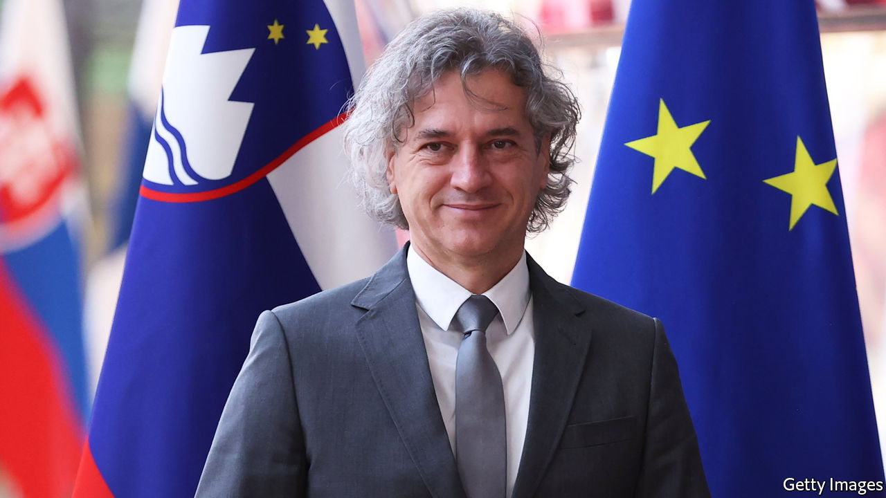

###### The turnaround

# With a pro-Orban prime minister gone, things are looking up in Slovenia 

##### A slide towards autocracy has stopped and the economy is roaring 

 

> Jun 23rd 2022 

“Karma is a bitch!” says Robert Golob, who assumed power as Slovenia’s new prime minster on June 1st. Slovenia’s greatest looming problem is reducing the country’s dependence on Russian gas and oil, and not many people in the country know more about energy than Mr Golob himself. With the news dominated by Ukraine, Slovenia’s election on April 24th failed to make much impression abroad. But the political demise of Janez Jansa, the former prime minister and an enthusiastic fan of Donald Trump and of Hungary’s Viktor Orban, marks an about-turn for the tiny country of 2.1m people. 

In the past few years Mr Jansa, who has been in and out of government since 1990, has railed against a supposed communist “deep state” and the media, both of which he said were out to get him. Like Mr Orban, he attacked his enemies as “puppets” of George Soros, a Hungarian-born billionaire and philanthropist. Like Hungary, Slovenia under Mr Jansa had been steadily moving in an autocratic direction. 

When he took over a small Green party in January Mr Golob was a relative unknown, despite dipping in and out of national politics for decades. Nonetheless his party won a whopping 34% of the vote in April. Along with his coalition partners, Mr Golob now commands a comfortable 53 of 90 seats in parliament. 

In his youth Mr Golob was a whitewater kayaking fan and competed in Yugoslav teams abroad. Now he laments he has no time to relax while he works to make sure that the “future is something to be joyous about and not to be afraid of”. In the meantime, he has to keep the lights on. His father did the same on a more modest scale as the manager of a hydropower plant. Mr Golob studied electrical engineering and for 17 years ran a successful energy company. Wrenching Slovenia away from its dependence on Russia for 30% of its oil imports and 90% of its gas will be hard, he says, but by no means impossible. 

Slovenia’s economy is now roaring back post-covid-19. Its gdp grew by 9.8% in the last quarter yer-on-year, although inflation is running at 8.1%. Tourists, who underpin around 10% of the economy, are back in force. Business is cautiously optimistic, though unnerved by the presence of a party called the Left in Mr Golob’s coalition. It wants lavish public spending. 

In terms of foreign policy the government plans not only to end the era of Orban-imitation, but also to make new friends. Tanja Fajon, the new foreign minister, was a member of the European parliament for almost 13 years and a journalist in Brussels for eight years before that. The era of alliances with Poland and Hungary despite their questionable commitment to European values is over, she says. The focus is now on France, Italy and Germany.

Where Slovenia can make a difference in influencing policy is in the western Balkans. Ms Fajon has long championed bringing the region into the eu, but a challenge looms which could lead to disagreements with the friends she hopes to make. Ms Fajon worries that making Ukraine an official candidate to join the eu will raise false hopes there. At the same time, she thinks it will suggest to countries in the western Balkans that accession rests on politics, rather than reform. As it is, the eu has lost credibility in the region owing to its sluggishness to act on its promises. This week she has been lobbying hard for a trade-off. Give Ukraine candidate status, she suggests, but also give it to Bosnia. Open long-delayed accession negotiations with North Macedonia and Albania, too, and let Kosovars travel to Europe’s Schengen zone without visas—something they were promised back in 2018. ■

