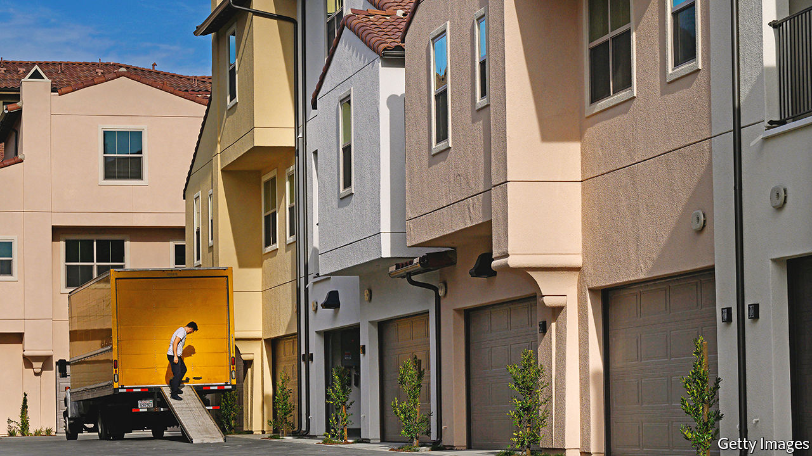
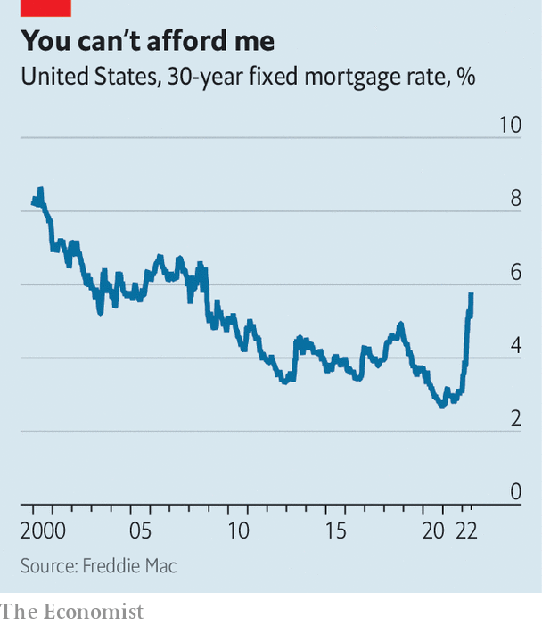

###### Move fast and break things

# Can the Fed pull off a controlled slowdown of the housing market? 

##### The events of the early 1980s might provide a guide 

 

> Jun 23rd 2022 

Estate agents are known for their sunny disposition. Lindsay Garcia, a realtor in Miami, is no exception. She talks about the city’s warm climate and low taxes, both of which have lured a wave of footloose outsiders. For much of the past two years agents enjoyed a bonanza. Buyers fought to outbid each other, waived property inspections and bought units sight unseen; many paid well over the asking price. Then mortgage rates began to climb this year, cooling the frenzy a little. Only houses that were newly renovated or ready to be moved into straight away received multiple offers, Ms Garcia says. Now a fresh spike in mortgage rates seems to have slammed the brakes on altogether.

On June 15th the Federal Reserve raised interest rates by 0.75 percentage points. Figures released a day later revealed that the benchmark 30-year fixed mortgage rate had hit 5.78%, an increase of more than half a percentage point over the week before. By June 17th, two of Ms Garcia’s colleagues had been rung up by buyers abruptly calling off deals because they could no longer afford them.

 


The plight of the would-be buyers illustrates just how swift and brutal the rise in interest rates has been, and how immediate its impact is on interest-sensitive sectors such as housing. In January mortgage rates were around 3%, only a little above their all-time low of 2.67%, reached during the pandemic. They have nearly doubled since (see chart); only in the 1980s was there a comparably rapid rise in interest rates. The increase has made houses even more unaffordable. In January a buyer with a deposit of $100,000 looking to spend $3,000 a month on housing could afford a home worth $815,000. Now they can afford one worth just $600,000. 

The prospect of a turn in the property market’s fortunes naturally calls to mind America’s housing crisis of 2007-09. But there are important differences between the two situations. Rising interest rates in the late 2000s revealed just how imprudent mortgage lending had been. By contrast, the median fico score—a measure of creditworthiness—for mortgages today is about 48 points higher than the pre-financial-crisis level of around 700. Household balance-sheets are robust, bolstered by pandemic stimulus, and in aggregate there has been far less borrowing for house purchases than in the early 2000s. The total value of mortgage debt is around 65% of household income, compared with nearly 100% in 2007.

Though it is possible that pockets of dodgy debt lurk in the shadows today, it seems less probable that rising rates will uncover systemic weaknesses in lending standards that could set off a vicious cycle of falling prices and foreclosures. Instead the problem of 2022 is house-price growth itself. “The type of acceleration in house prices that we’ve seen over the past two years is unprecedented,” says Enrique Martínez-García of the Dallas Fed. By the first quarter of the year the increase in American house prices over the previous two years, at 37%, was the fastest on record. 

That rapid growth is a problem for the Fed, argues Mr Martínez-García, because it feeds into rents, which in turn contribute to headline inflation. According to Redfin, a property platform, asking rents in May were 15% higher than in the same month last year. As new leases are signed, these will eventually add to consumer-price inflation. Indeed, rising housing costs already accounted for 40% of the monthly increase in the consumer-price index in May. “Cooling the housing market is almost a precondition to being able to tame inflation,” says Mr Martínez-García. A housing slowdown, then, will this time be engineered, rather than uncovered. 

The best possible outcome is that the Fed manages to slow the property market by enough to bring inflation under control, without overdoing it. The events of the early 1980s, when interest rates last climbed so quickly, illustrate what such a controlled slowdown might look like. Inflation soared to well above 10%, Paul Volcker had just been appointed chairman of the Fed, and the federal funds rate was briefly raised to an all-time high of about 20%. Property prices did fall sharply—but only in real terms. From 1979 to 1982 real house prices fell by nearly a fifth, even as prices in nominal terms rose by a tenth. More notably, housing transactions fell off a cliff. Existing-home sales peaked at 4m in 1978; four years later, only 2m homes were sold. 

Higher interest rates this time are indeed likely to hit transaction volumes first. That the initial consequence will be a fall in property sales, rather than a rise in financial distress among homeowners, can be partly explained by a quirk in the America’s mortgage market. 

In most countries borrowers are offered fixed interest rates for only two to five years; when that period ends, the rate floats in line with the central bank’s policy rate. But the existence of America’s government-sponsored housing agencies, most notably Fannie Mae and Freddie Mac, which were set up to incentivise home ownership, means that the vast majority of American mortgages are on a 30-year fixed rate. That makes would-be sellers increasingly reluctant to move and give up their cheap mortgages when rates go up. Buyers, meanwhile, can no longer afford the kind of house they want. Daryl Fairweather of Redfin therefore expects the market to go into a “cold period” of scant activity for the rest of the year. 

Things could easily get more complicated than they did in the 1980s, though, if the Fed is unable to act with enough precision to stabilise the market without causing prices to crash. The fact that housing has been so frothy makes the task harder. What has been remarkable about the past couple of years of price growth is that it has been so difficult to square with any of the “usual explanations”, such as millennial household formation or supply constraints, says Mr Martínez-García. Once those explanations have been ruled out, all that is left is “expectations”, such as the fear of missing out on ever being able to buy a house. Cooling a hot property market by just enough to quell inflation is one thing. Deflating a bubble without popping it is another. ■


