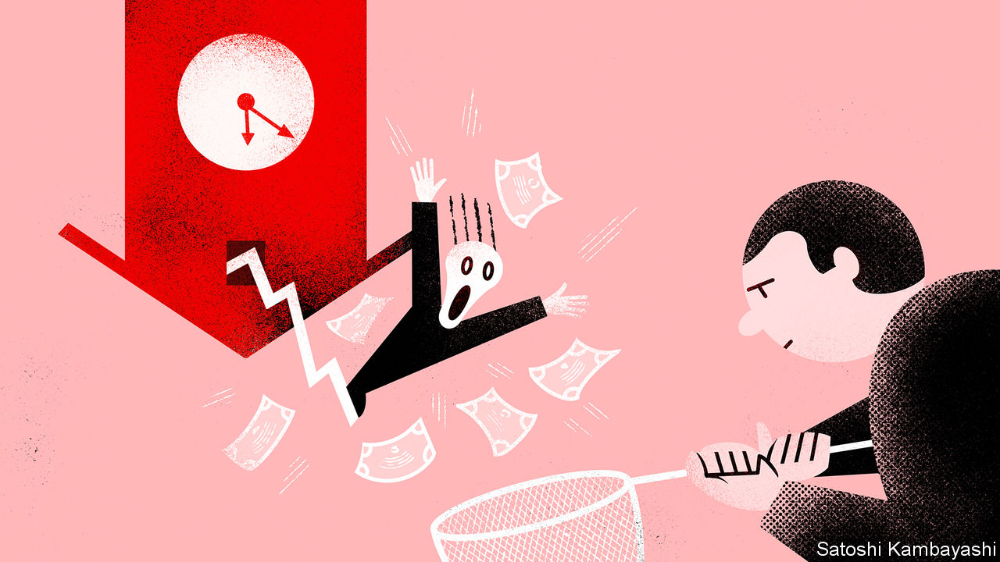
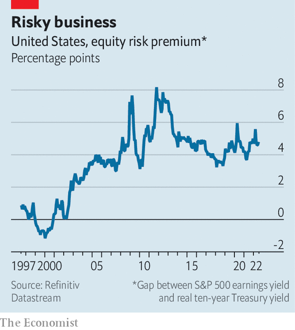

###### Buttonwood

# How attractively are shares now priced? 

##### What a key valuation measure says about buying the dip 

 

> Jun 21st 2022 

Everyone knows, or thinks they know, the advice of Warren Buffett to investors: that “they should try to be fearful when others are greedy, and greedy when others are fearful.” After  firmly into bear-market territory (defined as a fall of 20%-plus from a recent peak) in June, some will be starting to wonder whether there is enough fear in the air to warrant their being greedy. 

How attractively are shares now priced? One approach is to use the equity risk premium as a guide. A rough-and-ready version of it suggests that it is not obviously a time for would-be Buffetts to swoop in. Equities are not (yet) priced at fearful levels. An opportunity for greed may yet arise. But the circumstances will be such that only the steeliest of investors can take advantage.

Start with some definitions. Stocks are riskier than bonds. Owning shares should come with a higher reward for bearing the additional uncertainty about returns. This reward is the equity risk premium. Historically the premium has been handsome, particularly in America. Between 1900 and 2021 the excess real return of stocks over bonds in America was 4.7% a year, on average, according to the Credit Suisse , compiled by Elroy Dimson, Paul Marsh and Mike Staunton, three academics.

That is nice to know. But what investors care about is prospective returns. Yields to redemption are the obvious measure of the expected returns on bonds. The higher the yield, the greater the expected return. By a similar logic, the earnings yield (ie, the inverse of the share-price-to-earnings ratio) is a decent guide to expected return on equities. The gap between the earnings yield and long-term bond yields provides a forward-looking measure of the equity risk premium for long-horizon investors. The higher this premium, the keener investors should be to buy stocks over bonds.

 


The chart shows a crude measure of the equity risk premium: the excess of the earnings yield on the s&amp;p 500 index of shares over the yield on ten-year inflation-protected Treasuries. The latter yield is a gauge of long-term real interest rates and so is a proxy for prospective risk-free returns for a long-term investor. The risk premium varies over time, because people’s risk appetite varies with the circumstances. During the dotcom boom of the late 1990s, for instance, the equity risk premium was negative. Another salient feature is the severe spikes in the premium during periods of extreme stress, such as during the Great Recession in 2008-09 and the euro-zone crisis in 2011-12.

The current reading is broadly in line with the average over the past two decades. It is also little changed from the start of the year. A couple of implications follow from this. First, the bear market has been largely warranted by the sharp rise in expected interest rates now embedded in real bond yields. Share prices have fallen, but the equity risk premium has been broadly constant. You might say that not much has changed with regard to the attractiveness of American shares. That would not be quite right. It would be truer to say that equity prices are now based on more realistic expectations of future interest rates.

A second implication is that equity investors are not especially fearful—or, at least, their worst fears are not reflected in share prices. For now recession is a forecast. It is not yet a reality. History suggests that in recessions American share prices fall even more sharply than they have this year. Panic usually sets in. And a panic is often a good buying opportunity. Should such an opportunity arise again, though, do not imagine that it would be easy to take advantage of. It takes nerve to buy when markets are plunging. You can always convince yourself that an even better opportunity is around the corner. Delay always seems advisable. And delay often ends up meaning not making a decision at all. The opportunity is missed. 

Readers may sense a familiar conclusion coming: that market timing is a snare. In this regard, it is worth thinking about Mr Buffett’s quote in full. It is only “if they [investors] insist on trying to time their participation in equities”, he said, that they should try to be greedy when others are fearful. Mr Buffett was cautioning against a “start-and-stop” approach to the stockmarket, which often leads to investors missing out on returns. There are worse times to buy stocks than after a big fall. But for most temperaments, buying and holding for the long haul is usually the best policy.


