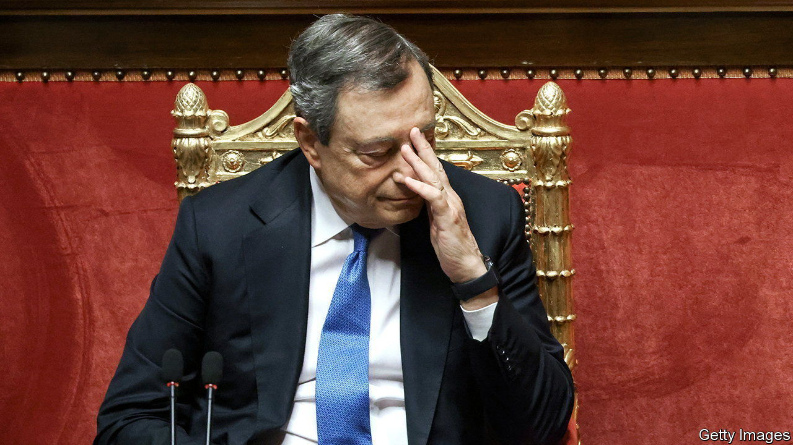
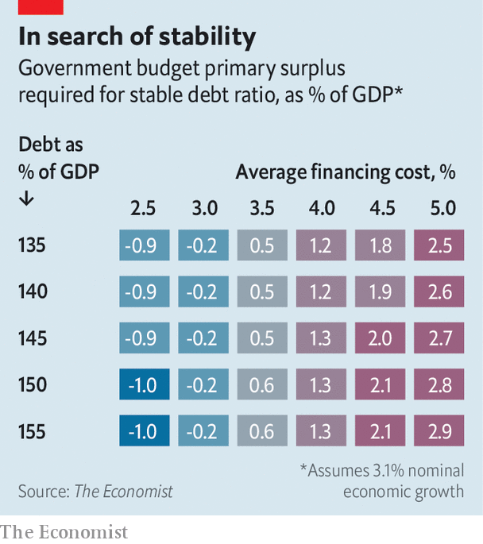

###### Whenever it breaks

# How inflation and interest rates might affect Italy’s budget 

##### Tighter monetary policy could make Italy’s debts harder to pay 

 

> Jun 23rd 2022 

Before the pandemic it was a cause for excitement among economists that the real interest rate governments paid on their debts had fallen below the rate of economic growth in most rich countries, allowing governments to spend more freely and worry less about running up debts. But central banks’ battle with inflation today threatens to turn that relationship on its head, making the fiscal position of indebted governments more perilous.

When interest rates are below growth rates, governments can run primary budget deficits (that is, deficits before interest payments are taken into account) without the debt-to-gdp ratio necessarily rising. But when rates exceed economic growth, primary surpluses are the only way to keep indebtedness stable. The higher the starting debt, the more belt-tightening needed.

Fortunately, inflation reduces the real interest rate, and so most countries will gain a fiscal windfall this year. Some of their debt, in other words, will be inflated away. But if central banks successfully bring inflation down, and if high interest rates endure, things could get more painful. The picture looks especially worrying in Italy. The euro zone’s third-largest economy had net public debt worth nearly 140% of gdp last year. Its government currently pays about 3.5% to borrow for ten years.

 


Precisely where Italy’s indebtedness and borrowing costs will settle after the energy crisis is uncertain. Our table shows a range of combinations for debt and financing costs, and what they would imply for the country’s budget were growth to match the average imf forecast during 2022-27, and were inflation to fall to the European Central Bank’s target of 2%. In reality, the average tenor of outstanding Italian debt is nearly eight years, so it would take time for its average financing cost to rise to the levels shown on the right-hand side of the table.

At financing costs of 3% or below, Italy can run small primary deficits and still outgrow its debt. (The table also shows one weird effect of growth exceeding interest rates: that debt stability is easier to achieve when starting debts are higher.) As interest rates rise, however, stability requires primary surpluses of 2% or more. The only time Italy has run so tight a budget since the global financial crisis was in 2012, at the height of European austerity.


