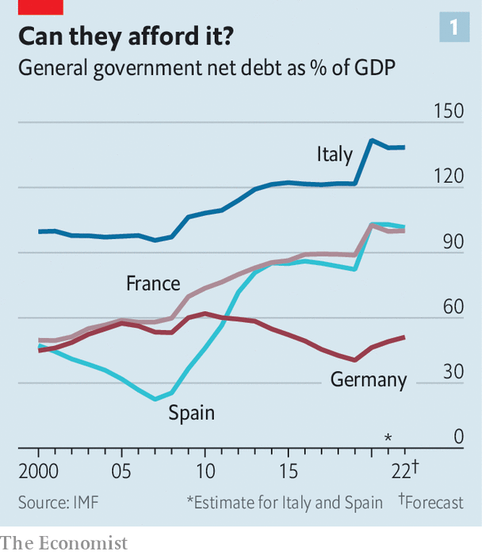
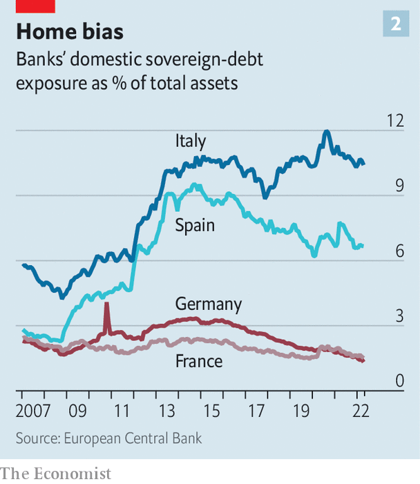

###### Thrown for a loop

# Is the euro zone’s doom loop still to be feared? 

##### Some reforms have weakened its force, but they have not eliminated it altogether 

 

> Jun 23rd 2022 

Those old enough to remember the euro zone’s economic crisis of a decade ago may have felt a shiver of  on June 15th, when the European Central Bank (ecb) called an emergency meeting to discuss the widening spreads between member countries’ government-bond yields. It is nearly exactly a decade ago that, as yields soared, Mario Draghi, then the president of the ecb, promised to do whatever it took to preserve the single currency. 

In both instances, bond spreads began to narrow after the central bank intervened. Today the ecb is considering an “anti-fragmentation” tool to lower spreads, say by buying the bonds of weaker countries (provided they meet certain conditions). Nonetheless, worries that the currency union might start to look shaky remain in the air. The fiscal position of Italy in particular, which last year had net public debt in the region of 140% of gdp, is preoccupying investors. Should interest rates rise much more, financial markets might start to doubt . 

 


One dangerous feature of the previous crisis was the infamous “doom loop” that connected banks and sovereigns. Crudely put, euro-area banks were loaded up with home sovereign debt. When fears of sovereign default intensified, banks’ balance-sheets crumbled, which then required them to be propped up by an already wobbly state. As banks cut lending, the real economy weakened, further worsening the public finances. How much of a worry is this doom loop today? A consideration of the various links in the chain suggests it is less fearsome—but that the monster has not been slain. 

Start with banks’ exposure to their home sovereigns. After the global financial crisis in 2007-09, banks in southern European countries started to buy large amounts of bonds issued by their home government (which banking regulators consider to be risk-free, meaning that banks do not need to fund their holdings of them with capital). Spanish lenders increased their holdings of national government bonds from around 2% of total assets in 2009 to more than 9% by 2015; Italian banks increased their holdings of home sovereign debt from 4% to nearly 11% over the same period. 

Banks in most big euro-area countries have since reduced their exposures to their home sovereign. Strikingly, the boss of one of the bloc’s big lenders says that it no longer has any exposure to any euro-area sovereign debt. But Italian banks are the big exception. They remain just as exposed to their government’s debt as they were a decade ago. In Italy, at least, this part of the doom loop is alive and kicking. 

What about governments’ exposure to collapsing banks? Severing this bit of the feedback loop has certainly been an important aim of policymakers. The eu’s banking union—which sought to set up a system of common supervision, resolution and deposit insurance—was born nearly a decade ago. The idea was to make banks more European, and rescuing them less of a national affair. The problem, however, is that the task is only half done. 

The ecb has been in charge of supervising banks since 2014. That, together with regulatory changes that have forced banks to fund lending with more capital, have made it more likely that troubled lenders can be restructured, meaning that sovereigns are less exposed to the risks stemming from collapsing banks than they used to be. But the European resolution of banks remains incomplete, and common deposit insurance has not been set up at all. All told, “the safety-net for banks and deposits remains predominantly national, and the exposure of banks to sovereigns has not been solved,” concludes Nicolas Veron of Bruegel, a think-tank in Brussels. 

If governments’ sensitivity to failing banks is somewhat lower than it used to be, what about the economy’s exposure to zombie lenders? Europe remains largely bank-based, with capital markets playing a minor role in financing firms. It helps at least that banks are less stuffed with non-performing loans than they used to be, and are in better shape overall. But a hit to a national banking system could still impair its ability to lend to firms and households, unless they find other sources of finance. 

 


In 2015 the European Commission launched a plan to bolster Europe’s capital markets. But little progress has been made. Most indicators that measure the size of capital markets, and the degree to which they are integrated, have moved sideways. The main problem, say observers, is that national politicians have not fully committed themselves to the difficult work of harmonising rules across countries. 

Regulation aside, there have been two big improvements within the euro zone that will help weaken the doom loop. The first is on fiscal policy. Without transfers between member states, a national economy will always suffer when its government is forced to cut spending. A sovereign under financial stress may have to cut benefits or raise taxes precisely when the economy is weak. That in turn lowers tax revenues, worsening the fiscal position. From the start of the euro area’s crisis in 2010 until about 2014, countries painfully shrank their deficits, hurting economic growth. It was only when interest rates came down and austerity was eased that the economy began to recover. 

The covid-19 pandemic has led to more fiscal integration. The eu’s recovery fund, financed by commonly issued debt, will spend about €750bn ($790bn) over the next five years, with more money going to support investment in the weakest economies. Such a mechanism of fiscal transfers, if repeated, could make the sovereign-to-economy loop less severe in the future. The second big improvement is political. Few politicians are agitating for their countries to leave the euro, which in turn means investors are not getting jittery about euro exit and debt default.

About a decade ago, policymakers in the euro zone started off with bold plans to eliminate the doom loop. Some of those have come to fruition. But the overall picture is mixed. With a recession looming and interest rates rising, that might not be good enough. ■


