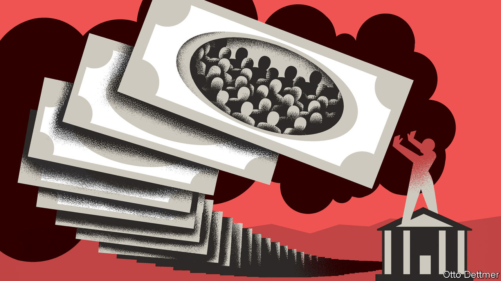
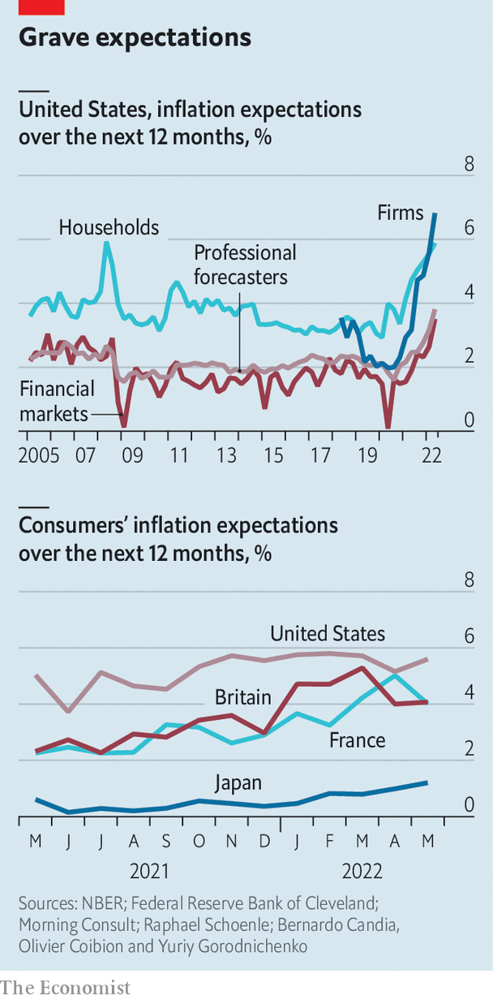

###### Free exchange

# People’s inflation expectations are rising—and will be hard to bring down 

##### Our first in a series on the central-bank pivot 

 

> Jun 19th 2022 

Consumer prices across the rich world are rising by more than 9% year on year, the highest rate since the 1980s. Worryingly, there is growing evidence that the public is starting to expect consistently high inflation. Figures suggesting that Americans’ medium-term expectations of inflation had risen helped set off the , which culminated in the  by three-quarters of a percentage point. Central banks urgently need to convince people that they are serious about getting inflation down. But a range of evidence suggests that changing the public’s mind could be extraordinarily difficult. 

 


The difference in views of expert and lay groups has become gaping. Bernardo Candia, Olivier Coibion and Yuriy Gorodnichenko, three economists, look at the  of four groups in America. Those of professional forecasters and financial markets remain close to the Fed’s target of 2%. But consumers’ beliefs increasingly do not. They expect prices to rise by more than 5% over the next year. Firms, exposed to surging commodity, wage and other input costs, expect higher inflation still. 

Expectations are rising outside America, too. A dataset put together by the Cleveland Fed, Morning Consult, a consultancy, and Raphael Schoenle of Brandeis University gauges public inflation expectations in various places. In May 2021 respondents in the median rich country thought inflation over the next year would be 2.3%. Now they expect a rate of 4.2%. 

Central banks face a problem in getting these expectations down again. This is because few people, aside from investors and financial journalists, pay much notice to what they say. A new paper by Alan Blinder of Princeton University and colleagues puts it more drily: “Households and firms have a low desire to be informed about monetary policy.” A survey in 2014 found that only a quarter of Americans could pick out Janet Yellen as the then-chairwoman of the Fed, from a list of four. Two-fifths of Americans believe that the Fed’s inflation target exceeds 10%. Small wonder that the impact of its policy announcements on inflation expectations is “muted”, according to a recent study by Fiorella De Fiore of the Bank for International Settlements, and colleagues. 

Nor are Americans alone. In the late 2000s researchers at the Bank of Italy assessed whether people knew what inflation was. Many had only a fuzzy understanding—with half of respondents confusing price changes with price levels. In recent years Japan has implemented forceful monetary easing in order to boost inflation. But in 2021 more than 40% of Japanese people had “never heard” of the plan, according to an official survey. 

In the years before the pandemic, public apathy to monetary policy did not much matter. Inflation was low and stable. Now it matters a lot. Spiralling expectations could become embedded in wages and prices, pushing headline inflation higher still. Central bankers’ conventional toolkits may do little to bring them down. Even the effect of raising interest rates is not totally clear: twice as many Americans believe that higher rates raise inflation than reduce it, according to a recent /YouGov poll. 

What more can be done? History points to several options. One is to make drastic or unexpected announcements. This could involve raising interest rates outside of scheduled meetings—a decision taken by India’s central bank in May. The European Central Bank (ecb) has used this trick in pursuit of another goal: keeping down government-bond spreads, which would otherwise threaten a debt crisis. In 2012 Mario Draghi, then the head of the bank, made an impromptu promise to do “whatever it takes” to save the euro. According to research by Michael Ehrmann of the ecb and Alena Wabitsch of Oxford University, the words generated high traffic on Twitter among non-experts, suggesting they had cut through. The genius of the statement, other research suggests, was that it focused on the end (“preserve the euro”) rather than the means (“buying bonds”), which is easier for the public to understand. The ecb has tried to repeat the trick more recently, such as by calling an emergency meeting to address widening spreads. 

Others have played the long game. Paul Volcker, the Fed’s chairman from 1979 to 1987, cultivated a reputation as what economists call an inflation “nutter”: someone willing to tolerate high unemployment to defeat the beast. The public eventually got the message. A recent paper by Jonathon Hazell of the London School of Economics and others argues that post-Volcker “shifts in beliefs about the long-run monetary regime” proved more important than any other factor in conquering inflation before covid-19. Andrew Bailey, the head of the Bank of England, has been trying to embrace his inner Volcker, such as by giving Britons the impression that he cares more about inflation than he does their wages. 

Public enemy number one

Another solution is for politicians to get involved. This has potential drawbacks, because they often advocate crackpot anti-inflation schemes such as price controls. Still, they might be able to help. After all, 37% of Americans believe that the president has “a lot” of control over inflation, compared with 34% for the Fed. Jimmy Carter’s appointment of Volcker in 1979 showed that he was serious about getting inflation down. In Britain, Margaret Thatcher and her henchmen talked tough on price stability; their willingness to slash government budgets probably backed up those words, by cooling the economy. Today in America, President Joe Biden says that “fighting inflation” is his “top economic priority” (though he shows less inclination to tighten fiscal policy). 

Public apathy towards central banking may be a backhanded compliment to the policymakers of the 1980s and 1990s. No one needed to care about inflation when it was low. Today’s policymakers are constrained by that very success. To get inflation expectations back down, then, they may need to try everything in their power to get people to sit up and listen. ■


