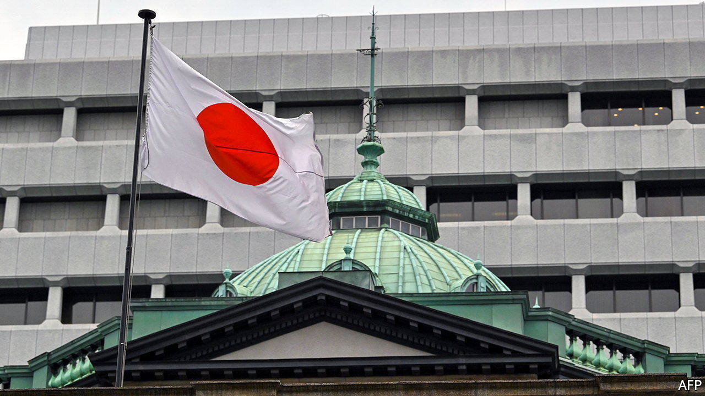
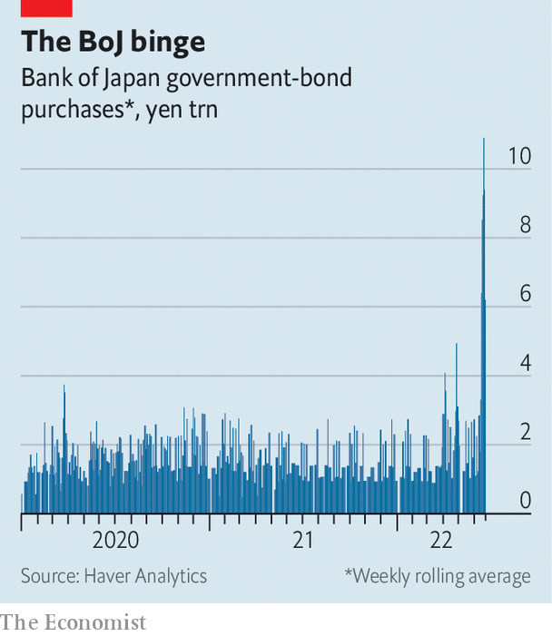

###### Last man standing

# The Bank of Japan v the markets 

##### Investors are testing the central bank’s promise to keep yields low 

 

> Jun 23rd 2022 

Thirty years ago, Britain’s snap decision to withdraw from the European Exchange Rate Mechanism made George Soros, a hedge-fund titan, more than $1bn from his short positions against sterling. Hedge funds may not be the financial giants they were in 1992, but some speculators still aspire to “break the bank”, to borrow the phrase used to describe Mr Soros’s bet. This time, it is not the Bank of England but the Bank of Japan that the would-be bank-breakers have their eyes on.

The boj stands out like a sore thumb in the world of monetary policy. While the Federal Reserve, the European Central Bank and the Bank of England are rushing to combat inflation by reversing asset-purchase schemes and raising interest rates, the boj is sticking to its guns. After a meeting on June 17th it left its policy of “yield-curve control”, intended to keep yields on ten-year Japanese government bonds at around 0%, firmly in place. As the gulf between Japanese and rising American bond yields has widened, the yen has plunged: by 15% this year so far, to its lowest level against the dollar since the late 1990s.

 


The boj adopted yield-curve control in 2016 as a way to maintain monetary stimulus, while slowing down the frenetic purchases of Japanese government bonds that it had been undertaking since 2013 to boost inflation. For most of the time its yield cap has been in place, the mere promise to buy more bonds if anyone tested its resolve was enough to keep a lid on yields. More recently, however, that commitment has itself been tested. In the five days to June 20th the central bank was forced to buy government bonds worth ¥10.9trn ($81bn) as it sought to suppress yields. By contrast, between 2015 and 2021 it never bought more than ¥4trn in a five-day period.

Some investors are betting that the boj will eventually be forced to alter, or even abandon, its target. BlueBay Asset Management, an investment firm with more than $127bn in assets as of September 2021, is short-selling Japanese government debt. Mark Dowding, the firm’s chief investment officer, has called the central bank’s position “untenable”. Volatility in the typically calm Japanese government-bond market has surged to its highest level in more than a decade.

 The investors betting against the boj might be taking hope from moments when central banks abandoned similar commitments. Late last year the Reserve Bank of Australia’s yield-curve control policy, which targeted three-year Australian government bonds, collapsed spectacularly as yields surged and the central bank failed to defend its target. The Swiss National Bank insisted it would not break its currency peg to the euro in the months leading up to January 2015, before doing precisely that. 

So far, however, neither Japan’s economy nor the central bank’s internal dynamics hint that a change in policy is coming. Inflation has risen, but not exploded as in other parts of the world; consumer prices rose by 2.5% in the year to April, compared with 8.3% in America. Excluding fresh food and energy, Japanese prices are still up by less than 1% year-on-year, and wages by less than 2%. There is little sign of domestically generated price growth.

The weak yen, meanwhile, has a mixed effect. It drives up imported inflation and magnifies the effect of rising dollar-denominated oil prices. But after many years in which Japan’s price level has barely budged, a shallow increase does not seem an urgent threat. Even with all these external shocks, inflation is barely above the central bank’s target of 2%. Rapid moves in the currency make planning difficult for businesses, but a weaker exchange rate benefits many exporters of manufactured goods, as well as the holders of Japan’s ¥1.2 quadrillion in overseas assets, which have gone up in yen terms.

Nor does the mood within the boj so far hint at a coming change in policy. The central bank still has several monetary doves in its roosts. Kataoka Goushi was the sole board member to vote against holding policy unchanged in June, but because he wanted even more stimulus, not less. In early June Wakatabe Masazumi, the bank’s deputy governor, said that monetary easing should be pursued to maintain wage growth. And Kuroda Haruhiko, the governor of the boj, is a longtime advocate of monetary stimulus to revive Japan’s sluggish economic growth.

Mr Kuroda is now into the final year of his term. His replacement may well be Amamiya Masayoshi, another deputy governor, who is so entrenched in the institution that he is known as “Mr boj”. Mr Amamiya has sometimes been seen as more hawkish than Mr Kuroda. But in his most recent comments on monetary policy, in mid-May, he spoke in favour of continuing current policy without reservations. Barring a change to the domestic picture, or a groundswell of hawkish sentiment within the boj, investors expecting a u-turn are likely to be disappointed. ■


