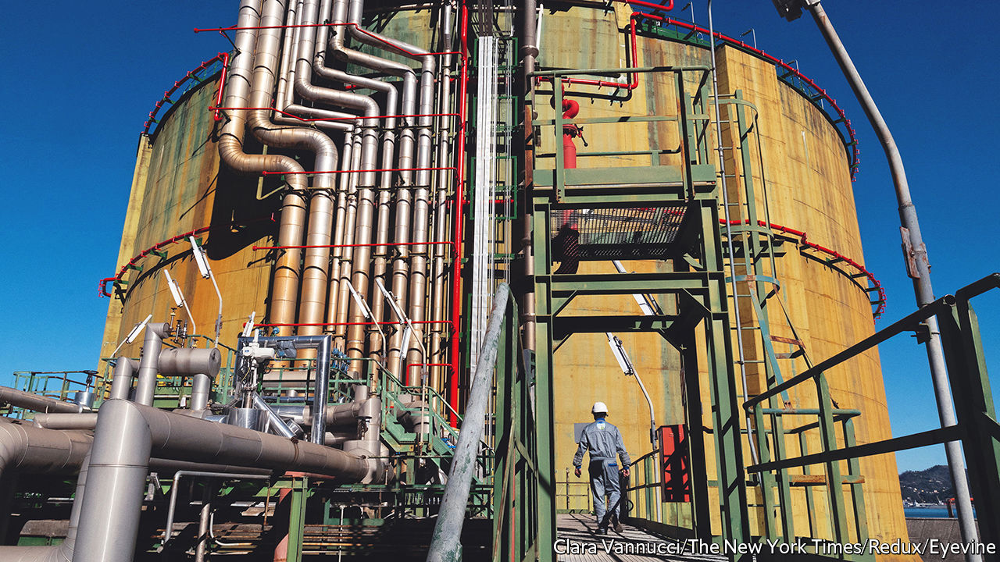

###### Green finance

# The rights and wrongs of investing in natural gas 

##### Should multilateral development banks finance gas projects? 

 

> Jun 23rd 2022 

Can natural gas ever be a “green” investment? Burning any fossil fuel inevitably makes the planet warmer. Yet switching power stations to gas from more carbon-intensive coal has helped countries cut their total emissions in the past. Environmentalists counter that global temperatures have risen so much that all fossil-fuel use needs to be ended as quickly as possible if the world is to meet the targets laid out in the Paris agreement to limit global warming to “well below 2°c”.

European institutions cannot agree on the question among themselves. The European Commission’s proposal for a “green taxonomy”, a classification scheme that aims to guide sustainability-minded investors, says the fuel can count as green provided it acts as a “bridge” to more renewable sources. The European Investment Bank (eib), the eu’s state-backed lender, by contrast, has virtually ruled out investing in natural gas as inconsistent with its climate commitments. 

The eib is not alone. Multilateral development banks (mdbs) that channel money from rich countries towards worthy projects, such as the World Bank and the Asian Development Bank, have in general turned away from financing natural gas. In 2018 they signed a joint statement saying they would align their lending with the Paris goals, giving them limited scope to invest in the fuel. 

Few mdbs lent as much to gas projects as the eib did before it said in 2019 that it would start phasing out such investment. Researchers at Boston University calculate that the eib provided more than half of the $63.7bn invested by mdbs in natural gas between 2008 and 2021, mostly for transmission and storage. (That is a tiny fraction of the total amount invested in energy worldwide, but mdbs argue they help catalyse private investment.)

The return of coal provides the case for restarting spending on gas. Eager to move away from imported gas from Russia, on June 19th the German government announced it was restarting some previously mothballed coal power plants. Investing more in Europe’s gas infrastructure—such as pipelines, terminals for liquefied natural gas (lng) imports and storage facilities—could alleviate a shortage of natural gas and keep the continent from having to switch on such plants. At present, bottlenecks prevent lng imports moving from the continent’s terminals, which are mostly in the west, to the eastern and central European countries that need to swiftly wean themselves off piped Russian gas.

What does the tension between the commission’s vision of “green” and the eib’s thinking mean for increasing investment in gas? Some think the implications are limited. If there is indeed a business case for gas in Europe, then the private sector could simply finance it, says Sonia Dunlop of e3g, a think-tank. Scarce public money should be used elsewhere.

But the disagreement over the question of investing in gas hints at a deeper problem. Whether it is deemed green or not, gas is an increasingly unattractive investment, the high prices for the fuel after Russia’s invasion of Ukraine notwithstanding. Both private and mdb investors worry that gas infrastructure could end up “stranded” as regulatory changes or technological improvements render them unprofitable. mdbs that lend to poor countries are worried that such investments might leave taxpayers saddled with debts for worthless assets. Even the commission’s taxonomy classes the fuel as “green” only until 2030. And as long as everyone agrees that gas is dirty in the long term, there is little incentive to invest today. ■


