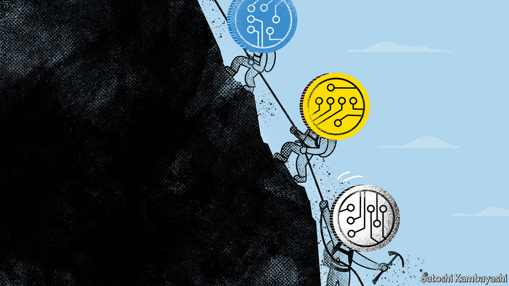

###### Blockchain reaction

# Three mechanisms for crypto contagion 

##### How to make sense of bitcoin’s plight 

 

> Jun 23rd 2022 

This year’s Juneteenth holiday in America gave crypto buffs little time to reflect or rejoice. On June 18th bitcoin reached a low of $17,600—its first tumble below $20,000 since 2020—before recovering a little the next day. The sell-off sparked over $1bn in liquidations, as traders who had borrowed money to make big bets failed to post more collateral. 

Overall, bitcoin is about 70% below its peak in November; ether, another cryptocurrency, is down by around 80%. As prices have fallen, cracks have appeared in the crypto infrastructure. Babel Finance and Celsius, two crypto lenders, have paused withdrawals after struggling to meet redemptions; their rivals have trimmed their balance-sheets, causing a credit crunch. Third Arrow, a crypto hedge fund, has failed to meet margin calls, and Hoo, an exchange, has halted transactions. 

The risk of a fresh downward spiral remains. Traders that were not wiped out have managed to post more collateral with decentralised-finance (DeFi) lenders; the level at which margin calls are triggered briefly dipped. But data from Parsec Finance, an app, suggest that the threshold has risen again to nearly $900 a coin for ether, from $700 on June 20th (at the time of writing, the price of ether was $1,100). Recent events have also shown how three weaknesses in crypto can amplify trouble: fuzzy valuations, incestuous relationships and the lack of a liquidity backstop. 

Start with valuations. Some of the most commonly traded crypto tokens are complex products such as derivatives and “tokens” issued by DeFi platforms, for which there are no established valuation models. The lack of an anchor means trust in pricing can vanish in a jiffy; the effect is magnified on weekends, when trading volumes are thinner. Problems in parts of the crypto market can end up rippling outwards, not least to bitcoin, the benchmark for the entire universe. 

A second channel of contagion comes from the high degree of interconnectedness between DeFi platforms. This is partly the result of intensifying competition. The amount of money invested in DeFi, after a period of explosive growth, has fallen over the past year. As crypto lenders have vied to attract a shrinking pile of dollars, they have promised ever-higher yields to depositors, which, in turn, has led them to invest users’ funds in riskier projects—typically other lending and yield-generating platforms. When the price of one asset falls, the effects cascade through the system. 

Celsius is a case in point. In December it claimed to have $24bn in crypto assets under management, which it had lured by offering yields to depositors of as much as 18%. To achieve those returns, it made loans to marketmakers, hedge funds and DeFi projects. When prices sank, however, so did the value of those assets. Some, such as the $400m Celsius held in “staked ether”, a derivative, proved illiquid. That left the firm unable to meet growing demand for withdrawals. When Celsius eventually froze funds on June 14th, bitcoin sank by 25%, partly on fears of contagion.

These goings-on revealed a third weakness: the lack of a liquidity backstop to prevent a free-fall in asset prices. In mainstream finance, regulators provide a safety-net. But no institution exists to mop up stressed crypto assets of systemic importance (at least to the crypto system), such as stablecoins, or to bail out important firms. Deposits with crypto lenders are not insured. In conventional finance, such fail-safes reduce the risk of panic-selling when prices tumble. 

Were bitcoin to drop below $15,000, liquidations could accelerate so much that posting enough collateral or raising funds to stop the fall may become hard, say Monsur Hussain and Alastair Sewell of Fitch, a rating agency. But it would probably take a trigger for that to happen: a huge hack at an exchange, say, or a big economic surprise. And time seems to be on crypto’s side. Crypto platforms, and the risks they take with their assets, may soon come under regulatory scrutiny. Some stablecoins are trying to build sounder reserves: Tether, the issuer of the world’s largest such coin, has said it plans to replace its holdings of commercial paper with safer Treasuries. Some of the makings of a frosty crypto winter, though, are still in place. ■


