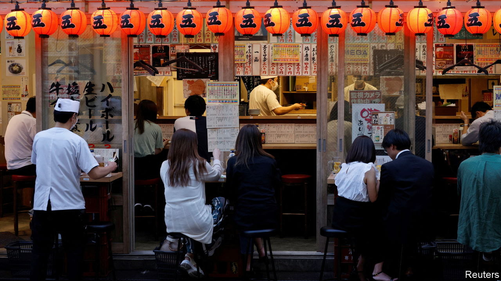
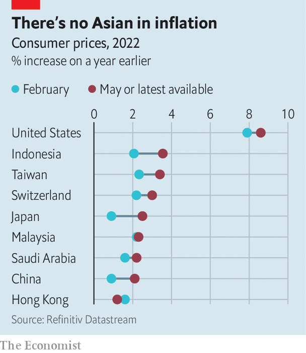

###### Islands of price stability

# Why is inflation relatively low in some places? 

##### We identify the large economies where inflation trails behind that in the West 

 

> Jun 20th 2022 

Faced with public uproar about the cost of living, policymakers like to point out that rising prices are a global phenomenon. “Every country in the world is getting a big bite and piece of this inflation,” said President Joe Biden on June 10th, after America reported its  (consumer prices rose by 8.6% in May, compared with a year earlier).

It is true that the cost of fuel, fertiliser and grains  after Russia invaded Ukraine in February. But not everywhere has its mouth full of inflation. Of the 42 big economies featured in the  of , eight still have inflation below 4%. Six of those eight are in East or South-East Asia (see chart). The region also includes some smaller oases of price stability, such as Vietnam (where inflation was 2.9% in the year to May) and Macau (1.1% in the year to April).

 


What accounts for this Eastern exceptionalism? Japan has long suffered from too-low inflation, although rising commodity prices have pushed the headline rate . Elsewhere, part of the explanation lies in the spread of two diseases. An  from 2018 to 2021 devastated the pig population in China, where as many as 200m pigs were culled, according to some estimates. This dramatically increased the price of pork, a staple food in East Asia. The price has subsequently fallen back sharply. In mainland China, for example, the price of pork fell by more than 21% in the year to May. This helped offset inflationary pressures elsewhere in the economy. (It also helps that East Asia, unlike other parts of the world, eats more rice than wheat. The price of rice has risen by 8% since Russia invaded Ukraine, whereas wheat prices have increased by 17%.)

The other anti-inflationary disease in the region is covid-19. Many parts of Asia turned to living with the virus more slowly and reluctantly than in the West. Indonesia, for example, did not entirely abandon quarantine for international arrivals until March 22nd. In Malaysia, travel and movement did not return to normal until early May, a full month after the country entered its official “transition to endemic” phase, according to an index of social restrictions developed by Goldman Sachs, a bank. Taiwan remains cautious even now. Its success in keeping covid at bay in the past has left its population with little natural immunity and less of the West’s fatalism about the disease.

China, of course,  on people’s movement and gathering wherever infections appear. The recent lockdowns in Shanghai and elsewhere hampered both the economy’s ability to supply goods and its consumers’ willingness to buy them. This twin disruption to supply and demand could in theory move prices either way. But the damage to consumer spending seems to be more severe and persistent. In May, the second month of Shanghai’s lockdown, retail sales fell by almost 10% (in real terms) compared with a year earlier, even as industrial production rose by 0.7%.

Limits on cross-border travel have been devastating to the economies of Hong Kong and especially Macau, which relies on visitors from the mainland to fill its casinos. Indeed, Macau’s gdp in the first three months of this year was less than half the size it reached in the same months of 2019. In that context, inflation of 1% does not seem so miraculously low. Indeed, it is a wonder that prices are rising at all. ■


