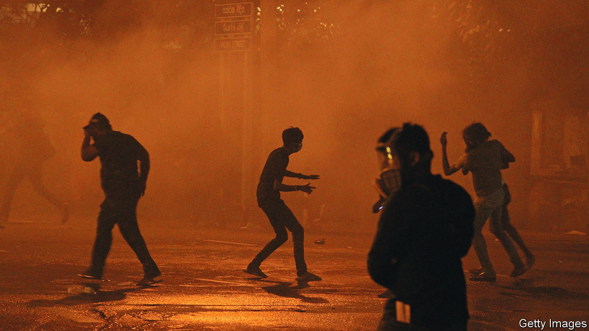

###### Hungry and angry

# A wave of unrest is coming. Here’s how to avert some of it 

##### Soaring food and fuel prices are adding to pre-existing grievances 

 

> Jun 23rd 2022 

Jesus said that man does not live by bread alone. Nonetheless, its scarcity makes people furious. The last time the world suffered a food-price shock like today’s, it helped set off the Arab spring, a wave of uprisings that ousted four presidents and led to horrific civil wars in Syria and Libya. Unfortunately, Vladimir Putin’s invasion of Ukraine has upended the markets for grain and energy once again. And so unrest is inevitable this year, too. 

Soaring food and fuel prices are the most excruciating form of inflation. If the prices of furniture or smartphones rise, people can delay a purchase or forgo it. But they cannot stop eating. Likewise, transport costs are baked into every physical good, and most people cannot easily walk to work. So when food and fuel grow dearer, standards of living tend to fall abruptly. The pain is most intense for city dwellers in poor countries, who spend a huge part of their income on bread and bus fares. Unlike rural folk, they cannot grow their own crops—but they can riot. 

Many governments want to ease the pain, but are indebted and short of cash after covid-19. The average poor country’s public debt-to-gdp ratio is nearly 70% and it is climbing. Poor countries also pay higher interest rates, which are rising. Some of them will find this unsustainable. The imf says that 41 are in “debt distress” or at high risk of it.

Sri Lanka has already defaulted and melted down. Angry and hungry mobs have set fire to vehicles, invaded government buildings and spurred their reviled president into pushing out the prime minister, who is his brother. Riots have erupted in Peru over living standards, and India over a plan to cut some jobs-for-life in the army, which rankles when so many yearn for security. Pakistan is  to save hard currency. Laos is on the brink of default. Anger at the cost of living doubtless contributed to Colombia’s  on June 19th.

 has built a statistical model to examine the relationship between food- and fuel-price inflation and political unrest. It reveals that both have historically been good predictors of mass protests, riots and political violence. If our model’s findings continue to hold true, many countries can expect to see a  . 

The greatest risk is in places that were already precarious: countries such as Jordan and Egypt that depend on food and fuel imports and have rickety public finances. Many such places are badly or oppressively governed. In Turkey the supply shock has accelerated ruinous inflation caused by dotty monetary policy. Around the world, the cost-of-living squeeze is adding to people’s grievances and raising the chance that they will take to the streets. This is more likely to turn violent in places with lots of underemployed, single young men. As their purchasing power falls, many will conclude that they will never be able to afford to marry and have a family. Frustrated and humiliated, some will feel they have nothing to lose if they join a riot. 

Another way inflation destabilises societies is by fostering graft. When wages do not keep up with prices, officials with needy relatives find it even more tempting to extort money from the powerless. This infuriates those who are preyed on. Recall that the trigger for the Arab spring was the suicide of a Tunisian hawker, who set himself ablaze to protest against constant demands for pay-offs from dirty cops.

If unrest spreads this year, it could add to the economic pain. Investors dislike riots and revolutions. One study finds that a big outbreak of political violence typically knocks a percentage point off gdp 18 months later. The damage is worse when protesters are angry about both politics and the economy combined.

Averting the coming explosions will be hard. A good start would be to scrap policies that discourage food production, such as price controls and export curbs. Farmers in countries like Tunisia leave fertile land unploughed because they have to sell their crop to the state for a pittance. Governments should let farmers reap what they sow. Also, far less grain should be .

Several countries are asking for bail-outs. International financial institutions must strike a tricky balance. Saying no could spell chaos—and do lasting harm. But so could bailing out woeful governments, by entrenching bad and unsustainable policies. Bodies such as the imf, whose negotiators arrived in Sri Lanka and Tunisia this week, should be generous but insist on reforms. They should continue to monitor carefully how their money is spent. And they should act swiftly. The longer all this anger is allowed to fester, the more likely it is to explode. ■

