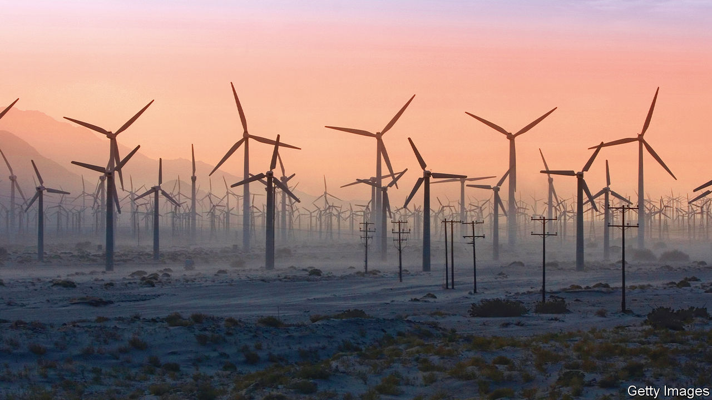

###### The energy crisis

# How to fix the world’s energy emergency without wrecking the environment 

##### Even as they firefight, governments must resolve the conflict between safe supply and a safe climate 

 

> Jun 23rd 2022 

This year’s energy shock is the most serious since the Middle Eastern oil crises of 1973 and 1979. Like those calamities, it promises to inflict short-term pain and in the longer term to transform the energy industry. The pain is all but guaranteed: owing to high fuel and power prices, most countries are facing soggy growth, inflation, squeezed living standards and a savage political backlash. But the long-run consequences are far from preordained. If governments respond ineptly, they could trigger a relapse towards fossil fuels that makes it even harder to stabilise the climate. Instead they must follow a perilous path that combines security of energy supply with climate security. 

In Europe what was long imagined as a nightmare of freezing midwinter nights has instead erupted as a midsummer fever dream. A heatwave forced Spanish gas demand to near-record highs, even as, on June 14th, Russia began to lower the flow of gas along the Nord Stream 1 pipeline to western Europe, sending prices soaring by 50% and raising fears that rationing may be introduced later this year. Elsewhere, Americans are paying $5 for a gallon of petrol (€1.25 a litre), fuelling the inflation that opinion polls say is their biggest worry and President Joe Biden’s worst headache. Australia’s power market has failed. Everywhere you look there are shortages and fragility.

Energy shocks can become political catastrophes. Perhaps a third of the rich world’s inflation of 8% is explained by soaring fuel and power costs. Households struggling to pay bills are angry, leading to policies aimed at insulating them and boosting fossil-fuel production, however dirty.

Mr Biden, who came to power promising a green revolution,  and visit Saudi Arabia to ask it to pump more oil. Europe has emergency windfall levies, subsidies, price caps and more. In Germany, as air-conditioners whine, coal-fired power plants are being taken out of mothballs. Chinese and Indian state-run mining firms that the climate-conscious hoped were on a fast track to extinction are digging up record amounts of coal.

This improvised chaos is understandable but potentially disastrous, because it could stall the clean-energy transition. Public handouts and tax-breaks for fossil fuels will be hard to withdraw. Dirty new power plants and oil- and gasfields with 30- to 40-year lifespans would give their owners more reason to resist fossil-fuel phase-outs. That is why, even as they firefight, governments must focus on tackling the fundamental problems confronting the energy industry. 

One priority is finding a way to ramp up fossil-fuel projects, especially relatively clean natural gas, that have an artificially truncated lifespan of 15-20 years so as to align them with the goal of dramatically cutting emissions by 2050. In particular Europe and Asia, which must wean themselves off Russian gas and coal respectively, have too little liquefied natural gas (lng) capacity. The trick is to get business to back schemes designed to be short-lived. One option is for governments and energy grids to offer guaranteed contracts over this period that provide an adequate return on the understanding that capacity will be shut down early. Another is to pledge eventual state support to make these projects cleaner, for example through carbon capture and storage. 

This does not mean easing up on the drive towards renewables—the most successful part, to date, of the world’s generally poor response to the climate crisis. Every extra kilowatt-hour from the sun fed into Europe’s electricity grids is one fewer that comes down a Russian pipeline. Governments must improve the reach, capacity and storage capabilities of their grids and remove the obstacles that continue to make it harder to add renewable capacity than it should be. The design of power grids and markets is squarely a matter for governments and they are too often trapped in 20th-century thinking.

As our  reports, 21st-century thinking turns on new ways to provide smart, resilient grids with the zero-carbon “firm” power that makes dependence on renewables safe and effective. Hydrogen stripped from water with renewable electricity, or from natural gas with steam in facilities that store the emissions, may be crucial here. So, in many places, may . Climate-conscious atomic enthusiasts often focus on whizzy but unproven small-scale nuclear plants. What matters more is to improve the building of big ones. Where there is strong and co-ordinated anti-nuclear opinion, governments must win support by showing that there are better safeguards against accidents and new ways to store waste, as  explains. Politicians need to tell voters that their desire for an energy transition that eschews both fossil fuels and nuclear power is a dangerous illusion.

The last necessity is to make the industry predictable. That may sound strange given that 20th-century energy markets coped with wars, coups, revolutions, booming Chinese demand and new technology. But the climate transition has added an extra layer of uncertainty even as it simultaneously requires a massive increase in investment. In order to reach net-zero emissions by 2050, annual investment needs to double to $5trn a year, according to the International Energy Agency. The risk is that this latest crisis, and the chaotic government response to it, make investors warier instead. 

A different kind of revolution

Spurring investment means eschewing gimmicks including greenwashing, protectionist plans to build domestic green supply chains, and silly prohibitions by banks on . Instead it will require steadily extending measures with more certainty about which energy sources can be used and for how long. That means enhanced disclosure so that firms understand the externalities they create, an expansion of carbon prices so that they have a sense of the cost of pollution, and regulations that mandate the phasing out of dirty technologies. The great energy shock of 2022 is a calamity. But it could also be the moment when better government policy triggers the investment needed to resolve the conflict between having a safer supply of energy and a safer climate. ■


