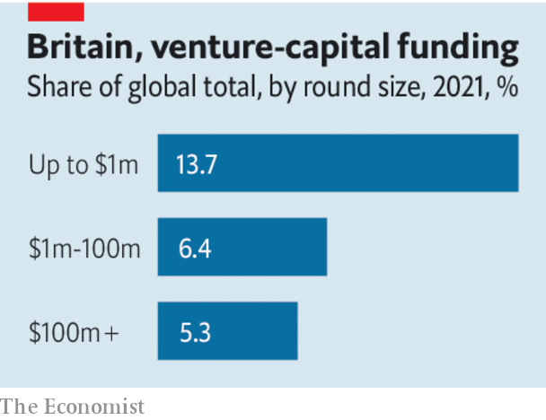

###### Britain’s growth crisis

# More of Britain’s pension assets should be used to drive business growth 

##### They are stuck in low-yielding bonds while companies are hungry for capital 

 

> Jun 23rd 2022 

Britain is a good place to be a budding entrepreneur. The country’s share of global venture-capital (vc) funding has doubled since 2018, to twice its share of global gdp. One out of every seven dollars the world invests in the earliest-stage “pre-seed” firms is invested in Britain. Although financial markets have taken a hammering this year, British vc funds have record amounts of unspent capital to throw at tomorrow’s winners.

But Britain is not a good place to turn promising startups into titans. There are many reasons for that, from Brexit to poor productivity. But a big stumbling block is that as , the capital they need dries up along the way. 

By the time these companies are raising tens of millions of dollars, rather than a few hundreds of thousands, their share of global vc funding has halved. “Deep tech” ventures, which try to develop industry-disrupting new technologies like quantum computing or artificial intelligence, fare especially poorly. And at the top of the capital ladder, Britain’s once-mighty stockmarket has drifted into insignificance. In 2006 it accounted for 18% of the equity capital raised in global initial public offerings. This year it has raised under 1%. 

 


America provides a sobering contrast. It has spawned four trillion-dollar behemoths in the past five decades. Britain has not created a business worth even a tenth as much in more than a century. In 2011 the ftse 100 index of leading shares contained only two globally respected tech firms, Autonomy and Arm. Now it has none. Autonomy has been sold to Hewlett-Packard, an American giant, and its reputation tarnished by fraud claims (which its erstwhile leaders deny). Arm was bought by SoftBank, a Japanese conglomerate, and is now considering . 

Comparisons between Britain and America are often misplaced. Much of America’s success in nurturing corporate titans was forged in the crucible of Silicon Valley, which has far more than abundant growth capital to recommend it. First-mover advantage in the vc market, long-standing partnerships with America’s Department of Defence and a culture that celebrates enterprise—they all turbocharge innovation. But Britain’s courts, excellent universities and world-class financial centre should make it unusually fertile ground for firms to grow, too. 

What should be done? One focus ought to be to simplify corporate-governance rules. Britain has had more iterations of its baroque governance code in the past 25 years than it has had prime ministers. The result is a tangle of worthy disclosure requirements that distracts fledgling firms. Another should be to seek to attract those rare experts capable of making sensible commercial decisions in deep-tech areas like quantum computing. Britain’s excellent research universities are already a lure. One idea would be to create fellowships that combine an investment role with an academic one.

But the top priority is to direct the £4.6trn ($7.4trn) of assets held in British pension and insurance funds into more productive areas. Less than 1% of these assets is in unlisted equities. Defined-benefit pension schemes’ allocation to the British stockmarket has sunk from 48% to below 3%. The government should dilute the pension-fee cap that crimps investment in early-stage firms. It should reform accounting rules that incentivise funds to load up on low-yielding gilts rather than riskier equities. The plethora of tiny pension funds—like the 90-odd local-government schemes—should be merged so they can invest at scale. Britain has assets seeking returns, firms hungry for capital and a financial centre that can bring them together. It can do better. ■

