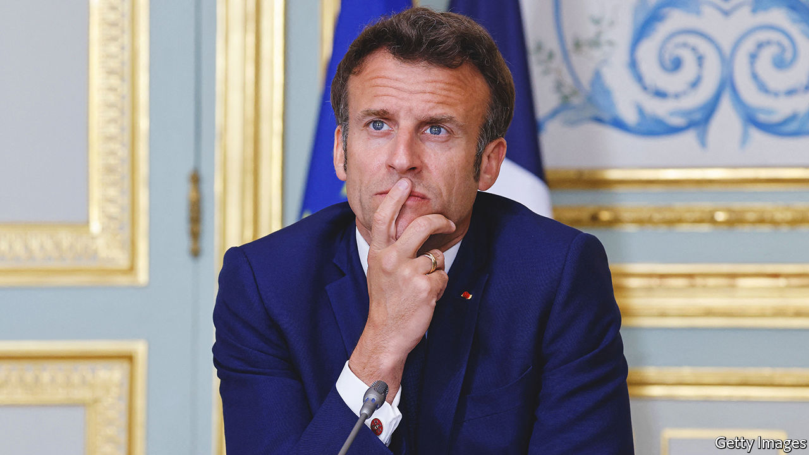

###### The man who fell to earth

# What Emmanuel Macron should learn from losing his majority 

##### Will the French president be able to get anything done in his second term? 

 

> Jun 22nd 2022 

Less Jupiter than Icarus, Emmanuel Macron came . On June 19th French voters did something that was last seen over 30 years ago: they denied a newly elected president a . It is not quite impossible to govern without one, but for the next five years Mr Macron will be scratching around for the votes he needs to get anything done. That is bad news for France—and for Europe too, which sorely lacks a leader of global stature. Angela Merkel left the field last winter, and the man who had hoped to reshape a continent after her departure will have his work cut out just keeping his own house in something that resembles order.

This outcome should not have been as much of a surprise as it felt. In the first round of the presidential election in April, slightly more than half the electorate cast votes for one or other candidate of the political extremes. Enough of them then rallied round Mr Macron in the run-off to allow him to handily defeat Marine Le Pen, the leader of the populist National Rally. But the impressive result masked the fact that Mr Macron, a buttoned-up technocrat who has never been able to shake off the label of  is , and loathed by many. He won just 28% of the vote in the first round, after all. The French gave him his job back, but they also decided to strip him of much of his authority. Clearly, Mr Macron will need to do things differently.

But what, exactly, and how? To understand the scale of the task ahead consider how Mr Macron is in some ways the victim of his own success. In his first term his political machine was all-conquering, poaching the best and brightest from the centre-right Republicans and the centre-left Socialists. By straddling the mainstream, he pushed dissatisfied voters to Ms Le Pen’s hard right or the radical left of . For Mr Macron to pacify the angry, left-behind voters who gave both this pair a huge electoral boost will not be easy, especially without spending even more money that France does not have. 

Ideally Mr Macron would pursue the difficult long-term reforms that France badly needs—simplifying its labyrinthine pensions system, laying the foundations for its energy transition and prising open its rigid, highly centralised education system. Yet the future looks very difficult. Mr Macron’s legislative agenda is up in the air. He has summoned the party leaders to talks. The constitution gives him considerable powers, particularly in the areas of foreign and defence policy, and he also has the right, if need be, to force his budget and one other piece of legislation through parliament by decree in each sitting. But if he is seen to abuse that authority, he may provoke a no-confidence vote that could bring down his government and perhaps force yet another parliamentary election. 

One option is to try to assemble ad hoc majorities for individual bills. His parliamentary grouping, Ensemble, has 245 seats; 44 short of a majority. He may, for instance, hope to appeal to the Republicans to get his pension reform through; or to the Socialists and the Greens to help him out with the energy transition. Yet both measures will face resistance and if early elections are thought likely, no one will want to risk losing their own voters to the Macron-loathing extremes.

France, with its almost monarchical presidency, lacks a tradition of coalition government. In Germany, the Netherlands or the Nordic countries such arrangements involve weeks or months of negotiation, to hammer out detailed policy agreements. French politics, as so often in the past, is deeply polarised, perhaps too much so for even the most limited agreement on policies. Mr Macron will therefore need to alter that culture. This will require him to embrace a new political style: no longer Jupiterian, controlled and analytical, but open, transactional and instinctive. It will not come naturally, but if he fails, his second term will be doomed to fail too. ■

