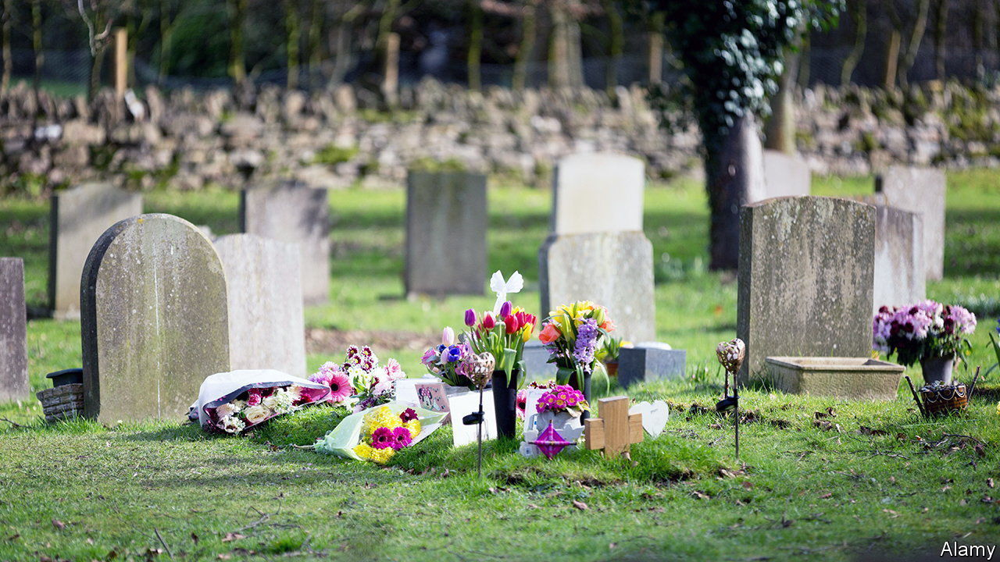
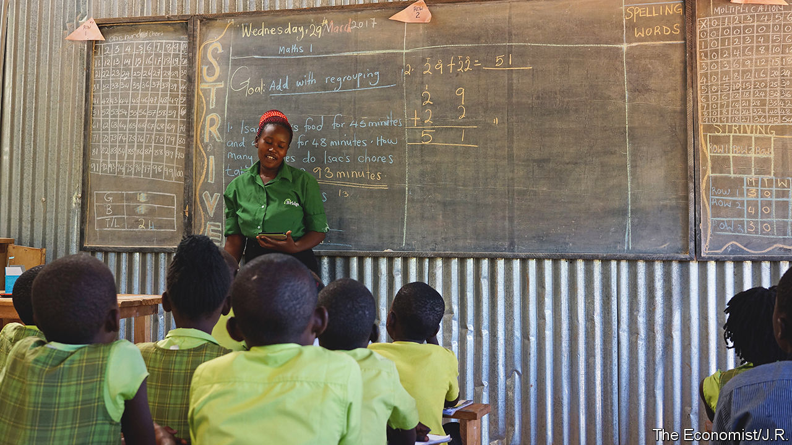

###### On Colombia, environmental goals, food, the NHS, NewGlobe, family names, the whole self

# Letters to the editor 

##### A selection of correspondence 

 

> Jun 23rd 2022 


Drugs and biodiversity

Bello described the palpable fatigue across the Americas with the war against drugs (). In the case of Colombia the historic absence of the state in the difficult terrain that accounts for half the drug industry’s territory has been a main reason for its success. As Bello says, improving security and boosting legal economic activity in these areas would be much more effective than yanking up coca plants. Crop substitution is not easy in these remote areas. However, Colombia is the second-most biodiverse country in the world and the tenth most vulnerable to climate change. It is rightly committed to tackling deforestation. 

The areas at risk are the very same where coca is grown, indeed the latter is the cause of much of it. To stop and reverse deforestation Colombia would need a large workforce, which would be drawn from those who would otherwise have continued to grow coca. As security improves more employment would come from ecotourism, which Colombia does very well in its coffee zone.

Other countries are keen to help Colombia’s efforts. Let us hope that the new president seizes this opportunity.

sir keith morris

British ambassador to Colombia, 1990-94


 


Businesses saving the planet

It was wrong to imply that the efforts of Mark Carney, Larry Fink and Jamie Dimon to “stop global warming and create a fairer, more enlightened form of capitalism” constitute wokeism (, June 11th). Capitalism and global business are transforming from focusing purely on shareholders’ financial returns to a conviction that society has a right, indeed a duty, to hold companies accountable for their actions. This is eloquently elucidated by Hubert Joly in his book, “The Heart of Business”. Far from creating confusion, which investor-driven environmental, social and governance (esg) does in abundance, this concept of corporate citizenship makes life simpler. Everyone knows how to tell a good citizen from a bad citizen. The same goes for companies. Messrs Carney, Fink and Dimon are on the right side of history.

nicholas dungan

Chief executive

CogitoPraxis


 


Producing food

We echo recent concerns regarding an impending food crisis (“”, May 21st). We have 10,000 years of experience with organic farming and 50 years of food security in the West due to scientific advances in agriculture. Going forward we will need to utilise all the tools at our disposal, including genetic modification technology, gene editing and crop protection, to ensure equitable access to nutritious food while at the same time minimising our environmental impact. The recent Sri Lankan experiment in organic farming clearly illustrates the devastating influence that anti-scientific policymaking has on large populations. These tragedies should remind us not to miss the forest for the trees.

DR ARI FILIP

Medical toxicology fellow

Washington University St Louis


DR S. ELIZA DUNN

Medical affairs lead

Bayer Crop Sciences


 


Healthcare and the NHS

As a frontline surgeon in the National Health Service for more than 30 years, I know a thing or two about errors in health care. I know about its impact on first victims (patients and their families) and second victims (doctors and nurses) and I know about its human and financial costs (“”, May 21st). Although to some extent I agree that above all “doctors need to be encouraged to speak up” it all sounds so simple. Words alone and simplistic solutions are not enough. The reality, given the sad history of the treatment of NHS whistleblowers, is that few but the very courageous will speak up, because those who do are often pilloried or sacked. Most continue to fear that management will label them as troublemakers.


What is needed is an approach that has been shown to work: that used by High Reliability Organisations (HROs), but adapted to a health-care environment. The wheel does not need to be reinvented. The aviation, rail, petrochemical and nuclear industries have shown the way and their model of formal training in the psychology of error, what we call human-factors training, combined with the development of genuinely no-blame cultures, works. They are light years ahead in all aspects of safety.


The problem lies not with the failure of frontline doctors and nurses to speak up, fearful for their jobs, but rather with the lack of leadership from government and health-care leaders to mandate that health-care organisations train doctors and nurses in the causes of error and in simple techniques to reduce error (in the same way that HROs so effectively train their frontline staff), a failure highlighted in the recent Ockenden report.


According to a report from the OECD in 2017 on “The Economics of Patient Safety”, 15% of hospital expenditure in OECD countries is attributed to treating safety failures, which means that if a doctor or nurse works a 40-week year, then 30 of those 200 days are devoted solely to dealing with the fallout from health-care error. Balanced against that vast expenditure, just one day a year in the classroom, away from the surgery, ward or operating theatre, learning how to prevent error would be time well spent. Even if it saved just one of those days it would be cost neutral and given the HRO experience it would probably save more. 


Other industries have shown the way. Now government must show leadership by forcing change.


JOHN REYNARD

Consultant urological surgeon

Oxford University Hospitals 

 


Education methods

“”, (June 9th) reported the optimistic findings of a study into the standardised and transformational teaching methods used by NewGlobe. These methods produce greater learning in all types of programmes, including government ones. Yet, this was missed in your article by reflecting common misinterpretations of a multi-partner programme study in Liberia. 

NewGlobe’s methods are not expensive, even when deployed by existing, government-salaried teachers and administrators. The Liberian study’s authors focused on total costs, whereas marginal costs drive scale and sustainability, as evidenced by NewGlobe’s subsequent rapid expansion in Liberia. Also, NewGlobe’s methods worked as well or better than any other operator within the Liberian experiment. The only available comparable data were published in the first-year report. The authors chose not to provide comparable data in the final report and explicitly warned against trying to use that report to compare school operators. 

Better teaching methods are sorely needed to improve learning in low- and middle-income countries; few are evidenced to work at scale.

steve cantrell

Chief impact officer

NewGlobe


 


All in the family name

Johnson’s enjoyable column on the terms used to denote family relationships in languages other than English resonated with me (). The Batak, an ethnic group native to Sumatra, have a rich collection of titles used inside and outside the family. Which one to use depends on factors including the relationship between clans and the generation in respective family trees, as well as sex and any ties that may exist through marriage. This takes some understanding. On first meeting, Bataks will commonly spend a few moments determining what they should call one another. For this native English speaker, despite 20 years of marriage to a Batak and a good degree of fluency in the language, the system is as baffling now as it was when I first encountered it. 

oliver craven


In one sense, English offers greater precision than Johnson acknowledges. The French  is used for both mother-in-law and stepmother. The old  for stepmother is pejorative and used principally in fairy tales.

james tebboth


The Armenian language also features complex terms for relatives. Parents of married couples refer to each other as . It is connected to the verb for caring. Marriages are not individual undertakings in Armenian culture. They create wider families. 

nareg seferian


 


Being who you are

I was disappointed by Bartleby’s view that we should “not bring your whole self to work” (). As well as the strict separation of an employee’s professional and private life, there is a third space of social interaction in the workplace. This is the space for water-cooler conversations, of internal and external networking, where being exactly yourself is an asset and pretending to be someone else is not going to help you. 

This is the space where you do not have to lie about having a same-sex partner or a child with special needs when people ask you on a Monday if you had a fun weekend. So many people have had to fight during their careers to be able to be themselves at work, to enjoy a space where sexist, homophobic and racist jokes are no longer the norm. 

luc vitry


Employees are renegotiating the social compact as we move to the digital age of work and the physical boundaries between our work and personal lives melt away. They are demanding greater autonomy in choosing when, where and how to work, yet also yearning for a deeper purpose and connection to their colleagues. 

christine dauchez


Bartleby warns against bringing your whole self to work, suggesting you “bring your role self” instead. Buddhism sidesteps this dilemma nicely: there is no self.

brendan kelly

Professor of psychiatry

Trinity College Dublin

