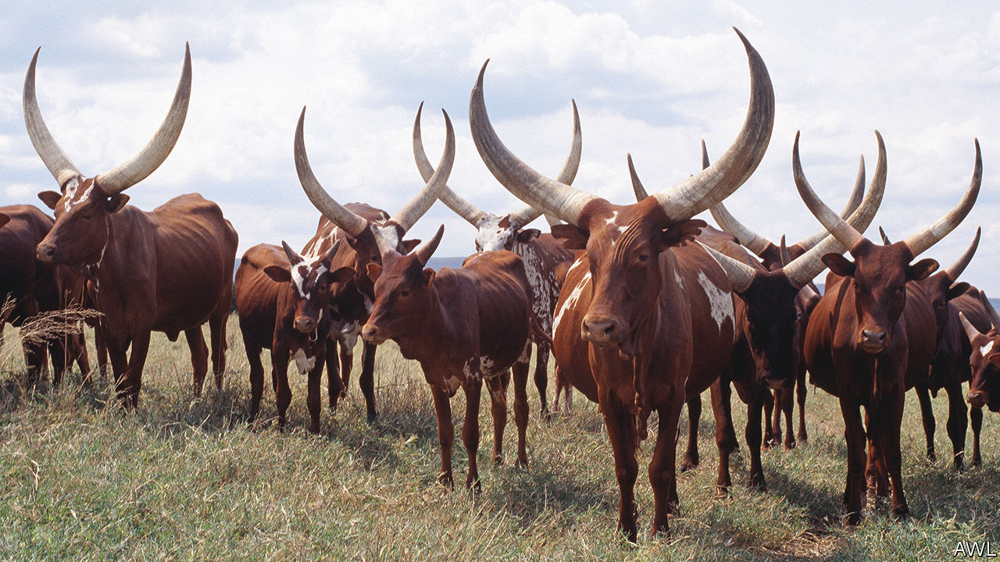

###### Cowed

# Allegations of impropriety weaken South Africa’s president 

##### His accuser is biased, but Cyril Ramaphosa still has some explaining to do 

 

> Jun 23rd 2022 

Cyril ramaphosa loves Ankole cattle. “The graceful movement of these amazing creatures”, he writes in “Cattle of the Ages”, a book he co-wrote about the majestic cows, “speaks to the gentle whispers of the ancestors in the wind.” In recent weeks, however, the animals have been less a source of joy than of controversy for the tycoon-turned-president. 

On June 1st Arthur Fraser, an ex-head of the State Security Agency (ssa), an intelligence organisation, asked police to investigate Mr Ramaphosa about a series of events starting in 2020. In an affidavit Mr Fraser claims that thieves broke into Mr Ramaphosa’s cattle farm that year and stole at least $4m in cash hidden in furniture. Mr Fraser alleges that Mr Ramaphosa asked the head of his presidential protection unit to investigate the robbery. 

The presidential guards, says Mr Fraser, tracked down and illegally detained suspects, including one in Namibia, after Mr Ramaphosa asked the neighbouring country’s president for help. All of this took place outside formal channels, claims Mr Fraser, and was thus against the law. That the president allegedly held a large sum of American dollars, which are subject to strict controls in South Africa, also points to money-laundering, he adds. 

Mr Fraser is not a disinterested party. As a senior official at the ssa he ran a rogue unit that spent vast sums on political operations without authorisation, according to Jacques Pauw, an investigative journalist. (Mr Fraser denies wrongdoing and is suing Mr Pauw for defamation.) A report on the ssa released in 2019 said it was politicised and had become a “cash cow” for many inside and outside the agency. A judicial commission investigating graft under Jacob Zuma, Mr Ramaphosa’s predecessor, released its final reports . The volume on the ssa said that there were serious allegations of “massive abuse of the assets of the ssa” when Mr Fraser was in charge. The commission recommended that criminal prosecutors investigate Mr Fraser with a view to possibly bringing charges against him. Mr Fraser’s attack on Mr Ramaphosa could be seen as a warning not to prosecute people implicated by a commission. 

The allegations against Mr Ramaphosa may seem trivial compared with those against Mr Zuma. Nonetheless, they may help the pro-Zuma faction of the ruling African National Congress (anc). (Last year Mr Zuma was jailed for defying a court order to testify to the commission. Mr Fraser, who was by then running the prisons service, released him on medical parole, a decision later deemed unlawful by a court.) Politicians allied to the former president wish to unseat, or at least weaken, Mr Ramaphosa ahead of elections due in 2024. 

The president dismisses Mr Fraser’s claims. He says much less than $4m was involved, the proceeds of sales of game. But questions remain. Was the cash properly accounted for? Did the presidential protection unit act appropriately? Mr Ramaphosa’s enemies will also beef about his running a hobby farm when so many national problems require his attention. ■

