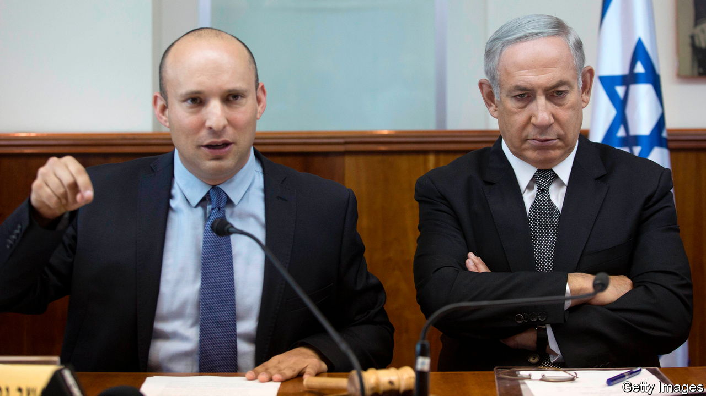

###### Once more unto the booths

# Israel’s government collapses, prompting the fifth election in four years 

##### An unlikely coalition implodes after a year. Political paralysis may resume 

 

> Jun 20th 2022 


A WEEK AFTER their first anniversary in office, the two leaders of Israel’s unwieldy government announced jointly on June 20th that they had “exhausted all efforts to stabilise the coalition” and would be dissolving Israel’s parliament, the Knesset. Israel is heading for its fifth general election in less than four years.

A series of inconclusive elections and a long period of political paralysis were supposed to have come to an end last June, when , an arch-nationalist, and Yair Lapid, leader of Israel’s largest centrist party, managed to yoke together eight disparate parties, including an independent Arab party—the first ever to participate in an Israeli government. This clunky coalition was able to hold a wafer-thin majority in the Knesset, so ending Binyamin Netanyahu’s .

For a short while things went fairly smoothly. The government passed a long-delayed budget. But Messrs Bennett and Lapid were soon struggling to keep their coalition of contradictions together. In April a religious-nationalist Knesset member defected to the opposition, depriving the government of its majority. “I am unable to lend a hand to damage the state of Israel and the Israeli people’s Jewish character,” she declared. Incapable of passing tricky legislation, the government finally fell after its Israeli-Arab members refused to renew a law governing Jewish settlements in the occupied West Bank. The opposition, led by Mr Netanyahu, supports the law in principle but voted against it to bring about the government’s collapse.

Under the terms of the coalition agreement, Mr Bennett, the prime minister, who recently told that he had “learned the value of compromise during the past year”, will cede his job to Mr Lapid during the election campaign. Mr Lapid, in turn, will try to prolong his time as prime minister by preventing Mr Netanyahu from returning to power.

Mr Netanyahu failed four times in a row to secure an outright majority for his bloc of right-wing and religious parties, but held on as a caretaker prime minister through election after election. The latest polls predict yet another stalemate.

But Mr Netanyahu clearly thinks he can do better this time by campaigning against the unlikely coalition he has just helped to bring down. He was quick to lambast the outgoing government for “relying on supporters of terror”. In the coming campaign he is likely to denounce his opponents as “controlled by the Muslim Brotherhood”. 

Such absurd scaremongering may win votes, although it may also prompt Israeli-Arabs, who form more than a fifth of the population, to turn out to vote in greater numbers than usual. Many on the right see the inclusion of an Arab party in government as “an experiment” that has now failed. But given the daunting arithmetic of cobbling together a majority, it is hard to imagine that the centre and left will not turn to Arab parties again. Whatever the election result, the now-defunct coalition may have changed Israeli politics for good. ■

