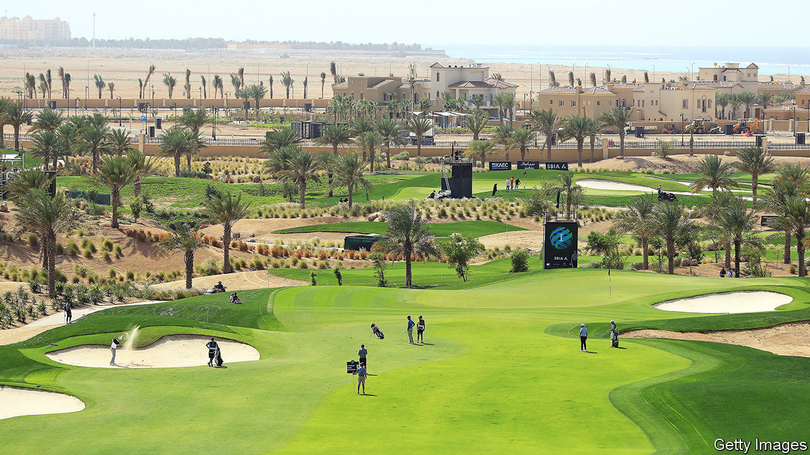

###### Sand trap

# Saudi Arabia still thinks money can buy a new reputation 

##### Throwing billions at a breakaway golf tour will not polish the kingdom’s image 

 

> Jun 23rd 2022 

It is a golf tour that would make a coddled Saudi bureaucrat happy. The work-week is short: 54 holes over three days, instead of the 72 over four days that is usual at other tournaments. A rolling start means play can finish within five hours. Those who play badly cannot fail to make the cut; even the worst collects $120,000. Take a World Bank report on the Gulf’s laid-back, overpaid public sector, add caddies and caps, and you have the concept behind the Saudi-financed liv tour. (liv, by the way, is the Roman numeral for 54, an impossibly low score for one round.)

Golf is usually a polite game. But the Saudi-backed tour, which held its inaugural event near London on June 9th, has brought howls of vituperation. The pga Tour, which runs the established circuit for top players, suspended 17 rebel players who took part in liv’s first event. Some golfers fear it will “fracture the game”. Fans have railed against defectors taking exorbitant sums to join the new tour. For all the changes in Saudi Arabia over the past seven years, the kingdom is stuck on its old strategy of trying to buy its way out of a shoddy reputation. 

Despite some far-fetched spin from politicians and liv players, golf will not transform Saudi Arabia’s post-oil economy. Nor will it provide much live entertainment for Saudis. Only one of its eight events will be played in the kingdom, on a course north of its commercial city, Jeddah. Organisers have struggled to find broadcasters for the liv tournaments. In many places they can be watched only on streaming services, including one owned by the Saudi government.

For decades, when Westerners thought of the kingdom, they thought of religious austerity, a place where women could not drive and fun was outlawed. To his credit Muhammad bin Salman, the crown prince, has unbanned many kinds of fun. But his government has also jailed scores of activists; waged a ruinous war in Yemen; and allegedly ordered the murder of Jamal Khashoggi, a Saudi journalist.

Sport, in theory, is a way to change the subject. Saudi Arabia is not the first Gulf country to pour money into it. Qatar has spent an estimated $200bn to prepare for hosting the football World Cup in November. Buying Europe’s top clubs is a favourite pastime of Gulf royals. The Saudis joined in last year when their main sovereign-wealth fund acquired Newcastle United, a middling British team.

The liv tour is something else—not co-opting a beloved sport but attempting to usurp one. It may backfire. In the past few weeks even the most apolitical of golf fanatics sounded annoyed. Fans know sport is big business, but tend to bristle when this is rubbed in their faces: witness the furore that erupted last year over the European Super League, a short-lived effort to create a new closed-shop football league that might have raked in billions of euros.

It does not help that some of the golfing rebels get tongue-tied when trying to explain themselves. Asked about Khashoggi’s murder, Greg Norman, a retired Australian star golfer who is now liv’s ceo, replied: “We’ve all made mistakes.” As if slicing a journalist into pieces is somehow akin to slicing a four-iron.

Some critics also grumble that two of the eight events in this year’s liv golf tour will be played on courses owned by Donald Trump. (The uspga championship, a long-established tournament, was to have been held on his course in New Jersey this year, but the organisers terminated the contract after last year’s Capitol riot.) 

The Saudis have long used cash as a diplomatic tool. On June 22nd Prince Muhammad made his first visit to Turkey since the murder of Khashoggi, which took place at the kingdom’s consulate in Istanbul. Recep Tayyip Erdogan, the Turkish president, was a fierce critic of the prince for several years. But his ardour for justice has cooled along with the Turkish economy.

The prince will hope to pull the same trick in July when Joe Biden arrives for his first visit as president. The Saudis may have little to offer on oil prices or sanctions against Russia, two of the president’s priorities. But the prince and his ministers will probably announce billions of dollars of new investments in America, in everything from e-commerce to clean energy.

Can’t buy you love

Money only goes so far, though. Saudi Arabia is a longtime Western partner but has little support outside political and business elites. A Gallup poll in March found that only 33% of Americans had a favourable view of it, seven points below Cuba, a country under American embargo for six decades. A survey in 2020 by YouGov found that only 14% of Britons liked the kingdom, putting it on a par with Belarus.

There are better ways to improve an image. One is to clean up your act. Saudi Arabia has eased up on repression over the past few years. It has also opened its doors to foreigners a bit wider, introducing tourist visas for the first time in 2019.

In December the kingdom hosted a dance-music festival in Riyadh, the capital, that drew big-name djs like David Guetta. Hundreds of thousands of party-goers came from across the country. The event brought some good pr, a glimpse of a changing Saudi Arabia—and gave young Saudis a chance to let their hair down, often literally. It also cost a fraction of what the Saudis are pouring into their controversial golf venture. Princes and well-paid foreign consultants may prefer costly vanity projects. But the best way to change the reputation of the kingdom is surely to change the kingdom itself. ■

