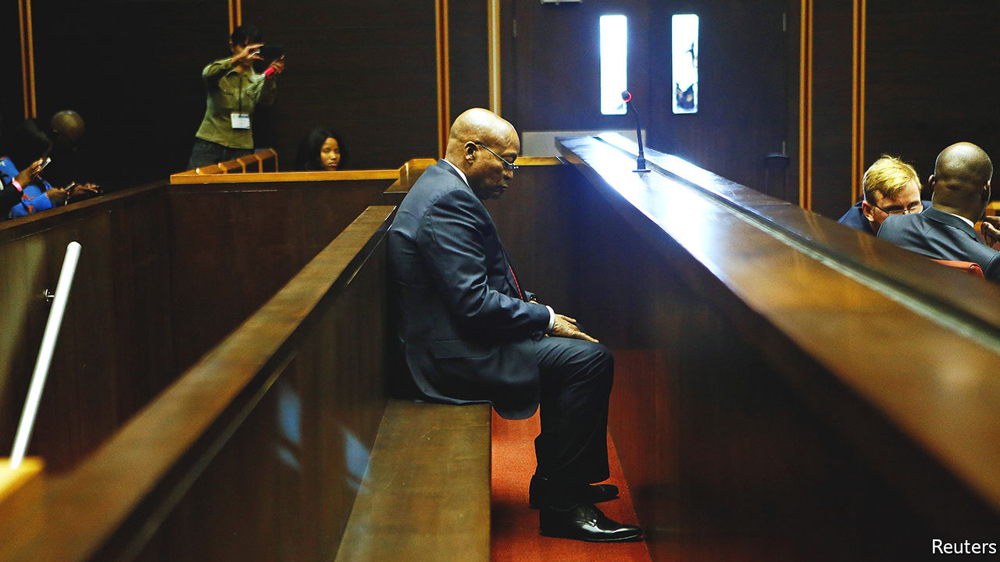
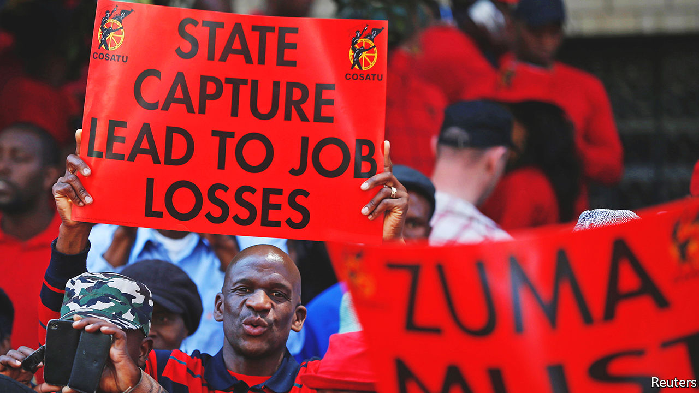

###### The rot that spread

# The Zondo commission has revealed vast graft in South Africa 

##### As a landmark inquiry concludes, South Africans demand prosecutions 

 

> Jun 23rd 2022 

To the new arrival at the Vrede Dairy, named after a town in the Free State that is not so much sleepy as catatonic, its iron gate is unremarkable. But to Ephraim Dlamini the structure is a symbol of what went wrong in one of the most notorious cases of “state capture”: the era of looting in South Africa allegedly orchestrated by Jacob Zuma (pictured), the former president; his son, Duduzane; allies such as Ace Magashule, the former premier of the Free State province; and Ajay, Atul and Rajesh Gupta, .

The provincial government, which funded the dairy, spun it as a scheme to help poor locals. In reality, it was taxpayers who were milked. They pumped in 280m rand (currently $17.6m), most of which seemingly ended up in Gupta-linked accounts. Procurement prices were vastly inflated: the gate, and accompanying security post, cost 2.6m rand. And the supposed beneficiaries were kept far away. “We weren’t allowed to enter the farm,” recalls Mr Dlamini. “And if you talked about it you were in the grave.” 

The Free State first funded the project in June 2012. A decade on—and four years after Cyril Ramaphosa replaced Mr Zuma as president—the province gave a 51% stake in the dairy to the “beneficiaries”. Yet they are struggling. They lack capital, training, working machinery—and, crucially, cows to milk. Some fear they are being set up to fail by the province. “I think they’re using us,” says Loliwe Ngwenya, whose father was murdered in 2018, shortly after he made an official complaint about the project. “We’re fighting but we’re not getting anything.” She notes that the alleged architects of the scheme, as well as whoever killed her father, remain at large. “The only thing we want is justice.” 

It is a sentiment echoing across the country. Many South Africans have placed hope in an official commission into state capture, chaired by Raymond Zondo, a judge and since April the country’s chief justice. The commission published its final reports on June 22nd. These included its findings about the Vrede Dairy, which it deemed “a project of the Guptas”. The commission asked the authorities to consider prosecuting, among others, Mr Magashule.

Taken as a whole, the reports document the astonishing scale of graft under the ruling African National Congress (anc). Their thousands of pages mean that no reasonable South African can deny how close the country came to the abyss. Whether they pave the way for widespread prosecutions depends on a state whose enfeeblement the reports exhaustively reveal. 

During Mr Zuma’s reign acolytes of the president dismissed allegations of corruption as a plot by political opponents to derail their efforts to help the poor. Justice Zondo dismisses this notion. The Guptas, notes one report, identified Mr Zuma “at a very early stage as somebody whose character was such that they could use him against the people of South Africa”. The former president, meanwhile, “would do anything that the Guptas wanted him to do”. (The Guptas and Mr Zuma deny wrongdoing and say the allegations against them are politically motivated.)

That led to schemes that are now notorious. Allies of Mr Zuma would be appointed, allegedly at the behest of the Guptas, to powerful positions at state-owned enterprises (soes) or government departments. In return for bribes or cuts they would steer contracts to Gupta-linked firms. Institutions meant to crack down on graft were infiltrated to ease the looting. Blue-chip firms such as Bain &amp; Company, kpmg, McKinsey and sap were allegedly linked to various schemes. Bell Pottinger, a public-relations outfit, helped spin the lie that critics of Mr Zuma and the Guptas were agents of “white monopoly capital”. 

Take the money and run

The commission said that at South African Airways, Dudu Myeni, then the chair of the state-owned airline, acted with “corrupt intent” and was “unlawfully benefiting” from the help of the State Security Agency (ssa), a spy organisation, in crushing enemies. She has denied wrongdoing. At Transnet, the public freight operator, more than 40bn rand was diverted in a “Gupta racketeering enterprise”, while staff lavished cash on luxury cars and properties.

A similar modus operandi was evident at Denel, an arms maker, and Eskom, the electricity utility, which was looted for about 15bn rand. The commission’s findings show that Mr Magashule acted like a mini-Zuma. He allegedly steered public funds to Gupta-linked schemes, including the Vrede Dairy, which reportedly helped pay for a plush wedding for the Indian family. Mr Magashule has denied wrongdoing. 

The details do not end with looting. As head of the South African Revenue Service (sars), Tom Moyane, another Zuma appointee, “dismantled the elements of governance one by one”, concludes the commission, “seizing control of sars as if it was his to have”. An attempt to bribe the then deputy minister of finance, Mcebisi Jonas, so that he would take the top job and become a Gupta lackey—the case that catalysed investigations into state capture that ultimately led to the commission—was deemed credible. So too was the report that the Guptas were behind the replacement of a respected finance minister, Nhlanhla Nene, with an inexperienced mp. 

The ssa was the subject of an entire volume of one of the final reports. The agency was said to run partisan operations in support of elements of the anc and withdrew vast amounts of cash without accounting for it. Justice Zondo also concluded that Mr Zuma encouraged the ssa not to investigate early concerns about the Guptas’ influence. Had it done so, state capture might have been averted.

For all the focus on Mr Zuma and the Guptas, the reports show that corruption was widespread in the anc. For instance Bosasa, a services firm, bribed on an “industrial scale” to win contracts. The commission concluded that “during this period the most dominant political faction—the anc under President Zuma—permitted, supported and enabled corruption and state capture.” 

The Zondo reports have also indicated how government policies facilitated corruption. Black Economic Empowerment, a scheme to transfer wealth to black South Africans, was used as an excuse to give contracts to chums. It encouraged the outsourcing of work to firms even though the state was capable of doing the job. The anc’s policy of “cadre deployment”, whereby unqualified comrades are given public jobs based on factional fealty, made the state less competent. Justice Zondo notes that such appointments are “unlawful and unconstitutional”. 

Mr Ramaphosa, who was deputy president under Mr Zuma, was in charge of this “deployment” for much of the period. He does not emerge unscathed from Justice Zondo’s latest findings. In a deliciously legal turn of phrase, the judge notes that the current president’s claims to have quietly and privately tried to stop graft “suffers from his inability to provide any further examples of resistance”. Moreover, his anc presidential campaign is criticised for “solicit[ing] donations from individuals suspected to be involved in corrupt activities.” 

 


The inquiry is thus a damning verdict on almost three decades of post-apartheid South Africa. Across nearly 5,500 pages it underlines how, having helped make the country a democracy, the anc proceeded to debase it. It also offers recommendations to stop this from happening again. Justice Zondo calls for tighter rules on procurement; a statutory body to oversee the appointment of senior figures at soes; a permanent anti-corruption agency; and, so as to reduce the power of the party over the executive, a directly elected president. It is a blueprint that may prove useful in the years ahead, when the probable collapse of the anc’s national majority leads to a more fragmented politics. 

For now, the big question is whether any of the alleged gangsters will end up behind bars. The commission urged the authorities to consider prosecuting dozens of people, including cabinet ministers past and present; mps; executives of the state-owned enterprises; and Mr Zuma himself. 

In recent weeks there have been signs that the wheels of justice are turning. In May the Hawks, a police unit, and the National Prosecuting Authority (npa) arrested five executives accused of fraud at Transnet. In early June two of the Gupta brothers were arrested in Dubai; the npa is working on their extradition. 

The task ahead is huge. The Zondo commission may have been headed by a judge but it was not a court of law. Successfully prosecuting so many state-capture cases would be daunting for any criminal-justice institution. But under Mr Zuma the organisations meant to investigate crimes were captured, too. Shamila Batohi, who took over as head of the npa in early 2019, has had to rebuild an institution that was deliberately sabotaged. Still, critics have long worried about the lack of prosecutions led by the npa in conjunction with the Hawks and the Special Investigations Unit, a branch of the executive. 

Jailhouse rock

Mr Ramaphosa has, unlike his predecessor, left these institutions largely alone to do their jobs. But senior figures in the npa have lamented the lack of funding and qualified lawyers to go after complex crimes. It is hard to escape the conclusion that Mr Ramaphosa, who needs the anc’s blessing to run for re-election, could be doing more to ensure that perpetrators are brought to justice. The farmers in Vrede seem symbolic: notional beneficiaries of a new era but in reality cast adrift by an uncaring state and still without justice for those who wronged them. 

In many ways the Zondo commission is laudable. Not every country is willing to air so much dirty laundry, so publicly. In its scope the inquiry has been compared to the Truth and Reconciliation Commission (trc), which held post-apartheid hearings into human-rights abuses. Yet that likeness also hints at its shortcomings. 

The trc, though praised more fulsomely abroad than in South Africa, revealed many truths. But after it closed the government neglected its recommendations. In a similar fashion the Zondo commission has ensured that no one can deny the extent of corruption during the anc’s 28 years in power. Justice, like reconciliation, may, however, prove only partial. ■

