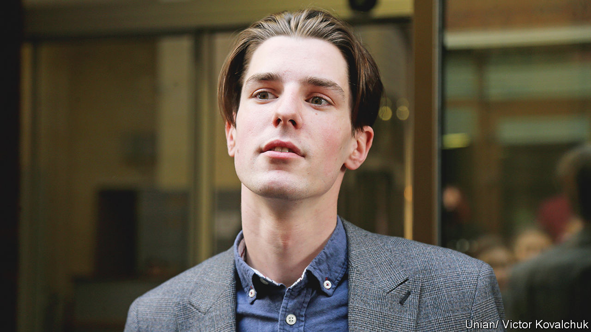

###### Fight without end

# Roman Ratushny believed in a better, purer Ukraine 

##### The civic and environmental activist was killed near Izyum on June 9th, aged 24 

 

> Jun 22nd 2022 

In 2013, when he was 16, Roman Ratushny lay down in Maidan Nezalezhnosti, Independence Square, in the centre of Kyiv and tried to sleep. It was difficult. The square was full of students, almost all older than he was. They were there to protest against the decision by the president, Viktor Yanukovych, to go back on a special trade deal between Ukraine and the European Union. By day the square was alive with blue and yellow flags, eu as well as Ukrainian; girls wore them round their shoulders. Now, at night in the chill of late November, braziers were burning instead. 

He had been there for several nights, sleeping in college lectures rather than miss anything. But on that night, the 30th, something odd started to happen. The stage they had set up for speeches was being taken down. People began to shout, and suddenly hundreds of riot police burst into the square, laying about them with sticks. He fled then, like the others, though not without getting bruised on his back and whacked on his leg as the men of the Berkut chased him through the streets. 

The rally appeared to have failed, but he learned many things that night. First, how quickly you could summon a community to a cause, and how good and powerful it felt to be part of one. And second, that even if you were trampled and dispersed you could still set something going. Small acts of defiance could grow. In this case, their protest led to far bigger rallies in January and February and, eventually, to the fall of the Yanukovych regime. Scores of people died to get that outcome, shot by security forces on the Maidan on February 20th, but that was what you had to do: risk your life. He would not hesitate to start the fire again and, this time, he would not run away.

Ukraine after the revolution was still not the country he wanted it to be. Corruption flourished there. Businessmen were in cahoots with the government, illegality was covered up and bribes were passed round freely. For civic activists, as he soon became—having realised how his bright, direct gaze could galvanise people—it was a dangerous place. Those who spoke out faced rough treatment, foot-dragging courts and no police investigations. His friend Kateryna Handziuk, who fought police corruption in Kherson, was doused with sulphuric acid and died. Serhiy Sternenko, a right-wing green activist in Odessa, was sentenced to a swingeing seven years in jail for robbery and possession of a weapon. At a rally for Mr Sternenko in Kyiv in 2021, where paint was sprayed on the presidential palace and glass broken in the doors, he himself was accused of hooliganism and sentenced to two months’ house arrest. He had to wear an electronic bracelet, like a criminal, when the only evidence against him was a police video in which nothing was visible except white dots on blackness. But he had to be made to suffer because he was a troublemaker. 

His field of action seemed fairly small. It was a corner of a forested ravine, Protasiv Yar, that ran through central Kyiv, an unexpected ribbon of green. Part of it was a complex where people could ski and go snowboarding, but the rest was precious wilderness. Inevitably developers were interested, the city government illegally sold them a permit, and plans were drawn up to build shops and offices in 40-storey towers. This had to be stopped. Kyiv was his birthplace, a city he loved with a passion, and for years his journalist father had campaigned to protect the Old Town from similar destruction. So in 2019 he set up a group called Save Protasiv Yar, which from then on became his cause and his life.

Early protests were mild, with pipers, fiddlers and himself with a megaphone encouraging a straggling band of citizens, some with their dogs, to block the road that ran by the park. But he also confronted the thugs in high-viz who guarded the building site, got pushed away and had his phone smashed. High-ups from the building company threatened to break his back and make him disappear. They began to watch his house, so for a time he moved out. 

Most of his fighting, though, was conducted through the courts. He had been to law school, knew how to talk to ministers, ceos and officials, and had a keen sense of injustice even before that. After the first Euromaidan rally, he was one of the plaintiffs who took its violent dispersal to the European Court of Human Rights, and won. When he defended himself in the Sternenko case he had already recruited a raft of poets, actors and writers to stand bail for him, and two international human-rights committees weighed in on his behalf. The fight for Protasiv Yar took him in and out of court for two years, until in 2021 the park was decisively declared a green zone that could not be built on. 

Soon enough, however, another war intervened; or perhaps it was all one war, to build a better, purer and more beautiful Ukraine. On the first day of the Russian invasion, he volunteered. Before proper volunteer units were even formed he had made his own in Kyiv, naturally called “Protasiv Yar”, and went shopping to buy small drones to spy out Russian military positions. He was now a go-to man to organise resistance, drawing in others and offering their services to any commander who could use them. Eventually he was moved into the 93rd Mechanised Brigade and, after fighting round Sumy for a while, was sent to the east. 

Actual war thrilled and hardened him. On the eastern front the battle was fierce. Round Izyum, where he was doing reconnaissance, Russian shelling was relentless. In the selfies he posted his face was still boyish, but his eyes were steel. Defiantly he held up a cloth badge of St Michael, sword-wielding patron of Kyiv, who had thrust the devil back to hell. One post, about his joy in fighting (“The more Russians we kill right now, the fewer will be left for our children to kill”) was taken down by Facebook and Twitter. But how could he not hate the existential enemies of his country? 

One post showed him in a trench in a forest, his helmet a bit askew, grinning. His grey-brown camouflage merged perfectly with the grey-brown earth. He looked at home there, among the tree roots. He had saved just such a forest, back home. This forest could not save him.■


