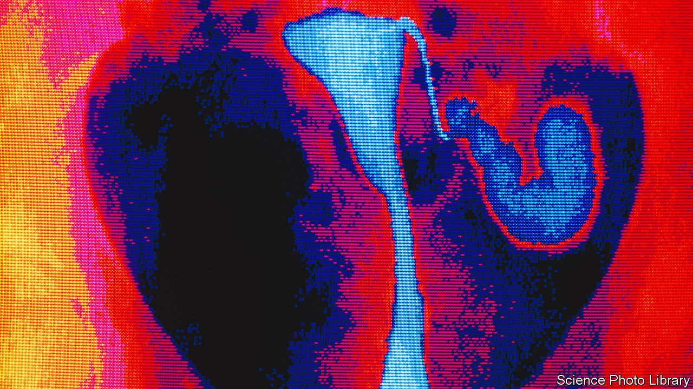

###### Infertility

# A neglected way to unblock Fallopian tubes needs revisiting 

##### Fertility doctors may be missing a trick 

 

> Jun 22nd 2022 

In-vitro fertilisation (ivf) is marvellous. But it is also a palaver. It involves drugs, injections, early morning vaginal ultrasound monitoring, sedation, minor surgery, medical skill, high-tech machines and luck. And at several thousand dollars a pop, it is . Not to mention that it is more likely than not to fail.

In cases where  is caused by blockage of the Fallopian tubes, which carry eggs from the ovaries to the uterus, an obvious alternative might seem to be to try unblocking the tubes in question. If the blockage is merely a result of dried mucus, that can be done fairly simply using a procedure called Fallopian tube recanalisation. This involves pushing a fine guidewire out through the end of a catheter and up the blocked tube. It is not a new approach. But it is, in the view of Lindsay Machan, an interventional radiologist at the University of British Columbia, in Vancouver, an underused one. According to Dr Machan, many reproductive endocrinologists and interventional radiologists do not know about it. And he thinks they should.

Between 2015 and 2021, as they reported on June 13th to the Society of Interventional Radiology’s annual meeting in Boston, Dr Machan and his team examined 951 women who had been diagnosed with at least one blocked Fallopian tube using a procedure called an x-ray hysterosalpingogram (hsg). This involves sending dye into the uterus to check, among other things, whether the tubes are clear.

For each woman, the team first repeated an hsg, under light sedation. Almost a quarter of their patients, they found, actually had two normal, unblocked tubes. Dr Machan’s explanation for this is that without sedation an hsg can trigger a spasm which causes the tubes to clamp shut. This may be mistaken for a blockage. 

For the remaining 725 women the team conducted, while they were still under sedation, a more focused procedure called a selective salpingogram. This involves sliding a fine catheter up through the cervix, across the uterus and into the opening of one the tubes, and then injecting dye through it directly into that tube. 

Results from the selective salpingograms showed that many of the women had a blockage of a kind that appeared treatable by Fallopian tube recanalisation, which the team then conducted through the catheter that was already in place. In all, they were able to reopen a clogged tube in this way in 539 of their patients—more than half of those originally presenting. 

The acid test, of course, is how many of these women have gone on to become pregnant by more natural means than ivf. To that question, Dr Machan has no answer. His purview as a radiologist does not extend to asking it. But, with about 2.5m cycles of ivf performed around the world every year, somebody should do so. If Fallopian tube recanalisation does routinely enable pregnancy, and if the numbers Dr Machan found in his study are anything like typical, it suggests that fertility clinics may be missing an important trick. ■


