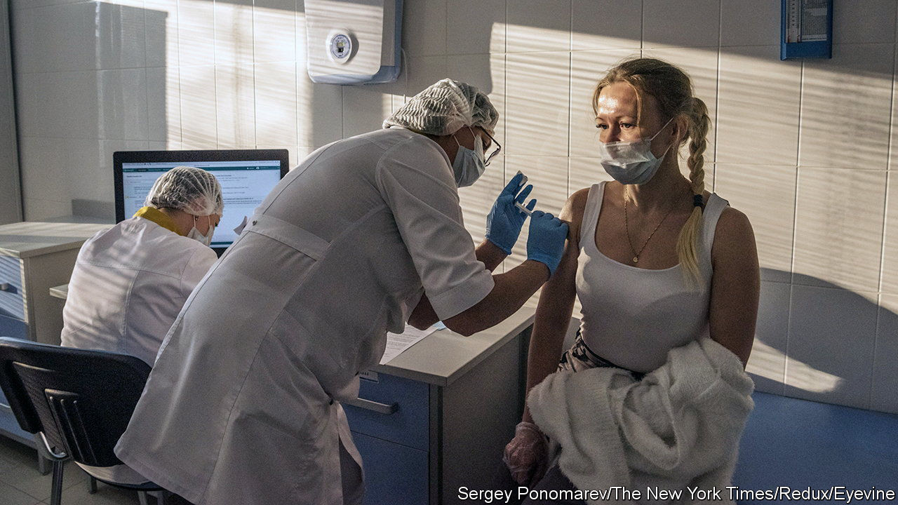

###### Sputnik V vaccination

# Are the Russian covid-vaccine results accurate? 

##### A new study calls into question a published clinical trial 

 

> Jun 22nd 2022 

If you flip a coin, your chances of getting heads or tails are equal. But if several people flip a dozen times each, the chance of them all getting a 50:50 split is small. Neither are they likely all to get exactly the same split, 50:50 or otherwise, between heads and tails. This simple concept is what Kyle Sheldrick of the University of New South Wales, in Sydney, and his colleagues have used to show that clinical trial results for Russia’s Sputnik V covid-19 vaccine, published in the  in 2021, contain some numbers which are extremely unlikely to occur in that type of trial. 

Dr Sheldrick’s team published their analysis on June 20th in the . It was motivated by concerns that other researchers had raised earlier about one particular pattern in the Sputnik V paper: the  was almost identical in each of the five age groups shown. The Russian scientists’ answer was that these results reflected a true efficacy that did not differ by age. But  are usually affected by all sorts of random circumstances, known as “noise” in the jargon. The implication is that, in this particular trial, the various sources of noise cancelled one another out in a way that generated a pattern of equivalent efficacy in all age groups. 

To examine how likely this would be to have taken place, Dr Sheldrick’s team examined what happens when various combinations of statistical noise occurred in a hypothetical sample of trial participants constructed according to the methods described in the Sputnik V paper. They used computer simulation to create 1,000 random variations of noise and counted in how many of these the vaccine efficacy resulting in each of the five age groups fell within the range reported by the Russian scientists. For comparison, they replicated this exercise for four other covid vaccines: those by AstraZeneca, Johnson &amp; Johnson, Moderna and Pfizer.

For the four comparison vaccines, between a quarter and a half of the computed efficacies for all age subgroups fell within the range of their actual published efficacies. For Sputnik V none did. The researchers then repeated the exercise with 50,000 simulations per vaccine. For Sputnik V only 13 of those iterations fell in the reported ranges. Put another way, a trial would need to be repeated, on average, more than 3,800 times in order to produce a single case where the efficacies in all age groups were in the reported ranges. For the four comparison vaccines, that result would be obtained in two to four repetitions. 

These results thus call into question the efficacy numbers reported in the original Sputnik V paper. For its part, the  said it recognised the concerns about the validity of the data and would be inviting the authors of the paper “to respond to these latest questions”.

The matter could be resolved if those authors were to release the data in question, so others could verify the results, says Enrico Bucci of the Sbarro Health Research Organisation, in Philadelphia, who was one of the first to flag the matter up. The ball is now in the Russian team’s court. ■


