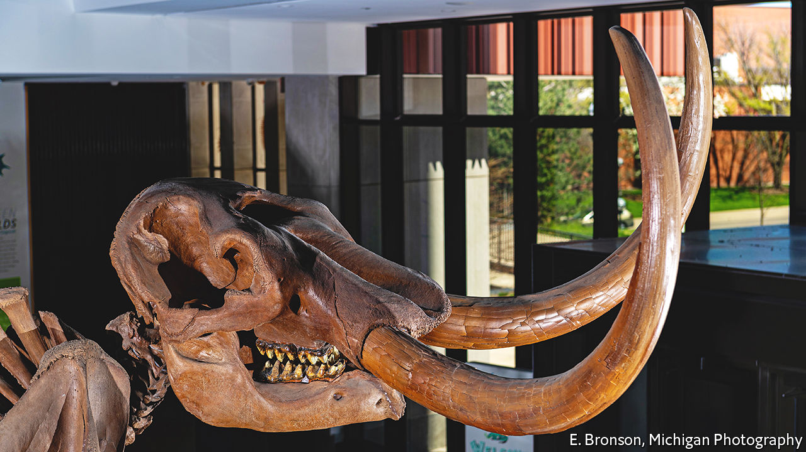

###### Death of a mastodon

# The Buesching mastodon’s story is imprinted in his ivory 

##### He died fighting, about 13,200 years ago, aged 34 

 

> Jun 17th 2022 

Geologists argue about what is truly the first trace of life on Earth. But to say that living things have been around since about 4bn years ago will do as a nice, round estimate. Ever since then, the winnowing of natural selection has done its work. Only the strong have survived long enough to deliver their genes to the next generation. And boy, was this guy strong. Two tonnes of rippling muscle draped over a skeleton weighing the same, all powered by another four tonnes of visceral organs. And tusks. Two enormous tusks, each three metres long and weighing 40kg.

It is those tusks that best tell the Buesching mastodon’s tale. More than 13 millennia after his last, fateful encounter with another bull—one that proved stronger, or cleverer, or just luckier—they were discovered, along with the rest of his almost complete skeleton, in peat workings near Fort Wayne, Indiana, owned by a family called Buesching. That was in 1998. Joshua Miller of the University of Cincinnati and Daniel Fisher of the University of Michigan have since been studying them, and have published what amounts to a biography of the animal in the .

Tusks are giant teeth. And teeth contain calcium phosphate. This is the material that strengthens them. But calcium is in the same column of the periodic table as strontium, a rarer element, so the two are chemically similar—so similar (and strontium so rare) that natural selection has never bothered to learn the difference. If the tusk-assembly process comes across a strontium atom, it incorporates it as though it were calcium, no harm done. 

This harmless mistake gave Dr Miller and Dr Fisher much of what they needed to write their mastodon’s life story. Commonly, strontium comes in two isotopes (atoms of different weights). The ratio of these in plants of the sort which mastodons ate depends on their ratio in the underlying rocks. Like trees, tusks have annual growth layers. And the rocks of America’s Midwest are so well studied that their strontium ratios are well known. So the pair were able to trace with reasonable confidence whereabouts their mastodon was when a pertinent bit of a tusk was growing. 

When he was there was given away by a second pair of isotopes—this time of oxygen atoms. Water molecules with the heavier version of oxygen in them are more reluctant to evaporate, so the ratio of the two isotopes in rainwater depends on the temperature, and therefore the season. And the oxygen from rainwater also ended up in mastodons via their fodder.

Where, then. And also when. But, reluctant to take for analysis more than the bare minimum of material from their precious sample, Dr Miller and Dr Fisher concentrated on the years when the animal was aged between 11 and 16, and between 31 and 34. And they had other information as well. Nutritional stress showed up in the appearance of the growth layers, as did damage caused by fighting other mastodons.

Previous studies suggest that male mastodons lived when young with their mothers, siblings, aunts and cousins, in matriarchal groups similar to those of modern-day elephants. Dr Miller and Dr Fisher did not bother to waste precious ivory confirming this. Instead, they started with the rebellious teenager.

The teenage Buesching mastodon, they found, was extending his range year by year, stomping over land in what are now the states of Illinois, Indiana, Ohio and Michigan. But he showed no seasonal preference for a particular place. He was also stressed by those adolescent years. At least, his tusks suggest he was not eating as well as he might have been.

Full-grown and at the height of his powers, though, all signs of stress are gone. The later samples indicate he was now migrating seasonally—returning in summer to an area near the centre of his range that seems to have served as a mating ground. 

And he was pugnacious. Tusk damage indicates that from the age of 26 he was getting into regular scraps at this time of the year. These may reflect musth—periods of aggressive temperament experienced by modern male elephants. If they do, it suggests musth evolved a long time in the past. The last common ancestor of mastodons and modern proboscideans lived about 25m years ago.

Whatever the details, he met his match in the eighth year of these jousts. The procreative instincts drilled into his genes by his ancestors’ successes over the aeons culminated in the moment of his death. One of his opponent’s tusks punched through his right temporal fossa, a weak area on the side of the skull, severing an artery. That was the end of him. But previous seasons’ successes would probably have seen him get his genes into the next generation, so job done.

A frank encounter

Nothing, though, lasts for ever—even the lines of creatures as mighty as mastodons. Palaeoanthropologists differ about when the peopling of the Americas began, but all recognise the rise of a culture called Clovis, with its suite of effective stone tools and weapons, particularly spearheads. That started shortly after the Buesching mastodon’s final, fatal fight.

Clovis weapons changed the rules of engagement between humans and the local wildlife. Mastodons, along with their proboscidean cousins the mammoths and a whole range of other large American mammals, from sabre-toothed cats to armour-plated glyptodonts, did not long survive contact with this supreme embodiment of the 4bn-year winnowing of the gene pool. All gone, their genetic lines cut off. But not forgotten. At least, not while biographers like Dr Miller and Dr Fisher ply their trade. ■


