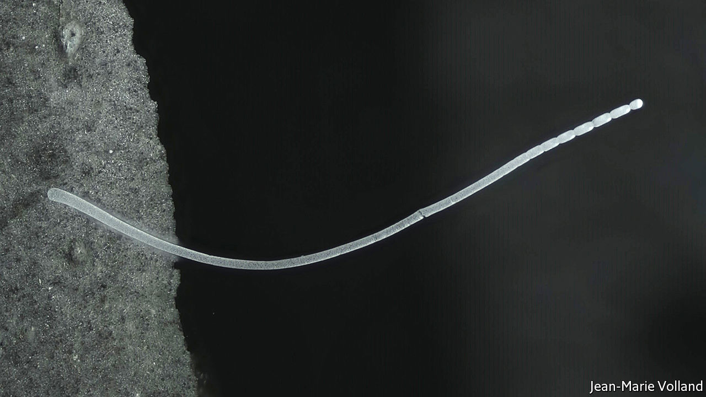

###### A giant bacterium

# The biggest bacterium yet discovered lives on Guadeloupe 

##### It can grow to be a centimetre long 

 

> Jun 23rd 2022 

At a full centimetre long, this is the largest species of bacterium yet discovered. It was found in a mangrove swamp in Guadeloupe by Jean-Marie Volland of Lawrence Berkeley National Laboratory, in California, and his colleagues. They have dubbed it  in a paper just published in . To supply its elongated body with appropriate biomolecules, it contains half a million copies of the circular dna molecules that constitute its genome, each doing its thing locally to keep the organism alive.


