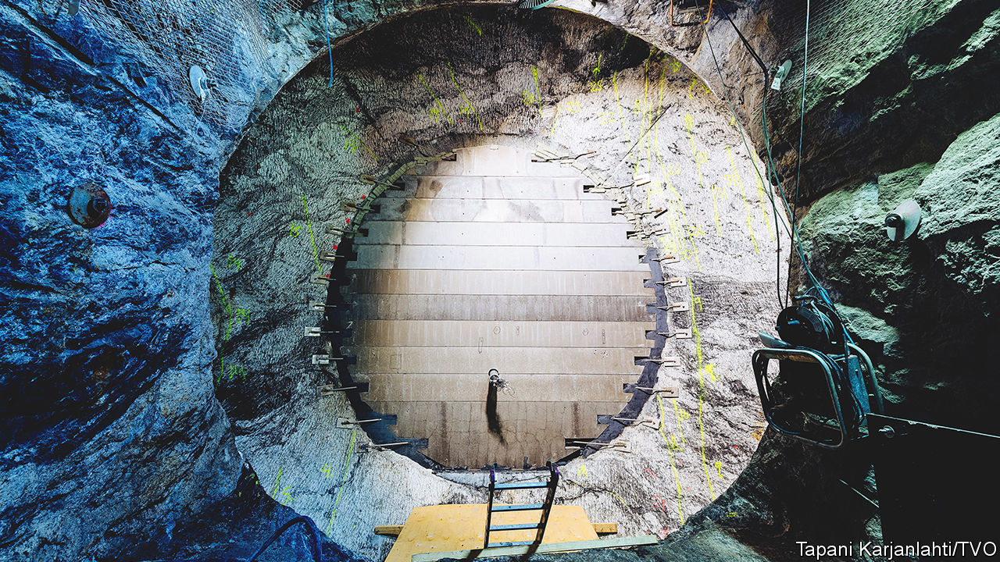
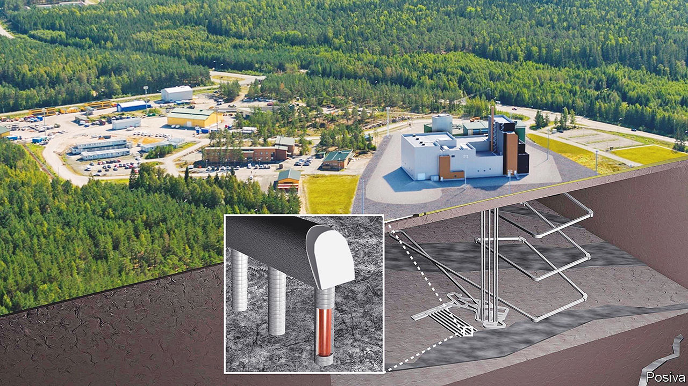

###### Nuclear waste

# The first underground warren for disposing of spent nuclear fuel 

##### Finland leads the way. Sweden and others may follow 

 

> Jun 22nd 2022 

Nearly half a kilometre underground, in the Precambrian bedrock of Olkiluoto, an island off the south-western coast of Finland, a rough-hewn gallery a few metres wide and similarly high runs dead-straight through the granite. Underfoot, the floor is a bit muddy, though mostly rocky. Overhead, steel meshing stops any fragments that might have been loosened by the drilling falling onto people’s heads. Neither hard-hat-mounted torches nor the headlights of an electric van can reach far enough into the stygian darkness to pick out the gallery’s end, some 350 metres away in the distance.

Within a few years, this gallery, part of the Onkalo spent nuclear fuel repository, should be a resting place for batches of waste from Finland’s two nuclear power stations to be sealed off permanently from the world. It was completed this month, the last of five almost identical tunnels that run parallel to each other, connected by a main access gallery (see diagram). If all goes well, a warren of roughly 100 more will be excavated as needed over the coming century. As new galleries open, old ones will be backfilled with clay and sealed with concrete, entombing their radioactive contents. 

 


Cold storage for hot waste

Deep geological disposal of this sort is widely held to be the safest way to deal with the more than 260,000 tonnes of spent nuclear fuel which has accumulated in 33 countries since the first  began churning out electricity in the mid-1950s, and the still larger tonnage that may be generated in the future. Spent fuel is a high-level nuclear waste. That means it is both physically hot (because of the energy released by radioactive decay) and metaphorically so—producing radiation of such intensity that it will kill a human being in short order. Yet unlike the most radioactive substances of all, which necessarily have short half-lives, spent fuel will remain hot for hundreds of thousands of years—as long, in fact, as  has walked Earth—before its radioactivity returns to roughly the same level as that of the ore it came from.

At the moment, the vast majority of spent fuel is kept underwater in cooling pools, often within or near the power plants that generated it. The rest is in dry store. Wet or dry, these facilities are all intended as temporary depots—way-stations on the path to permanent disposal while companies and governments wrestle with the headache of where to put the stuff permanently (or conveniently turn a blind eye to a problem which they hope will not become a crisis on their watch). 

And so Finland stands, for now, as the only country to have built a complete deep geological storage facility. It is just down the road from Olkiluoto’s nuclear-power plant, which generates 21% of the country’s electricity. Operations are expected to begin in 2024 or 2025, according to Janne Mokka, chief executive of Posiva, the company behind Onkalo. Posiva applied for its operational licence in December 2021. A trial run is expected next year. Sweden is just a few years behind, with its own repository at Forsmark, directly across the water from Olkiluoto. Both use similar designs. 

The basic principle of deep geological storage is to put a multiplicity of physical barriers and a great deal of stability between the waste and human beings. Spent fuel rods are first left to cool for a few decades before they are sealed into metallic capsules of a composition that depends on the repository’s geochemistry. The idea is to use something which will not corrode—at least not faster than the radioactive material within it decays. 

In both Onkalo and Forsmark the water pervading the granite’s tiny fissures is free of dissolved oxygen. Copper, corrodible by oxygen but otherwise stable, can thus be used for containment. The cooled fuel rods are packed into cast-iron vessels sheathed in cylindrical copper capsules eight metres tall and 1.05 metres wide. Argon, an inert gas, is injected between the two metals and the copper welded shut by remotely operated machinery. The capsule is then cleaned and transported to a lift that lowers it 430 metres, to a place where the rocks are unperturbed by human activity, climate change or the kinds of fracturing that an ice age might impose.

All this happens inside a remotely operated assembly line on top of the lift shaft. Onkalo’s encapsulation building was finished at the end of May and its rooms are now being kitted out with .

When the capsules are at the bottom of the shaft, a fleet of remotely operated vehicles will ferry them through a network of underground tunnels to whichever gallery is in the process of being filled. Once there, each will be lowered into a hole in the floor that has been lined with bentonite, an absorbent clay commonly used in cat litter. This will help to keep the copper dry. Gaps that remain will be filled with further bentonite and the hole sealed off. In Onkalo, the floor of each 350-metre gallery can accommodate 30 evenly spaced capsules, together holding 65 tonnes of spent fuel. Once full, galleries will be backfilled with yet more bentonite before their entrances are sealed with a reinforced-concrete cap. . Goodnight, sleep tight. 

Nor will any unwitting adventurer easily blunder across the place in future to wake the sleeping horror lying beneath. In 100 years’ time, Posiva will fill the whole site in, remove all traces of buildings from the surface and hand responsibility over to the Finnish government. The thinking is that leaving no trace or indication of what lies below is preferable to signposting the repository for the curious to investigate.

Eventually, the containers may corrode. How long that will take is debated. In 2007 Peter Szakalos, a chemist in Sweden, published a study suggesting copper canisters can do so even in oxygen-free water, and that this could cause them to crack within decades or centuries, not millennia. These findings caused some angst among regulators in Sweden and Finland. Nevertheless, in January of this year, Swedish authorities announced that their concerns had been allayed and construction at Formsark was given the go-ahead. 

The current consensus is that corrosion rates, combined with the rates of processes which might bring any radioactive material towards the surface, are so slow that by the time anything does get there it will pose little risk to whatever life is around. 

The technology needed to dispose of Finland’s waste is thus now in place. But, crucially for Onkalo’s success, the government has also, through decades of careful communication and negotiation, obtained popular buy-in for the project.

“It represents 50 years of building trust,” says Mr Mokka. That trust-building started with the local power plant. On June 11th, at a summer fair in a town square in Rauma, 20km down the road from the repository, children tottered about holding balloons emblazoned with the logo of the local electricity company. Jenna, a young mother, described how she visited the plant on a school trip when she was a little older than her own child is now. Most people are fine with a nuclear facility just up the road, she says. It is an important employer, and the property taxes its operators pay help local finances. Of the final five sites that had appropriate geology to host Onkalo, two had local populations that were extremely pro-nuclear. Both were next to nuclear-power plants. 

Other countries face more difficulties. France’s deep-storage efforts, though well advanced, are plagued by demonstrations. America’s Yucca Mountain project, in Nevada, is stalled by state-level opposition. But feelings could change over coming decades, and technological advances may make recycling spent fuel first before disposing of it—something France does already—a more attractive option. But regardless of whether nuclear power experiences a comeback, just solving the problem of that 260,000 tonnes of existing waste will surely require lots of digging. ■


