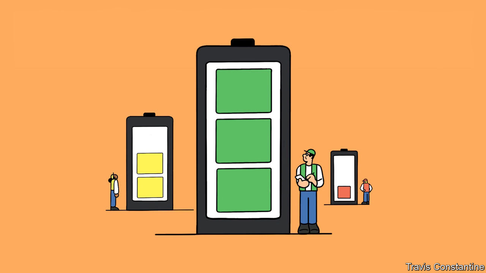
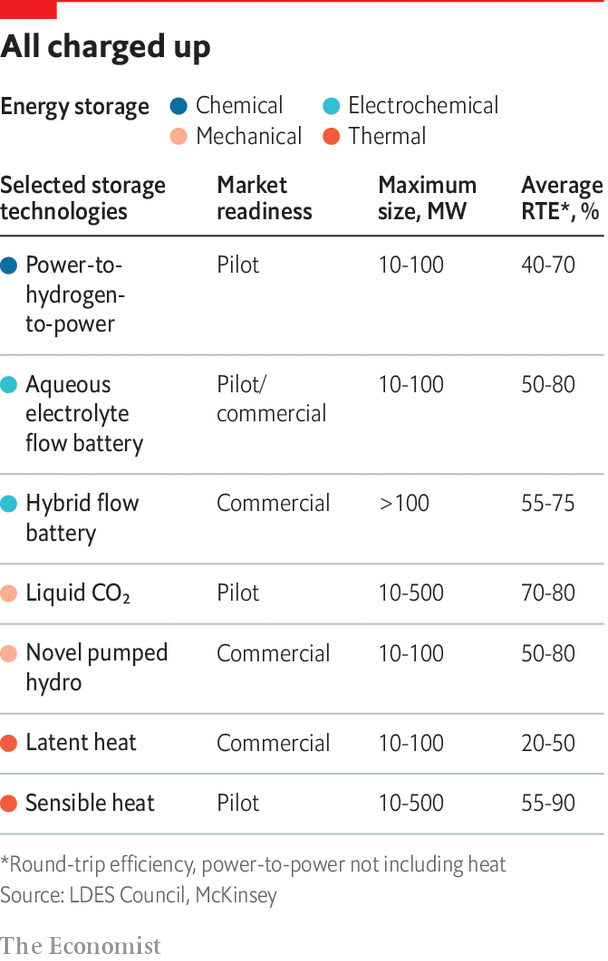

###### Beyond batteries

# Decarbonisation of electric grids reliant on renewables requires long-duration energy storage 

#####  

 

> Jun 23rd 2022 

Most climate action centres on getting rid of carbon dioxide. Energy Dome, an Italian startup, wants to put it to use. Its “CO batteries” will store the gas under high pressure when electricity is plentiful; when electricity is needed the stored gas will be run through a turbine to generate some. The advantage of using CO is that it can take on a dense sort-of-liquid form at room temperature; similar systems using other gases need low temperatures. The company has built a pilot plant in Sardinia and is moving up to a commercial scale. “I dream that our domes will become an icon of the energy transition,” says Claudio Spadacini, its charismatic boss, “like windmills and solar panels.” 

Energy Dome is one of a promising crop of firms seeking to upend the field of long-duration energy storage, or ldes. Such technologies, which can provide large amounts of electricity for hours, days or weeks when called on, are important complements to intermittent renewables—especially in systems which aim to do without any fossil-fuel or nuclear power stations. “ldes allows you to go from 60-70% renewables on the grid to 100%,” says Godart van Gendt of McKinsey, who works in the field. 

But you need a lot of it. Storage systems are measured in two linked but distinct ways: the power they can deliver (expressed in a multiple of watts), and the amount of energy they can store (expressed in a multiple of watt-hours). To understand the difference, think of the simple technology which provides almost all the world’s ldes needs: pumped-storage hydropower (psh). When electricity is cheap and copious, water is pumped up into a high-level reservoir. When electricity is scarce the water is allowed to run back down to a lower level, spinning a turbine as it does so. 

The power rating of the system is set by the size of the turbine and the difference in water levels between top and bottom; for the world’s psh systems the total number is about 165gw. The energy-storage capacity is set by the amount of water you can get into the top reservoir in the first place. For today’s psh systems that figure is around 9,000gwhrs, or 9twhrs.


In a report for the ldes Council, an industry body, Mr van Gendt and colleagues modelled the most cost-effective path to a world with net-zero emissions by 2040. They found that the system needed to be able to deliver 1.5-2.5tw and store 85-140twhrs. To put that in context, America’s total electricity-generating capacity today is about 1.1tw; 140twhrs is about 5% of the eu’s annual electricity consumption. Huge numbers—but achievable with sufficient investment, the report argued.

Indeed, if everything could be done with pumped hydro, this might look quite promising, given the exponential growth that has often been seen in the technologies elsewhere in the energy transition. Global wind capacity has increased by a factor of four in the decade to 2020; solar capacity increased nearly 18-fold over the same period. That makes increasing psh capacity by a similar amount in a couple of decades sound quite reasonable. 

In practice, though, things are trickier. Wind and solar benefit from the increasing returns of mass-production and started off at a very low base; psh systems are one-offs and many have already been built. The best sites for it have often already been taken; the best remaining sites are often far from where people need power. Project-development times for psh are long, capital costs are high and local environmental objections common. The industry thinks it is on track for a 50% increase in capacity in the next decade. But a tenfold increase in two decades looks implausible. 

What is more, storage is not needed just as a way of time-shifting energy from renewables. It is also needed to keep grids stable, and to keep energy near where it will be used, to avoid grid congestion or reliance on long-distance transmission. psh can do the first of these but not the rest. 

Alternatives that can meet all these goals might also grow much faster—possibly at solar or offshore-wind rates. But they have the problem of starting at a very low level. The Global Energy Storage Outlook published by Bloombergnef (bnef), a research firm, last year saw non-psh storage increase 20-fold by both measures over the coming decade. But it was still only 1twh by 2030. 

 Lithium-ion batteries, the cost of which has crashed due to a mixture of innovation and economies of scale, have provided by far the greatest recent advances in “grid scale” electric storage. After a 90% decline in the cost of battery packs between 2010 and 2021, reckons Citi, a bank, America is now seeing more megawatts of capacity added to its grid in the form of batteries than in the form of natural-gas combined-cycle turbines. Enormous banks of such batteries already provide up to four hours of dispatchable power to California’s grid operator on demand. When Californian utilities asked companies to come up with technologies for an eight-hour buffer the winning bids all used lithium. 

 


But though the use of such systems is sure to increase a lot—bnef expects them to make up most of the terawatt-hours it imagines the world having by 2030—the disadvantages of hitching a ride on the coat-tails of the electric-vehicle (ev) boom are becoming apparent. For one thing, there are a variety of constraints on lithium supply, and even with new mines opening up there are real worries that the booming ev industry will suck up most of their output. On top of that, the improvements in battery technology needed for evs differ from those required for grid-scale storage. Cars need batteries that store energy in as small and light a form as possible and in a range of environments. Storage cares little for weight or volume.

Developments that excite ev-makers, such as batteries in which lithium is used as a solid metal, rather than as ions held in an electrolyte, offer little to storage people. The ability to sit unused for a long time, which storage people prize, is of only passing interest to carmakers. A recent study of emerging lithium-based technologies by ihs Markit, a research firm, concluded that “None of these systems can store the volumes of electricity required to deal with the supply and demand imbalances that are likely to arise in the future as renewable penetration rises.” Only novel approaches to long-duration storage can hope to fill the breach. 

That is the opportunity which Energy Dome and other innovators have in their sights. Their approaches can be divided into four groups: mechanical, electrochemical, thermal and chemical. 

Mechanical storage is dominated by psh, and probably always will be. But other options are available. Storing gas under pressure, as Energy Dome does, is one. Another is doing with big solid blocks what psh does with water: lifting them up high into the air with cranes when energy is cheap, lowering them down with a pulley that acts like a generator when the need arises. The idea has a number of critics; but a Swiss-American startup in the area, Energy Vault, has attracted a lot of investment.

Voltage differences between various sorts of metals and chemicals are known as electrochemical storage. Electrochemical batteries have been used for centuries, but many researchers believe novel designs and materials offer new possibilities. Researchers at America’s Lawrence Berkeley National Laboratory (lbnl), which did early work on the chemistry underlying lithium batteries, are using artificial intelligence to sift through hundreds of thousands of possible battery materials looking for new ideas. In what must be the geekiest proclamation ever made by a un secretary-general, on May 16th António Guterres even called for a “global coalition on battery storage to fast-track innovation and deployment”. 

Batteries do not have to be packages that contain all the chemicals they make use of. Flow batteries store their chemicals in external tanks, pumping them through the battery as it charges and discharges. Bigger tanks let you store more energy. It is too bulky an approach to use for a laptop, or even a car. But that does not matter if they are to sit on the grid. 

ess, a firm in Oregon, makes a flow battery that uses widely available materials—iron and salt. When charging, the salts are converted to iron deposits on the electrode; when discharging, the iron dissolves and the stored chemical energy is converted to an electrical charge. Form Energy, one of whose founders led the energy-storage arm of Tesla, an ev-maker, also uses iron in a process it calls “reversible rust”. Its washing-machine-sized devices inhale oxygen from the air when discharging to convert iron to rust; when charging, they apply a current to convert the rust back to iron and emit oxygen. The firm’s claim to be able to store power for up to 100 hours will be tested at a pilot project next year.

Thermal storage is also hotting up. Antora heats up blocks of carbon to as much as 2,000°C. This stored energy can be used to heat steam or air in a pipe; the firm also claims that the glow from the toasty blocks can be directed at photovoltaic cells like those in solar panels to generate electricity. Rondo Energy uses battery bricks made of novel materials it heats to over 1,200°C. That stored energy is later delivered as heat directly, if industrial customers need it, or used to create steam that can turn a turbine. Malta, a firm in Massachusetts, is pioneering an electro-thermal system that operates as a heat pump in charging mode, storing electricity as heat in molten salt, while in discharge mode it acts as a heat engine, using the stored heat to produce electricity.

Perhaps the most transformative technology is chemical storage, which uses electricity to make a chemical which can later be used in a generator or engine. The simplest option is to use renewable power to drive an electrolyser that splits water into oxygen and hydrogen, and storing the hydrogen. “Batteries are useful, but what about storage across seasons?” asks Robert Schlögl of the Max Planck Institute for Chemical Energy Conversion, a European research group. He argues that as generation of renewable energy in remote areas proliferates, more and more electricity will be stored in hydrogen for later use—or as a first step towards making more complex fuels such as synthetic diesel or ammonia.

And chemicals really are very storable. snam, an Italian pipeline operator with plans to spend up to €5bn on energy storage, says gas-storage sites can safely store hydrogen for long periods. Gasunie, a Dutch utility, is storing hydrogen in salt caverns near Groningen, home to Europe’s biggest natural-gas field. Intermountain Power Agency, a coal-fired utility in Utah, has a salt cavern, too. It plans to fill it with renewable hydrogen that it can later burn in refurbished coal-fired stations to fill gaps in supply when renewable sources are offline. 

America’s Department of Energy (doe) has just announced a $504m loan guarantee to boost Intermountain’s efforts. Jigar Shah, whose loan office at the doe controls some $40bn in funds earmarked for energy innovators, calls the project “the first-of-its-kind clean-hydrogen production and storage facility capable of providing long-term seasonal energy storage.” It will not be the last.■

