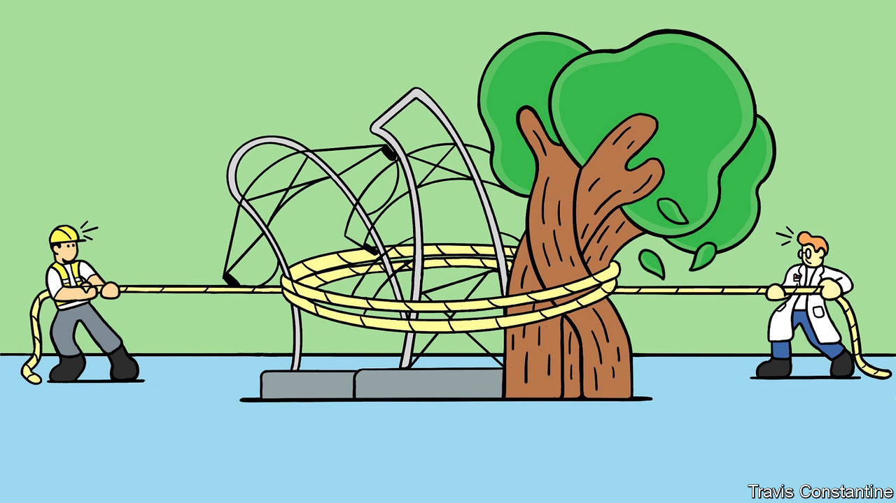
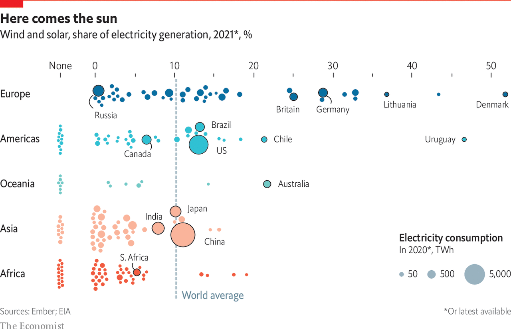
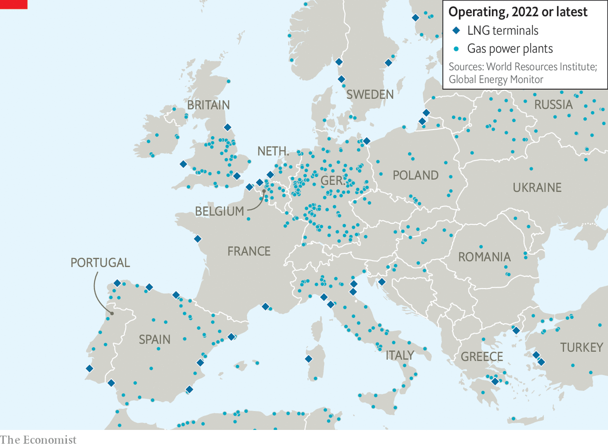

###### The electric endgame for fossil fuels

# Electrifying everything does not solve the climate crisis, but it is a great start 

##### The transition still needs plenty of assistance 

 

> Jun 23rd 2022 

Walking into the grid control room at 50Hertz, a Berlin-based utility, on the morning of May 13th felt like walking onto the bridge of a spaceship: screens full of data, an air of competent calm and the underlying sense of an immense flow of power being guided on its journey. This hyper-secure site (and its mirror in another location) are charged with controlling the flow of electricity to 18m people in eastern and northern Germany. 

Today the screens show 28% of that flow coming from wind farms and 24% from solar panels. A decade ago the custodians of the grids which keep the rich world’s lights on would have told you this was impossible. Renewables were too troublesome, too hard to balance with demand moment by moment, too prone to fluctuations in the frequency of the current they provided. In 2011 a symposium of electricity mavens convened by mit concluded that “Too much electricity generation from intermittent renewables is as much of a problem as too little generation.” 

This scepticism was understandable. Dirk Biermann, who is in charge of system operations at 50Hertz, points out that grid operators “are very conservative when it comes to system operations because, at any price, we have to make sure that the electricity supply is maintained.” Nevertheless it was misplaced. The grid 50Hertz oversees is quite capable of running a transmission grid with 50-60% wind and solar power. 

And the progress is not over. The company aims to be able to handle a 100% wind-and-solar grid by 2032. Mr Biermann sees that target as demanding—“We have to speed up”—and anticipates “moments of tension” on the way. But he thinks it will be done. Some places, after all, are already doing it, if only for fairly short periods. Neighbouring Denmark has at times run its entire power grid on wind power alone. At 3.39pm on April 3rd over 97% of California’s power came from just wind and solar. A decade of technical, managerial and systems-engineering progress has put the design and management of grids dominated by renewables within the sober, risk-averse grasp of people who run electric grids. What was once touted as a fundamental barrier to the transition from fossil fuels has been done away with.

The rub of the green

The ability to use renewables for the lion’s share of a grid’s supply, coupled with the fact that renewables have been made cheap and are getting yet cheaper, is the basis of a decarbonisation strategy all but universally accepted by those determined to stabilise the climate. Make the power on electric grids emissions-free, cheap and copious. Start electrifying all processes that now require fossil fuels—such as powering cars, or heating homes and steel foundries—where electrification is clearly possible. It does not deliver everything that is needed. But it delivers a lot. 

 


Two decades ago the high price of emissions-free generating capacity made such a trajectory look both far-fetched and scary. Now it is seen by many as an opportunity. But it faces serious obstacles. This report looks at opportunities and obstacles alike. It also looks at the impact that the war in Ukraine is having on both.

One big issue is back-up. If there was twice as much renewable capacity on the 50Hertz patch—as there well could be in the 2030s, given present trends on cost and deployment—then on this breezy spring morning the grid would have access to all the power it needed. But after sunset during extended periods without wind, no amount of extra capacity is any help, however cheap it may be. 

Mr Biermann says part of the answer to such —dark doldrums—is to expand the grid, bringing in renewable energy from a wider range of sources. Another part is to find ways to lower demand when supply is dicey. And increasingly capable batteries and other storage systems will be vital. But there will also be a need for back-up. 

 


In Germany it will not be nuclear. The country’s last nuclear plants are due to be shut down this year as part of a process begun in overreaction to the meltdown at Fukushima in 2011. And in no country should it be coal. With those options untenable, Germany has built up its renewables on the basis that, in the long run, backup will be provided by burning hydrogen produced using the grid’s copious renewable resources. As the hydrogen-production capacity is built up, Mr Biermann says the plan had been to use natural gas as a stop-gap, slowly tapering it off as the hydrogen supply increased. This is not a perfect solution since, although gas produces fewer climate emissions than coal, it does still produce plenty of them. But it is a technically plausible one.

Politically, not so much. The Russian invasion of Ukraine did not just send natural-gas prices soaring. It also opened up concerns about security of supply, and the strategic viability of a supply dominated by a powerful enemy. In 2021 the eu imported 45% of its natural gas from Russia; for Germany, Europe’s biggest gas consumer, the figure was 55% (see map). 

Complex trade-offs

The basic logic of post-Ukraine energy security, which applies far beyond Germany, is to rely as little as possible on flows of hydrocarbons from geopolitically dodgy sources. At one level it is a goal well served by adding renewable capacity to the grid as fast as possible. A kilowatt-hour from a solar panel or a wind turbine is one that does not need to be bought in the form of gas. 

Increasing renewable generating capacity yet faster is already a priority for people who are devoted to climate security. In other ways, though, the two agendas diverge. However quickly they are crowded onto the grid, renewables cannot entirely eliminate Europe’s need for gas; as well as providing back-up when renewables are not producing electricity, gas is vital to Europe’s industrial heartland, not to mention heating many of its homes. So energy-security hawks want to increase greatly Europe’s capacity to import liquefied natural gas (lng). 

Climate hawks look on this with trepidation. They argue that a low- to no-emissions future is not just a matter of reducing fossil-fuel use in existing infrastructure; it is about establishing system-level change through a once-and-for-all replacement of infrastructure. Investment in alternative sources of hydrocarbons on the scale needed to replace Russian supplies within a decade, they fear, will see hydrocarbons embedded in Europe’s electricity system for decades to come. “Get new gas, then go green” is pitted against “To go green means no new gas”. 

The issue is not unique to Europe. Similar concerns were raised when Gavin Newsom, California’s governor, announced that there would be a role for natural gas in a new $5.2bn “strategic reserve” of capacity designed to ensure that the state’s ambitious expansion of renewable power would not lead to blackouts. 

These trade-offs between energy security and climate security are complicated further by one of the fundamental issues plaguing the race to decarbonise the economy. Is the technology needed already available? Or does it still need to be developed? 

At one extreme are those who argue that all the tools necessary for radical decarbonisation already exist, and that the energy transition is a matter of finding political support for their deployment at an ever greater pace and scale coupled with a willingness in the rich world (and sometimes, implicitly, in the developing world too) to make do with less energy. At the other are those who say that the transition will require whole rafts of technology not yet out of the lab, and in some cases not even in the lab. 

The technical and the political are intertwined. If you believe that climate catastrophe looms in the near future you more or less have to believe in a technologically come-as-you-are transition. If you are deeply averse to climate action which requires massive political and economic disruption you will tend to favour going long on research. 

This report will look at which technologies needed for a fast transition to a green grid are already available and deployable, and which need more work. It will look at what is required in order to do without natural gas and at how gas can be made more genuinely climate friendly, thus aligning energy security and climate security. Before doing all that, however, it will look at a technology that makes everything easier: one that lets grids manage demand, as well as supply. ■


