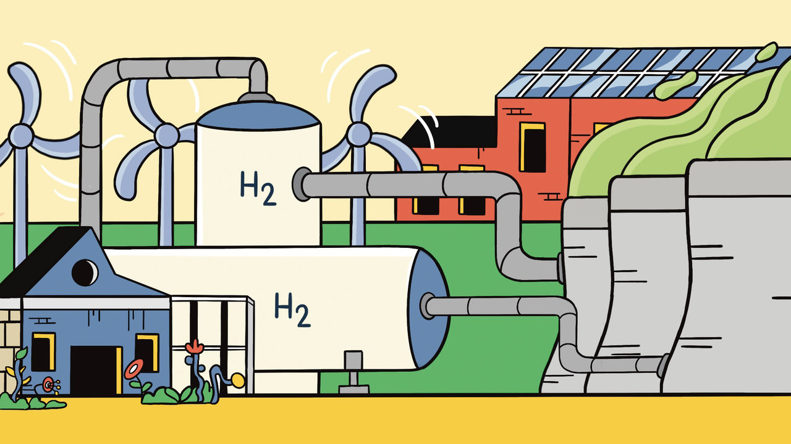

###### Heat, hope and hydrogen

# Green gases can help in the shift from fossil fuels to electricity 

##### But there will always be more to do 

 

> Jun 23rd 2022 

Using electricity to do things currently done with fossil fuels means generating more of it. If all America’s cars were evs and Americans drove as far in them as they drive today, the country’s power consumption would rise by 28%. If just two of Germany’s largest industrial sites—the Ludwigshafen complex run by basf, a chemicals goliath, and the Duisburg plant run by ThyssenKrupp, a steel giant—were to run on currents not hydrocarbons, the country’s electricity consumption would be increased by 15% at a stroke, says Klaus Schmitz of Arthur D. Little, a consultancy. 

That is a daunting prospect for developing countries which do not have the capacity to meet today’s demand. It is less worrying for countries like America, Germany and Japan where new capacity is affordable and grids are getting more sophisticated. But it is still a huge challenge. And there are still difficult decisions to be made about what is electrified directly and what is electrified indirectly with green hydrogen. 

The cost of making hydrogen from renewables is high. But it is also plunging. The falling cost of renewable energy itself is being amplified by improvements in the technologies of hydrogen manufacture—notably the electrolysers in which water molecules are torn apart to make hydrogen and oxygen. Electrolysers are ripe both for innovation and for economies of scale. They may well be the next technology to shoot down a precipitous cost curve in the way that solar cells and batteries have. Emma Champion of Bloombergnef, a research firm, predicts that by the end of this decade green hydrogen will be cost-competitive with hydrogen from fossil fuels, even if it is made without ccs. 

And it will keep going. Vinod Khosla, a venture capitalist with a long-standing interest in climate change, expects cheap renewables making cheapish hydrogen will lead to a booming market for the stuff. “If this path starts to work, our needs for electricity will grow hundreds of percent over our current forecasts for 2040, making solar even cheaper,” he predicts.

Such hydrogen will not, though, be a one-for-one replacement for natural gas in all applications. In high-temperature turbines it makes sense. In domestic boilers it generally does not. Going from a natural-gas-fired boiler to a hydrogen-fired one may sound nice and likely to be minimally disruptive. But using electricity to make hydrogen to burn in a boiler is much less efficient than using it to run a heat pump.

 

Electric heat pumps are, in effect, air conditioners that run in reverse. The energy they use does not heat things up directly. Instead it moves heat from one place to another, and moving heat can be more effective than producing it. A heat pump that heats a house using warmth from the ground beneath it can produce 400w of heating for every 100w of electricity consumed. Retrofitting houses with heat pumps can be costly and inconvenient, and the workforce needed to do so at scale does not exist. But it still seems more sensible than burning hydrogen, a process which always releases less energy than making the hydrogen required in the first place. For living spaces, workspaces and industrial processes requiring “low grade” heat, which is to say temperatures below that of boiling water, heat pumps look like the way to go. 

 This is a tall order. In a scenario designed to limit warming to 1.5°C above the preindustrial level produced by irena, a un body devoted to renewable energy, the number of industrial heat pumps will have to rise from fewer than 1m in 2019 to 35m in 2030 and 80m in 2050. In buildings, it calls for growth from 53m in 2019 to 142m in 2030 and 290m in 2050.

For high-grade heat, above 500°C, hydrogen probably has the edge. And it will have other niches, too. One of the reasons that the chemicals and steel industries are locked into fossil fuels is that they make use of their chemistry—the way the carbon and hydrogen inside them react with things—as well as the energy stored up in them. Making iron from iron ore and then steel from iron requires chemistry as well as heat, and the steel industry has grown up relying on fossil fuels for both. 

At a factory in Toledo, Ohio, Cleveland-Cliffs, the biggest supplier to the American automobile industry, uses natural gas to remove the oxygen from iron ore, producing briquettes of direct-reduced iron (dri). Hydrogen can do much the same job. Lourenco Goncalves, the firm’s boss, says that replacing 30% of the natural gas with hydrogen would be easy if the plant had a reliable hydrogen source, and 70% could be achieved with limited modifications, slashing emissions by over 1m tonnes a year. Going hydrogen-only would be harder, but such plants are quite possible. 

The dri made in Toledo still goes into coal-fired blast furnaces. But it could be put into electric-arc furnaces (eafs) which melt iron with electricity. The addition of some carbon to turn the iron to steel is still necessary; heat produced by fossil fuels is not. In the net-zero-emissions scenario published by the iea in May around two-thirds of primary steel production in leading industrialised countries used the hydrogen dri-eaf route by 2050. India’s Tata Steel said last year that it would use this approach to green steel at a big plant in the Netherlands. 

For a sense of the multifaceted, and integrated approach to energy infrastructure that climate action makes necessary and technology makes possible, come back to Berlin. Reuter West, one of the largest generators on the 50Hertz grid, is a large coal-fired plant operated there by Vattenfall, a Swedish firm. By 2030 the firm hopes to have it running on natural gas and be hydrogen-ready. The district-heating system which relies on the plant’s hot water will be augmented with heat pumps. Hot water will be used for energy storage, too, in the form of a giant vacuum flask which can hold 56,000 tonnes of water at a couple of degrees below boiling. 

Like all the paths forward in this report, the project is constrained by the history of what came before. It combines informed, perhaps idealistic, technical imagination with the kick-the-tyres conservatism of good engineering. It depends on the integration of technologies old and new to control immense flows of power. And it is a work in progress. If you want a mascot for the energy transition, you could do much worse. ■


