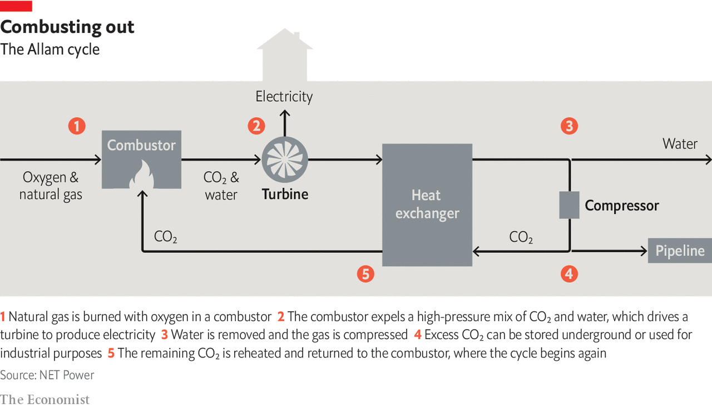

###### The long goodbye

# Making natural gas emissions-free will be a challenge 

##### It will mean dealing with its carbon content either before burning it or after 

 

> Jun 23rd 2022 

On a gravel road in La Porte, an industrial city to the south-east of Houston, a series of billboards tells an inspiring story. “Burn natural gas” says the first, “Generate electricity” the second. After that comes “Capture all emissions” and, finally, “Change the world”. The outwardly unremarkable industrial facility at the end of this display of Burma-Shave Americana has big ambitions. Its owners see it as a step towards making natural gas a permanent part of zero-emission electric grids around the world. 

The first two billboard injunctions are, in themselves, unproblematic. As long as methane losses in the journey from gas well to turbine are kept low, combined-cycle gas turbines (ccgts) are the most efficient way of producing electricity from fossil fuels on a large scale; after passing the hot combustion gases through a primary turbine, they harvest the left-over heat to drive steam through a secondary turbine for an overall efficiency of about 60%. That means they produce on average only about 350kg of CO per mwh of electricity. Coal-fired power stations can easily produce twice as much, and a bunch of other nasty pollution to boot. 

There is, however, a world of difference between lower emissions and zero emissions. In 2019 the 6,300twh of electricity that was provided by natural gas worldwide came at a cost of over 2bn tonnes of CO. 

Hence billboard three: “Capture all emissions”. In principle it is possible to scrub the COout of a ccgt’s exhaust and stash it away—an approach called carbon capture and storage (ccs). Since the turn of the century ccs has been held up as a way in which coal and gas could go on being used to generate electricity without wrecking the climate, both by being retrofitted to existing plants and designed into new ones. 


The degree to which this has failed to happen is quite spectacular. The iea’s Net-Zero Emissions scenario calls for ccs in electricity-generating plants to be capturing 430m tonnes of COa year by 2050. The only commercial power station in the world currently using the technology captures 1m tonnes a year. And it runs on coal. There is not a single operational ccgt fitted with ccs. 

There are many reasons for this. Some in the industry point to a stubborn unwillingness by greens to see any sort of fossil-fuel use as a helpful part of climate action. Eye-rolling can-you-blame-us greens complain that the industry is following a “make me chaste—but not yet” strategy worthy of St Augustine. It talks about ccs to provide an illusion of future viability while doing nothing to make that future real. 

On top of this there are real technical problems. None of them are showstoppers but they are troublesome. And they are likely to reduce the efficiency of the power plants to which they are affixed. Adding ccs to a ccgt plant could increase the cost of its electricity by 50%, though that figure depends on the natural-gas price.

The installation at the end of the series of billboards in La Porte cannot on its own do anything about the politics of ccs. But it does aim to clear up the technical problems inherent in “Capture all emissions”. Rather than add ccs equipment to existing gas-plant designs, the startup which built it, net Power, has built a new sort of generator that is ccs-friendly from the get go. It uses an approach called the Allam cycle.

 


In an Allam-cycle plant the incoming air is stripped of everything but oxygen; that oxygen is then burned with natural gas in an atmosphere of pure, hot CO (see diagram). The additional heat from the combustion drives the stream of CO through a turbine, producing power. The heat in the exhaust gas is removed in a heat exchanger and the combustion products—water and some extra CO—are taken out of the system. The same heat exchanger then heats the remaining COback up so it is ready to go through the system again. 

It is an elegant idea, generating electricity almost as efficiently as a ccgt in a plant with a single turbine and providing a waste stream of pure CO, thus taking most of the cc out of ccs. As engineers know, elegant does not mean easy. It took many years of hard development work before, last November, the pilot plant in La Porte began delivering electricity to the Texas grid. 

net Power claims its commercial plants should cost no more to build or operate than today’s ccgts. Baker Hughes, an energy-services firm, Oxy Low Carbon Ventures, the climate-tech division of Occidental, an oil and gas company, and Constellation, a power utility, are now working with 8 Rivers, the innovative investment firm that incubated and nurtured net Power’s technology in order to take the technology further and increase the size of the plants from 50mw at the demonstration site to 300mw elsewhere. 

Paul van Poecke, executive co-chairman of Tree Energy Solutions, a green hydrogen firm, is licensing the technology and plans to build several units in Europe: “Thanks to Texas, the technology is good to go, mature to scale up and be running by 2025 or 2026.” Other global investors are looking to develop the technology at commercial scale in Britain and Canada. 

This is all encouraging. But before the company gets to “Change the world” there are two substantial obstacles to overcome. One is that to replace an existing ccgt with an Allam plant will probably be even more expensive than fitting it with ccs. The other is that you need to have somewhere to put the CO so handily captured. In Texas there is demand for CO from companies like Occidental, which pump it down wells to flush out more oil. That market is not available everywhere. 

A world in which the Allam cycle moves quickly into a lasting role is a world in which people are willing to write off existing generating plant and also one where there is stable, well-monitored underground storage capacity for billions of tonnes of CO. 

Such a scenario is not inconceivable. The net-zero strategies countries started pursuing after the Paris agreement of 2015 do not imagine all greenhouse-gas emissions stopping completely. They see residual emissions cancelled out by “negative emissions” which draw down CO that is already in the atmosphere. Some negative-emission technologies store the carbon they sequester chemically in biomass, soils or minerals. But some contenders need to bury it away underground in saline aquifers (which provide no drinking water) or played-out oil fields. 

Bioenergy with ccs, or beccs, burns biomass to drive turbines and generate electricity while using ccs to dispose of the CO produced in the process. Because the carbon in the biomass came from the atmosphere—the biomass grew by means of photosynthesis—this reduces the atmospheric carbon-dioxide level. “Direct air capture” (dac) uses huge banks of fans and chemical engineering to pull CO out of the atmosphere. If either is used on a large scale—and it is unfortunately hard to imagine a world staying below the Paris agreement’s 2°C limit if this does not happen—the world will need to find secure underground resting places for tens of billions of tonnes of CO. In such a world CO from Allam-cycle power stations, or normal plants fitted with ccs, could be buried in a similar way. Indeed doing so would help to prove the storage capacity for later use.

The mainstream alternative to a world in which new infrastructure can continue to burn natural gas because it comes equipped with ccs is one in which existing gas infrastructure is first made as clean as possible and then sees increasing amounts of unnatural gas added to its fuel stock in the form of hydrogen created specially for the purpose. 

The European Commission is taking a lead on cleaner infrastructure. As well as seeking to eliminate methane leakage, it wants to see investment only in new gas power plants that emit less than 270kg of CO per mwh. 

On replacing natural gas altogether things are a little sketchier. European politicians and companies are promising piously to “future-proof” all their gas-related infrastructure by making it ready for hydrogen and other “green gases” (such as methane produced from biomass). The commission’s repowereu strategy, which foresees €210bn of investment by 2027, calls explicitly for “hydrogen-ready infrastructure.” 

Unfortunately, these policies are poorly defined. A knowledgeable European government official who specialises in hydrogen insists that the war in Ukraine will “speed up the global market for green gases and derivatives.” Push him hard on future-proofing, though, and he throws up his hands: “At the moment it’s at the level of political wishes, not technological details. It’s not clear how it will work.”

And it is not just the future-proofing that is open to question. So are the relative importance of different sources of hydrogen and the ways in which it might be shipped, and, particularly in Europe, the relative importance of energy security and climate security.

For greens, the preferred form of hydrogen is made with renewable electricity and electrolysers, known as “green hydrogen”. The repowereu plan says that “renewable hydrogen will be key to replacing natural gas”. But this is an idea whose time has not yet come. Capacities are small, and costs are high, which makes green hydrogen a non-starter in terms of energy security. There is no plausible path leading to Russian gas being entirely replaced by green hydrogen in a decade. 

The alternative is a two-stage greening, dependent on “blue hydrogen” made by reacting natural gas with steam, keeping the hydrogen thus produced and disposing of the concomitant COin the sort of underground dump used for dac and ccs. A two-stage blue-hydrogen strategy for Europe would quickly replace Russian natural gas with imports from elsewhere, mostly in the form of lng, and, over time, it would use more of that natural gas in the form of blue hydrogen. Thus it hopes to achieve both climate and energy security.

For a process dominated by economies of scale it makes sense to turn the natural gas into hydrogen close to where it is produced; there are far fewer producers of lng than there are consumers of it. Making every lng terminal have a blue-hydrogen plant with ccs on hand makes much less sense than having acceptable gas exporters like America, Australia and Qatar make the hydrogen and ship it over more or less ready to use. 

The problem with this is that shipping hydrogen is hard. Like natural gas, it can be liquefied. But whereas liquefying natural gas only requires temperatures of -160°C, to liquefy hydrogen you need refrigeration systems capable of getting down to -253°C. That is an expensive proposition. Using current technologies the energy required is 30% of that in the hydrogen being liquefied. But it is doable, and the resultant liquid can be shipped in tankers like those used for lng, though again specialist materials and designs are required. , built by Kawasaki Heavy Industries, recently sailed from Australia to Japan with the world’s first cargo of liquefied hydrogen. South Korea’s ksoe plans to have a similar vessel ready by 2025. 

A leading alternative is to turn the hydrogen into ammonia. Like liquefying it, this is expensive. But it is a well understood technology. Liquid-hydrogen expertise is rare outside the space-launch business. Making ammonia from nitrogen and hydrogen is the basis of the fertiliser industry. And ammonia is liquid at temperatures as high as -33°C, which means it can be carried in fairly normal tankers. Once ashore, it can either be “cracked” back into hydrogen or used as is. Last October jera, Japan’s biggest power firm, started to experiment with burning ammonia at the site of the country’s biggest coal-fired power plant. It plans to increase the concentration to 20% during the pilot, and ultimately to switch off coal and use only ammonia. Though ammonia is a less efficient fuel than hydrogen, using it directly saves the cost of cracking. 

Thinking ahead

At the moment, Europe is not telling companies how to import hydrogen from overseas. But it is making it very clear that they should plan on doing so. Patrick Graichen of Germany’s economics ministry says lng-import terminals that are on land (as opposed to floating lng “regas” ships, which can sail away when they are no longer needed) must be “hydrogen ready, or at least green-ammonia ready.” 

To encourage firms to make the extra investment in fuel flexibility, the government will grant lng-import terminals only a “limited permit” that will expire in two decades, the implication being that getting a new permit will only be possible if you have the capacity to handle alternatives: “Either it’s turned off in 2043, or from the very beginning you’re already planning that conversion,” says Mr Graichen. 

Once the hydrogen comes ashore it needs to get to the plants that will burn it. Small amounts of hydrogen can be moved around through some existing pipelines simply by adding it to the natural gas they carry. To transport pure hydrogen, though, will often require significant retrofitting. Being truly hydrogen-ready means upgrading a system’s steel, gaskets and valves and modifying aspects of its design. It could double the cost. Greenwashing strategies that claim systems are hydrogen-ready when they are not seem horribly plausible. 

After transport comes use. Again, early on this should not be too hard. Tests in several countries have shown that modern ccgt plants can run blends of natural gas containing 20-30% hydrogen without problems. Above that, though, you start to need adjustments to fuel injectors, burners, combustion controls, process safety systems, valves and so on. Several ccgt manufacturers, including Mitsubishi and ge, are pushing ahead with efforts to commercialise proven turbine-technology for burning pure hydrogen, but they will take time to scale up and roll out. 

The worry this all raises is that a European transition based on moving to hydrogen via lng may provide energy security but falter well before it reaches its 100% hydrogen-in-end-use goal. “Europe is fully conscious of the risk of being locked in with lng,” insists Pierre-Etienne Franc, boss of Hy24, a European investment firm focused on clean-hydrogen infrastructure that has recently raised €1.5bn. But knowing the risks will not in itself make alternatives like green hydrogen come to market quicker. ■

