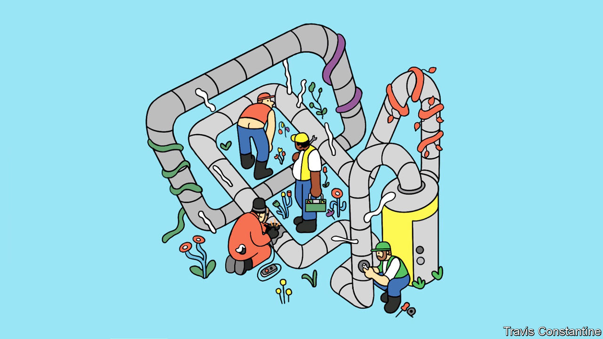

###### Low-hanging fruit

# New technology can help monitor, manage and minimise methane leaks 

##### Such leaks continue to dog the natural-gas industry 

 

> Jun 23rd 2022 

More or less every day, several light aircraft operated by Kairos Aerospace take off from an airport in Odessa, Texas, right in the heart of America’s Permian basin—and thus of its shale-oil and -gas industry. They fly low, at about 1,000 metres, their cameras scanning what passes beneath them. But they are not looking at the ground. They are looking at the air just above that ground. They are designed to detect the tell-tale infrared signature of methane as it escapes from leaks at wells, along pipelines or in storage facilities. Every day they find some. “We can image the plumes directly, tell you how big they are, and exactly where they are coming from,” says Steve Deiker, the firm’s co-founder. 

Between October 2018 and January 2020, Kairos flew a systematic series of missions over the 36,000 square kilometres of the Permian that lie in New Mexico. It took multiple pictures of 90% of the 26,000 wells in the area and 15,000km of pipeline. In a paper published this March researchers from Stanford with access to that data estimated that the amount of methane being lost to the atmosphere was equivalent to just over 9% of the methane being produced. Roughly one tonne of methane was being lost for every nine tonnes that were not. 

That is not just a waste. It is an assault on the climate. Methane absorbs some infra-red wavelengths very nicely. That makes the leaks spottable by Kairos’s cameras; it also makes it a very powerful greenhouse gas. Over a 20-year period, a tonne of methane released into the atmosphere provides as much greenhouse warming as about 80 tonnes of CO. Burning nine tonnes of methane releases only about 25 tonnes of CO. If the companies in the Permian do lose one tonne of methane for every nine that they capture, those leaks warm the climate three times more, over the next 20 years, than burning the gas the companies actually sell.

 


Other methane-watchers find the Stanford figures to be surprisingly high. Adam Brandt, the leader of the study, says that because a very small number of sites with large leaks dominate the picture, you can only see what is really going on if, as his team did, you have very thorough coverage. Either way, there is no real doubt that leaks of methane substantially increase the amount of warming associated with using natural gas. 

Russia is a particular worry. Though Europe’s concerns about Russian gas are now largely strategic, there are good reasons for climate worry, too. Relying on Russian production, which is leaky and poorly maintained, means the life-cycle emissions for European gas are very high. Analysis by rmi, a think-tank, shows that methane leaks make Russian gas imported to Germany twice as damaging to the climate as the same amount of natural gas imported from America as lng, and nearly three times as damaging as gas from Qatar shipped the same way. 

In the Permian basin, if not in Russia, there are forces in play that can help to stop the leaks. Less methane is something governments want, it is something investors want and it is something which often pays its way: gas not lost to leaks is gas that can be sold. And companies like Kairos Aerospace allow all the would-be little-Dutch-boys to see where the best leaks to plug are to be found. 

Norway produces huge amounts of natural gas with much lower greenhouse-gas emissions. Many governments elsewhere want to see their industries, and those which supply them, do the same. As Patrick Graichen, a senior climate official in Germany’s economics ministry, puts it, “It is crucial that we tackle methane leakage through the entire value chain, from well to final consumer.” The leakage rates must be low enough that emissions from gas remain well below those from coal. “It is not about incentives,” he insists, “it is about hard regulation.” 

Some investors feel the same. There is hot debate, and in some quarters open scorn, about the fact that some fossil-fuel producers are assessed as meeting high environmental, sustainability and governance (esg) standards. But they are, and taking their methane leaks seriously is one of the ways that they qualify. Fully 17% of America’s gas production, and 4% of global gas production, is now certified to this end by miq, a not-for-profit platform. Georges Tijbosch, its boss, says the platform’s assessments look at three factors: the firm’s methane emissions, the technologies it uses and the policies and procedures in place for improvement. 

In March the Oil and Gas Climate Initiative, which includes a dozen of the world’s biggest energy firms, from ExxonMobil to Shell to Saudi Aramco, announced a goal of zero methane emissions from oil and gas operations by 2030. That will appeal to regulators and investors alike. 

There is a market advantage here. Big firms can afford to clamp down on methane in a way firms less well endowed with capital and human resources cannot. That said, the expense is not likely to be crippling. According to a study by the iea 40% of methane emissions from energy operations around the world could be eliminated cost effectively: the money spent plugging the leaks would be recouped through increased sales. And that study was based on the average natural gas price for the past five years. Apply the higher prices seen last year and almost everything needed to eliminate emissions could be implemented “at no net cost”. 

The only thing the leaks have going for them is that they have, in the past, been hard to spot. Major sources of unwanted gas can be burned in flares: on some nights the Permian basin seems studded with flame. But a lot of methane is vented during standard procedures or unwittingly lost to leaks. A decade ago, hand-held methane monitors were either so simple that they could not do continuous monitoring or so expensive they were impractical. Satellite monitoring was expensive, insensitive and low-resolution. Now, “Methane emissions are a problem that we have the tools to solve,” says Stefan Bokaemper with the characteristic self-confidence of a technology entrepreneur. He is the boss of Kuva Systems which, like Kairos Aerospace, then sells data on methane leaks to the companies concerned: in Kuva’s case the data gathered by ground-based sensors are delivered in the form of annotated video clips of the leaks that can lead to immediate action. 

The first satellite capable of pinpointing methane leaks at specific installations was launched by ghgsat, a Canadian company, in 2016; it now has six in orbit and hopes to have ten up by 2023. The Methanesat system, developed by edf, an American environmental group, and researchers at Harvard University, is scheduled to launch this year. Its spatial resolution is not quite as good as that offered by ghgsat, but it looks at larger chunks of the surface at a given time and can, under certain conditions, pick up lower levels of methane. Carbon Mapper, a consortium led by the state of California, Planet, a company which sells data from its Earth observation satellites and jpl, the institute responsible for most of nasa’s planetary science, will launch two prototype satellites next year and hopes to fly a couple of dozen or so by the middle of the decade; they are intended to measure point sources not just of methane but also of CO. 

Such schemes typically work together with airborne detectors. Bridger Photonics, a startup, uses helicopter-mounted lasers rather than ambient light to pick up methane’s telltale spectral signature. Baker Hughes says its drones can detect and quantify methane emissions with flow rates as low as 0.12kg/hour (170 litres/hour). SeekOps has drones that sniff instead of seeing, measuring methane in the air they fly through with very high precision. 

There is also a rush to come up with ground-based technologies for detecting methane, like Kuva’s. Cheapish always-on sensors that report back regularly have advantages over drones and satellites that visit more rarely. Project Canary, which helps companies meet esg commitments, offers a cloud-based service that monitors methane using rugged, ground-based monitors that report back 6,000 times a week. 

All this wizardry would not be enough if the industry were still in denial. At least at the biggest firms it is not. Walking around Chevron’s central tank battery at its gbg field in the Permian reveals an increasingly thoroughgoing approach to methane. The firm has completely changed how it designs and manages such kit. It has eliminated pneumatic controls that bleed natural gas, and converted them to air compressors. It has made modifications including redundancies so that there are zero routine tank-vent emissions and no flaring. 

The firm’s methane emissions at on-shore facilities in America are less than a fifth of the industry average. It has centralised processes and introduced accountability for emissions, even baking it into compensation. Chevron’s Ryder Booth sums up the methane strategy this way: “Culture is the most important factor.” ■

