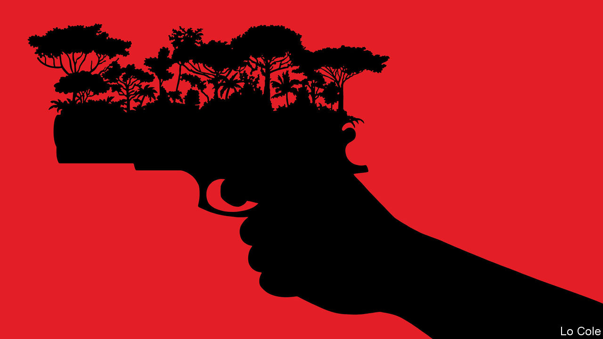

###### Bello

# Brazil’s Amazon rainforest has become more dangerous 

##### President Jair Bolsonaro scorns environmentalists 

 

> Jun 23rd 2022 

Fly from Europe to Peru and you make landfall over Guyana. For almost five hours you then fly over a dark green carpet festooned with serpentine rivers, some a muddy brown, others inky black. Such, still, is the vastness of the Amazon rainforest. Yet this aerial view is deceptive. At ground level large swathes of the forest have been eaten away. It is an assault that began centuries ago, as colonists pushed up the rivers. Since the 1960s it has gathered pace, accelerated by the chainsaw, the bulldozer and the building of highways. At issue are two opposing visions for the region, of economic development or of environmental protection, and two groups of people: most indigenous tribes on the one hand, and ranchers, farmers, loggers and  (wildcat miners) on the other.

Now this conflict has reached even the most hidden areas of the Amazon, as the murders earlier this month of Bruno Pereira, an adviser to indigenous tribes, and Dom Phillips, a British journalist, make clear. According to Brazil’s federal police they were shot dead as they were returning by boat from a research trip in the valley of the Javari, a territory the size of Austria close to the border with Peru that is home to 16 tribes living in isolation. The police say their killers were illegal fishermen, three of whom have been arrested.

The pair are far from the first defenders of the forest to die violently. In 1988 the murder of Chico Mendes, the leader of a rubber-tappers’ union in Acre, to the south of the Javari, caused international outrage. His killers were the sons of a rancher who wanted the union’s land. Mendes’s death contributed to far-reaching changes of policy in Brazil, coinciding with the country’s democratic constitution of 1988. Governments banned wildcat mining, set aside large chunks of the forest as indigenous reserves or national parks, and stepped up enforcement of laws against deforestation. This change peaked under Luiz Inácio Lula da Silva and his environment minister of 2003-08, Marina Silva, who had worked with Mendes. Deforestation fell from 27,700 square kilometres (10,700 square miles) in 2004 to 4,400 square kilometres in 2012. By the same token, after centuries of decline, Brazil’s indigenous population has been enjoying a sustained increase, from fewer than 100,000 in 1960 to 1.1m today, thanks to better health care and the protection of their lands and livelihoods. 

Over the past decade environmental progress has reversed, however, owing both to pressure from the farmers’ lobby and budget cuts. The fate of Messrs Pereira and Phillips highlights new threats. As Brazil has become a big consumer and exporter of cocaine, organised crime has spread across the Amazon. The Javari joins the Amazon where Brazil intersects with Peru and Colombia. It has become a drug route. Environmentalists say that narcotraffickers have diversified into environmental crimes, such as smuggling ill-gotten timber and endangered animals. The murder rate in rural areas in the Amazon is rising and is now above the national average.

The most insidious threat comes from Jair Bolsonaro, Brazil’s president since 2019. He is contemptuous of environmentalism and of indigenous reserves, which he sees as unfairly blocking economic development (a minority of the indigenous agree with him). A former army officer, he embodies the military’s nationalist view of the Amazon: that it must be settled if Brazil is to secure its sovereignty over it. And he won the votes of many of the 29m people who now live in the Amazon, including farmers,  and townspeople. 

Mr Bolsonaro has slashed spending on enforcement by Ibama, the environment agency, by two-thirds and reduced its powers. As for Funai, the body that protects indigenous people, Mr Bolsonaro called it “a nest of rats”. He has brought in military officers to run it. All this has encouraged those who break environmental laws, such as the illegal fishermen on the Javari river. The president appeared to blame Mr Phillips for his own death, saying, “That Englishman was disliked in the area because he wrote a lot against , environmental issues, people didn’t like him. He should have been much more careful.”

Environmentalists hope that Lula, as the ex-president is known, will defeat Mr Bolsonaro in the presidential election in October. Lula’s campaign platform promises to defend the rights and lands of indigenous people, to rebuild Ibama and Funai, and to fight deforestation. But in the Amazon, all that becomes harder with each year that passes.


