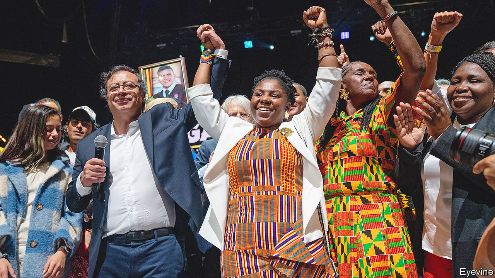
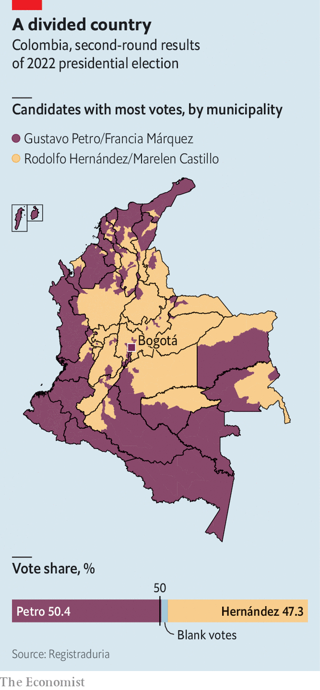

###### Petrofied

# How Gustavo Petro, a former guerrilla, might govern Colombia 

##### An election puts a radical leftist in the presidential palace 

 

> Jun 20th 2022 

“We are writing a new history for Colombia, Latin America and the world,” declared Gustavo Petro, the winner of Colombia’s presidential election, in Bogotá on June 19th. His grandiloquence was perhaps understandable. When he takes office on August 7th Mr Petro will become the country’s first left-wing president. He offers a radical departure from a century of right-wing and centrist rule. Mr Petro’s running-mate, Francia Márquez, an environmental activist, will be the country’s first black vice-president. 

Mr Petro won by 50.4% to 47.3% in a run-off against Rodolfo Hernández, a property tycoon. He got 11.3m votes on a turnout of 58%, the highest in 50 years. The ballot was peaceful, in an election marred by death threats to both candidates and worries about potential fraud. Mr Hernández conceded defeat quickly. 

The result makes Mr Petro the latest in a string of leftist leaders in Latin America who have come to power as part of an anti-incumbent wave. In Peru and Chile voters recently plumped for anti-establishment candidates. Brazil is also expected to lurch to the left in presidential elections in October. Yet though Mr Petro’s agenda is radical, he will be constrained by a fractured Congress and Colombia’s institutions.

 


Mr Petro’s win was a victory for press-the-flesh campaigning over social-media savvy. He secured almost 3m extra votes between the first round on May 29th and the run-off, mainly through grassroots work among young and poor people. Turnout in Magdalena and Chocó, two of the country’s poorest departments, increased by 16%. In Bogotá, where Mr Petro was once mayor, he got half a million extra votes. 

Mr Hernández, by contrast, focused on finger-jabbing rants on TikTok. In the final week he cancelled media appearances and flew to Miami, saying his life was at risk. He mentioned the Virgin Mary and prostitutes in the same sentence, which his critics gleefully construed as an insult to the country’s Roman Catholics. His standing among conservatives took a hit when a video emerged of him dancing on a yacht with a dozen young bikini-clad women. 

This made Mr Petro seem more statesmanlike. He tried to calm jittery investors by suggesting he would appoint a centrist finance minister. In his election speech he defended capitalism, albeit half-heartedly, saying he would “develop [it], not because we adore it, but because we have to overcome premodernity and feudalism.” 

Nevertheless, many Colombians distrust their president-elect. Polls taken before the election found that he was less popular among older voters who had experienced more of the country’s long-running armed conflict with insurgencies. For many Mr Petro’s former membership of the m-19, a guerrilla group that demobilised in 1990, is a huge red flag. 

Mr Petro has not reassured investors. His programme includes making university free and giving every persistently unemployed person a state job. (Unemployment is currently 11%.) He wants to ban oil exploration, open-pit mining and fracking—even though oil, coal and minerals make up around half of Colombia’s exports. His proposal to grab money from private pension funds to bolster the public pot outrages savers and would weaken capital markets. The peso fell by 3% against the dollar on June 21st; the stock exchange fell by 4%. 

Colombia’s close relationship with the United States could also fray. Since 1999 it has received more aid than any other country in Latin America, mostly to fight drug gangs and guerrillas. Kevin Whitaker, the us ambassador to Bogotá until 2019, worries that Mr Petro’s desire to end forced coca eradication and to stop extraditing drug kingpins would “fundamentally change the nature” of security cooperation. A free-trade deal signed in 2012 is also at risk. On June 22nd Mr Petro tweeted that he had called Venezuela’s government to reopen the shared border. 

Yet Mr Petro will struggle to implement his big plans. His coalition has only 15% of seats across both houses of Congress. Though he can expect support from some centrists and the five senators formerly in the farc, a Marxist guerrilla group which demobilised in 2016, he would still need to make alliances with established parties. That may disappoint his base. 

Many fear that Mr Petro’s plan to “democratise” Colombian institutions means stuffing them with his followers. But this will be difficult. The departing president, Iván Duque, was able to appoint the attorney-general, public prosecutor, comptroller and procurador, who disciplines public servants. A state of emergency to combat hunger, which Mr Petro once promised to call, is unlikely to pass muster with the Constitutional Court. Similarly, the Central Bank’s independence is enshrined in the constitution. Mr Petro can only appoint three out of seven members of its board during his term. He is unlikely to count on the army for much support. 

The question is how Mr Petro will react if such institutions restrain him. He has vowed to release 160-odd people jailed after protests last year. To do so, he will need to face down the prosecutor. As mayor he had a reputation for being irascible. For some, none of this matters. “Petro represents change,” says Paola Quiñonez, an activist. “If the economy suffers, that’s ok. The people have lived through hunger, poverty and insecurity before.” Nearly half of Colombians are less sanguine. ■

