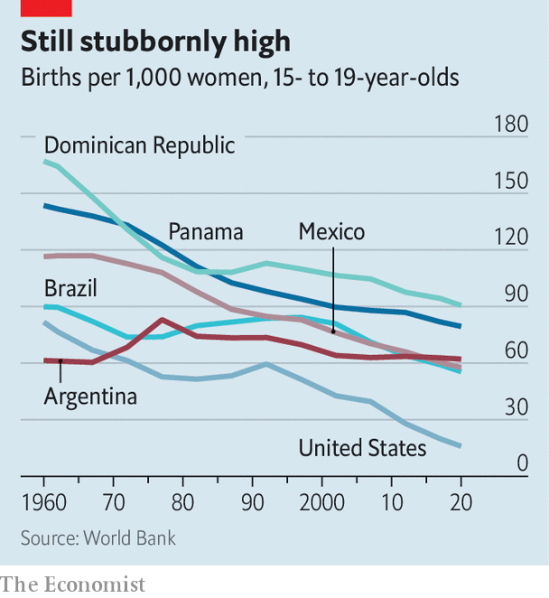

###### Birds, bees and not much else

# Latin America lacks decent sex education in its schools 

##### Teenage pregnancy rates are still too high across the region 

 

> Jun 23rd 2022 

Two 14-year-old students at Jesus and Mary College, a Roman Catholic girls school in Buenos Aires, squirm as they describe their classes on sex. Last year they learned about fertility and sexual organs (“It was really embarrassing!” says one). This term they have talked about the process of giving birth, but they are not sure what else they will learn. The teachers refused to answer some of the questions that their classmates were allowed to write in anonymously. “They said it wasn’t appropriate to talk about it in school and we could ask our family members these things,” recalls the other.

Sex education is patchy across Latin America, a mostly Catholic continent. Although on paper every government in the region tells schools they must teach their pupils about the birds and the bees, many fail to do so. A survey in 2020 in Brazil showed that only a quarter of teachers had undergone training in how to talk to their pupils about sex. “We train ourselves from our own interest,” says Vicky Fernández Blanco, a nursery-school teacher in Argentina who teaches her charges how to ask for consent before hugging a friend, and so on.

A few countries are better at sex education than others. In Mexico, where the constitution enshrines secular education, public-school textbooks show, with simple illustrations, how boys can just take down their trousers to learn about their sexual organs, while girls can use a mirror. (However, these textbooks are not used everywhere.) In Argentina in 2011 the ministry of education produced a textbook to help parents talk to their children about puberty, masturbation, contraception and how sexually abusing children is a crime. 

But in much of the region sex education is indistinguishable from a biology lesson. Although abstinence is seldom actively promoted, information on contraceptives can be out-of-date or limited to condoms. “They mentioned interrupting coitus, which I don’t think is a very good suggestion,” says Ariadna, a 15-year-old at a public school in Argentina. Teachers are often silent about abortion, not least because it is illegal in parts of the region. Any talk of sex is nearly always about the heterosexual variety. “It would have been nice to have heard something about the lgbt community [at school],” says Igor Farah, an 18-year-old in Brazil.

Many parents, having been through the same system, are unable to fill in the gaps. Sometimes they lack knowledge, says Guadalupe, a 24-year-old who works with charities to teach young people in the Mexican state of Oaxaca about sex. Adults in her hometown have long taught their children they can get pregnant from sitting on a toilet. Other parents are just squeamish. Euphemisms are common, such as “” (little dove) for vulva.

Many children turn to the internet. But that complicates things, reckons Yuri Pitti, who works at Aplafa, a sexual-health organisation in Panama. “Before the fight was about access to information, now it’s about access to good information,” she says. Boys tend to have unrealistic expectations of sex from watching porn, in particular.

 


Perhaps as a result of shoddy sex ed, teen pregnancies are common in Latin America and the Caribbean, though the rate has fallen (see chart). Some 18% of births in the region are to mothers under 20. Only sub-Saharan Africa does worse. Covid-19 may have interrupted progress. In Panama the number of pregnant girls aged 10 to 19 increased by 8% in 2020 compared with 2019, possibly because of lockdowns and school closures. Sexually transmitted diseases are rising in some countries, too. 

Some politicians are trying to change matters. Gabriel Boric, Chile’s new 36-year-old president, wants to introduce “non-sexist education”. He wants to make it mandatory to teach children at all levels not only about sex, but sexual diversity and gender stereotypes. He wants schools to hand out condoms and for sex education to include topics such as abortion (which may soon be legal in Chile). 

In April the government of Panama introduced a sex-ed law that means that children now have to be taught how to avoid pregnancy and sexually transmitted diseases, and how to find help if they are being abused. Mexico’s ruling Morena party is planning to include sex ed in its laws on children’s rights. This would mean, on paper, that teachers have to talk about contraceptives and the like. Last year Cuba’s dictatorship announced it would update its “family code” from the 1970s. If that passes a referendum, it will mean that sex ed includes classes about sexuality.

But in some places sex education has become caught up in the culture wars. In Peru legislation which would allow parents to stop sex-ed classes from happening if they do not like them was expected to become law this week. If teachers do not take parents’ concerns into account, they can be fired. Esdras Medina, the lawmaker who promulgated it, once blamed floods caused by El Niño on sex education in schools. “Con Mis Hijos, No Te Metas” (Don’t Mess with My Kids), a parents’ pressure group which started in Peru in 2016, has spread across the region. The group successfully agitated for two education ministers in Peru to be fired.

Similarly, in 2016 the municipal government of Santiago, the capital of Chile, tried to introduce a textbook for teenagers entitled “100 Questions about Adolescent Sexuality”, which included segments on what a clitoris is, how long penises are on average, menstruation, lgbt people and healthy relationships (it advises that they involve “mutual respect, communication and trust”). Conservatives objected, calling the book a sex manual. A centre-right politician won the municipal election soon after and took it out of circulation. The new mayor falsely claimed it promoted anal sex as a way to avoid pregnancy. Mr Boric’s plans may face a similar backlash. ■

