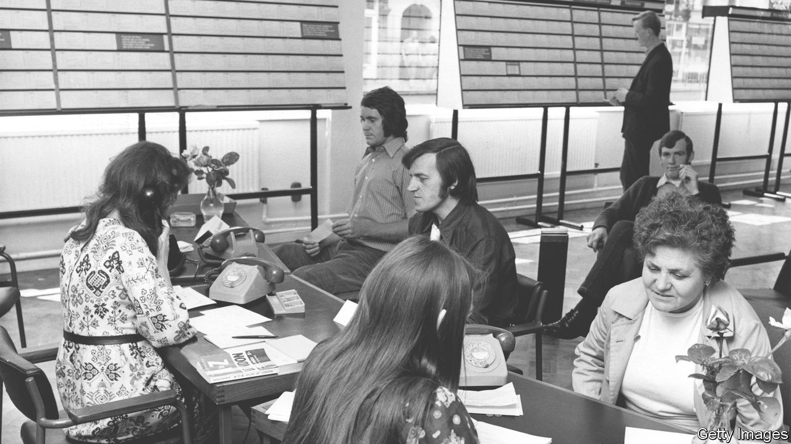

###### The Economist explains

# What is stagflation, and might it make a comeback? 

##### A combination of inflation and sluggish growth brings memories of the 1970s 

 

> Jun 16th 2022 

INFLATION IS RUNNING at around 8% in both  and , far above central-bank targets. Growth is starting to slow down, prompting fears of a . That has led to some, including the World Bank, to warn of an old foe: “stagflation”. The portmanteau, a combination of stagnation and inflation, was popularised in the 1970s by Paul Samuelson, a Nobel economics laureate. In America it brings memories of a time when inflation was high, the economy struggled through two recessions and unemployment remained elevated. What leads to stagflation, and to what extent are America and Europe at risk? 

Economists usually think of a trade-off between inflation and unemployment. In recessions, as demand slumps, inflation tends to be low and unemployment high. In booms, the opposite applies. A period when both inflation and unemployment are high is therefore unusual—and undesirable, as both widespread joblessness and rising costs of living are painful. Policymakers strive to keep both down, but it is a delicate balance. Attempts to squash unemployment and boost the economy, for example through added public spending or very low interest rates, risks generating inflation. 

Today in America and Europe, unemployment is low and inflation high, suggesting that one indicator of stagflation, high unemployment, is missing. And as in some previous inflationary episodes, there is still a good chance that once the current surge in prices has dissipated, inflation rates will come back to normal, though at a higher overall price level than previously expected. 

Turning the current inflation problem into stagflation would require two further ingredients. First, inflation would have to become persistent, so that the economy adjusts to accept and expect a higher rate of inflation each year. That only happens if central banks are willing to tolerate it for long enough that expectations of workers, firms and investors shift. In the 1970s some central banks avoided this. Germany’s Bundesbank stopped inflation becoming entrenched by stepping on the brakes early and committing itself firmly to stable prices. America’s Federal Reserve, in contrast, took too long to fight inflation, and had to break the new inflationary psychology later, under the leadership of Paul Volcker, through a painful recession. 

As things stand, both the Fed and the European Central Bank seem determined to bring inflation down to their target rates, even if that takes a while and could entail a recession. And the markets seem to believe them. Long-term inflation expectations are within recent historical ranges. Although inflation is higher and more persistent than either central bank expected, the change in expectations that is necessary to generate stagflation does not seem to have happened. 

The second ingredient to turn today’s inflation into stagflation is a weak economy and higher unemployment—not a temporary increase, as in a recession, but a permanent one, known as structural unemployment, which cannot be stimulated away through more expansionary policies without generating inflation. In the 1970s, the oil shocks provided the backdrop for a rise in structural rates of unemployment as economies adapted to higher energy prices and growth slowed. Today there is a risk of that, but unemployment is still very low. In America, unemployment stood below 4% on the eve of the pandemic, with inflation also low. That suggests the current rate of unemployment at 3.6% is close to the long-term norm. In Europe, too, unemployment has dropped below the levels of 2019. Central banks in both America and Europe are struggling to deal with inflation. But it is too soon to predict stagflation. 


