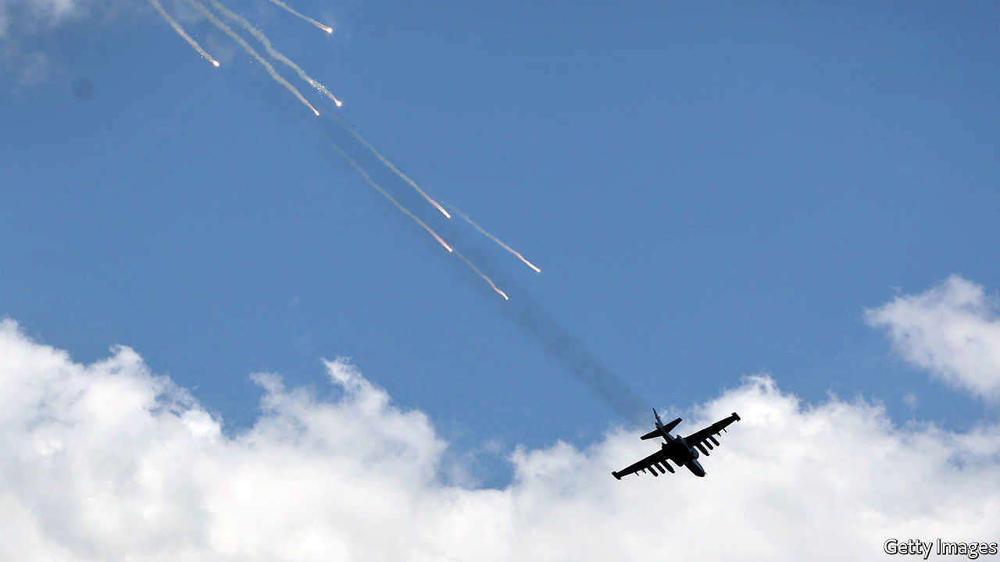
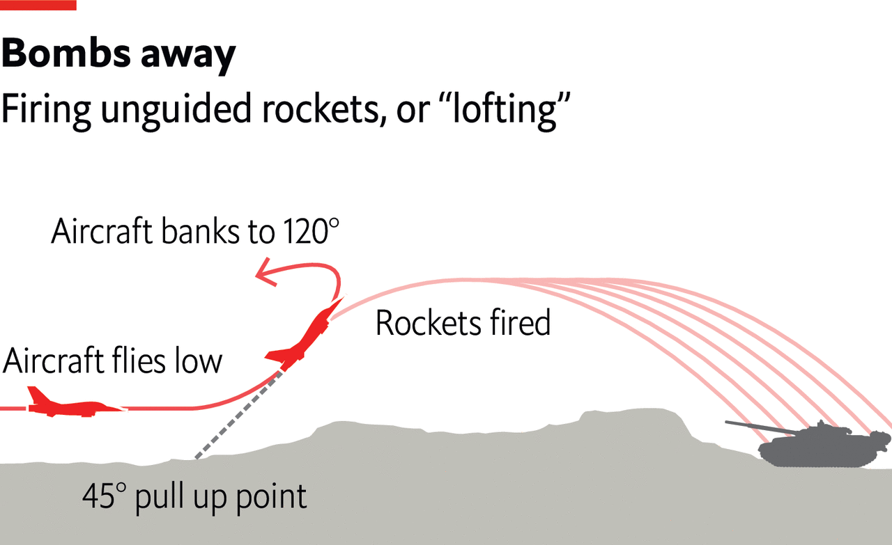

###### The Economist explains

# Why are pilots in Ukraine firing rockets so clumsily? 

##### “Lofting”, which dates back to the 1940s, suggests both sides lack modern weaponry 

 

> Jun 20th 2022 

Russian aircraft have adopted an unusual tactic for firing unguided rockets. Rather than launch them in pairs directly at a target on a downward angle, pilots tend to fly low before climbing and firing an entire pod of rockets steeply upwards, after which the pilot veers away. This clumsy approach, known as “lofting” or “tossing”, has some advantages, but points to a lack of modern weaponry on both sides. 

The technique was originally developed by the American armed forces in the 1940s. To deliver an atomic bomb without having to fly directly over its target, aircraft would make a steep climb before releasing a bomb on an upwards trajectory. The plane would then break off sharply while the bomb continued, achieving the maximum range without catching the aircraft in the blast. 

Pilots around the world adapted lofting to their own purposes. Aircraft that fire rockets are protected from their own weapons, but lofting helps keep them out of range of enemy defences. The Israelis used the technique in the Yom Kippur war of 1973, for example, to stay clear of Egyptian and Syrian surface-to-air missile systems. 

 


Today Russian and Ukrainian air forces use the technique to similar effect. They are equipped with 80mm s-8 rockets developed in the 1970s (the number refers to the diameter of the tube from which the weapon is fired). These are stored in pods of either seven or 20 and carried on both sides of an aircraft; they are typically fired in pairs. 

The basic s-8 is 1.5 metres long and weighs 11kg, and its shaped-charge warhead, designed to focus the effect of the explosive’s energy, can penetrate armoured vehicles. Its maximum range is about 4km, but lofting can potentially double that while allowing the aircraft to remain low and thus safe from defence systems such as  and tracked anti-aircraft vehicles. The technique often comes at the expense of accuracy, though. Rockets fired in pairs can be aimed at a specific target, but releasing a whole salvo from out of sight simply launches rockets in the general direction of the enemy.

America and other nato countries make little use of such unguided rockets. That Russia and Ukraine are still using the s-8 shows how poorly equipped their air forces are. The ah-64 Apache helicopter, for example, flown by the us Army and others, typically carries 16 laser-guided Hellfire missiles with a range of 11km. Although Russia and Ukraine do have some equivalent air-to-surface guided missiles, such as the Vikhr (“Vortex”), they appear to be in short supply. 

There may be smarter ways to use unguided rockets. Ukrainian forces recently released a video of a pickup truck with banks of s-8 rockets mounted on the back and a joystick controller next to the driver. This improvised setup is not as accurate as the  mounted to military vehicles, but it is probably as good as lofting, and certainly cheaper. What both sides really want are modern guided missiles. But unless Ukraine’s allies supply it with such weapons, or Russia can increase its production of advanced munitions, pilots will continue to lob unguided rockets and hope for the best.


