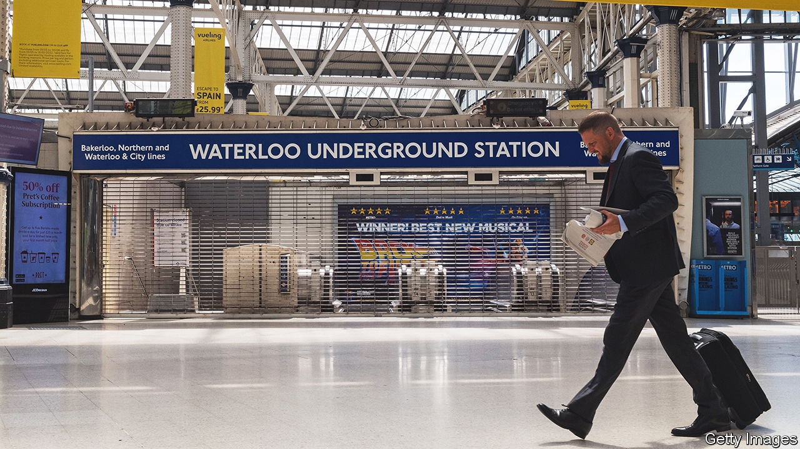

###### The world this week

# Business 

#####  

 

> Jun 23rd 2022 

Britain’s annual  rate hit 9.1% in May. Food prices accounted for much of that, but road-fuel prices were up by 32.8%, year on year, the biggest such increase in that category since the data were first compiled in 1989. Britain already has the highest inflation rate among g7 countries. The Bank of England recently increased its main interest rate for the fifth consecutive time, to 1.25%. The squeeze on household costs is pushing up wage demands. Train drivers went on strike this week, crippling the rail network for five days. Nurses and teachers are also considering action over pay in a “summer of strife”. 

A union at  rejected a 4% pay rise and a one-off £2,000 ($2,450) payment to ease workers’ living costs. The company, which makes jet engines, is one of the biggest manufacturers in Britain. The union said it was considering its next steps. 

More than 1,300 pilots for  held a protest outside Dallas Love Field airport to complain about their overstretched working arrangements. Southwest, like other big carriers, has been caught out by the strength of the travel revival. A lack of staff at airports in America and Europe is also causing turbulence, leading to regular flight delays. The situation will probably get worse as big airports, such as Heathrow, have increased their forecasts for passenger numbers. 

Following the example of workers at Amazon and Starbucks, staff at an  store near Baltimore voted to join a union, the first time employees at the tech giant have opted for unionisation. The crusading store staff are Apple’s core: the Coalition of Organised Retail Employees. 

Sales of  fell again in May, according to the National Association of Realtors (the tally excludes newly built properties). The decline was the fourth in a row, after sharp rises in the worst of the pandemic, and sales are back to where they were in 2019. However, the median price of a home rose for the 123rd month running, to $407,600, up by 15% year on year.

More expensive money pits

A shift in expectations about inflation and tighter monetary policy are pushing up  in America, according to Freddie Mac, a government-sponsored mortgage backer. The rate for an average 30-year fixed-rate mortgage has doubled over the past year. 

The  hit a seven-year high against the dollar. It has gained the most of any currency against the greenback this year, despite the loosening of capital controls and a reduction in interest rates. A strong rouble undermines Russia’s exports and public finances, a headache for the government, which is mooting whether to set an “optimal” exchange rate. 

Meanwhile, the  fell to a new 24-year low against the dollar. This follows the Bank of Japan’s commitment to stick to a monetary-easing policy that targets a short-term interest rate of -0.1%, just as America’s Federal Reserve steps up an aggressive round of monetary tightening.

 from Russia leapt to a record level in May, equivalent to almost 2m barrels a day. Russia is now once again China’s main supplier of oil, displacing Saudi Arabia.

America’s Supreme Court declined to hear an appeal from  against the $25m awarded to a man who blamed his non-Hodgkin’s lymphoma on his exposure to Roundup, a weedkiller. Bayer took on a mighty legal mess when it acquired Monsanto, which made Roundup, in 2018. The company has set aside $16bn to resolve litigation on Roundup’s alleged harmful effects. The Supreme Court’s decision not to hear the appeal may mean that Bayer fast-tracks the remaining suits. 

There was another twist in the lengthy battle to take over , when Jet Blue Airways again increased its offer. Spirit is also considering a bid from Frontier. A combination with either suitor will create America’s fifth-biggest airline in terms of passengers.

 decided to split its business into three publicly traded companies, based around cereals, snacking and plant-based foods. Growth in its cereals division, which houses Froot Loops, Rice Krispies and Special K, has stalled as more people forgo breakfast. 

A greener great outdoors

, a maker of trailers and motorhomes that are a familiar sight on America’s highways, reported solid earnings for its latest quarter. The company has shrugged off inflation fears by increasing its prices to offset the cost of rising materials. With the price of petrol reaching an all-time high in America, Winnebago recently completed a 1,380-mile (2,220km) test trip of an all-electric motorhome. The size of a large van, it is smaller than a regular recreational vehicle, but 60% less costly to run than a petrol-powered one. 

